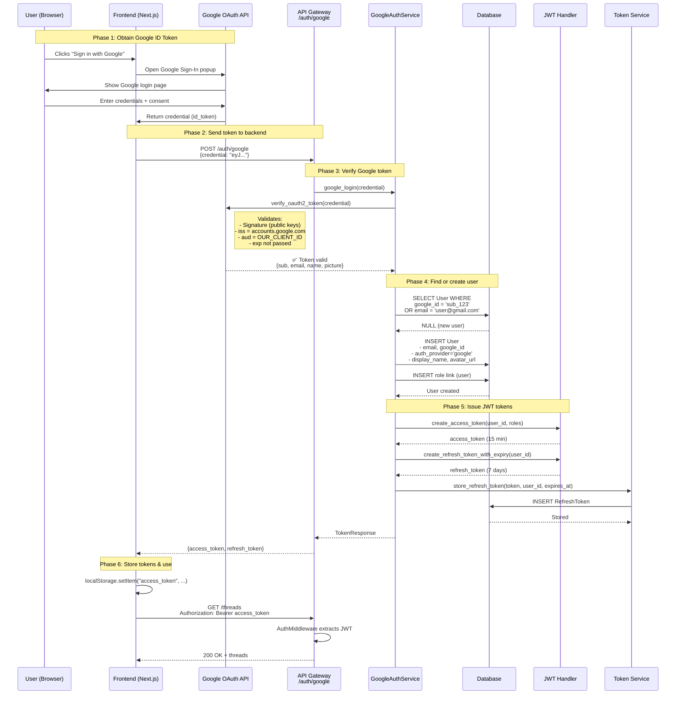
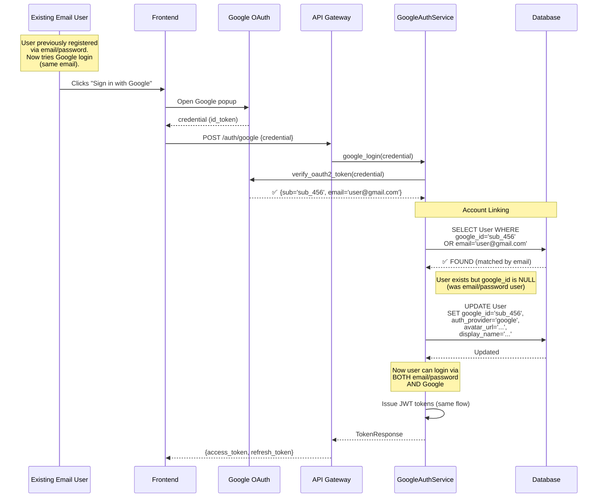

# Google OAuth2 Login - Architecture & Design Documentation

## Table of Contents

1. [Overview](#overview)
2. [Architecture Diagrams](#architecture-diagrams)
3. [Architectural Decisions & Trade-offs](#architectural-decisions--trade-offs)
4. [Design Patterns](#design-patterns)
5. [Key Scenarios](#key-scenarios)
6. [Integration Points](#integration-points)
7. [Security Considerations](#security-considerations)
8. [Future Extensions](#future-extensions)

---

## Overview

This document describes the architecture and design decisions for implementing Google OAuth2 login in the API Gateway service. The implementation follows SOLID principles, leverages existing infrastructure (JWT tokens, RBAC), and introduces minimal changes to the existing codebase.

**Core Principle**: Google OAuth users are **first-class citizens** — they use the same JWT token system, RBAC roles, and API endpoints as email/password users.

---

## Architecture Diagrams

### Flow Diagram: Google Login vs Email/Password Login

```
┌──────────────────────────────────────────────────────────────────────┐
│                         Authentication Flow                          │
└──────────────────────────────────────────────────────────────────────┘

    Email/Password Flow                    Google OAuth Flow
    ───────────────────                    ─────────────────
          
    ┌──────────────┐                      ┌──────────────┐
    │   Frontend   │                      │   Frontend   │
    └──────┬───────┘                      └──────┬───────┘
           │                                     │
           │ POST /auth/login                    │ User clicks "Sign in with Google"
           │ {email, password}                   │
           │                                     ▼
           │                             ┌────────────────┐
           │                             │ Google Sign-In │
           │                             │   SDK (popup)  │
           │                             └────────┬───────┘
           │                                     │ Returns id_token (JWT)
           │                                     │
           │                                     ▼
           │                             POST /auth/google
           │                             {credential: "id_token"}
           │                                     │
           ▼                                     ▼
    ┌─────────────────────────────────────────────────────┐
    │            API Gateway /auth routes                 │
    │  ┌──────────────────────┐  ┌──────────────────────┐ │
    │  │  auth_service.py     │  │ google_auth_service  │ │
    │  │  login()             │  │     .py              │ │
    │  └──────────┬───────────┘  │  google_login()      │ │
    │             │               └──────────┬───────────┘ │
    └─────────────┼──────────────────────────┼─────────────┘
                  │                          │
                  │ Verify password          │ Verify Google token
                  │                          │   (google-auth lib)
                  ▼                          ▼
         ┌─────────────────┐      ┌──────────────────────┐
         │  password_      │      │  Google Public Keys  │
         │  handler.py     │      │  (via google.oauth2) │
         └─────────┬───────┘      └──────────┬───────────┘
                   │                          │
                   │  ✅ Valid                │  ✅ Valid token
                   │                          │
                   │                          │  Extract: google_id, 
                   │                          │           email, name
                   ▼                          ▼
         ┌─────────────────────────────────────────────────┐
         │         Find/Create User in Database            │
         │   ┌─────────────────────────────────────────┐   │
         │   │  SELECT WHERE google_id OR email        │   │
         │   │  ├─ Found? → UPDATE profile fields      │   │
         │   │  └─ Not found? → CREATE new user        │   │
         │   └─────────────────────────────────────────┘   │
         └──────────────────────┬──────────────────────────┘
                                │
                                ▼
                       ┌────────────────────┐
                       │  Issue JWT Tokens  │
                       │  ├─ access_token   │
                       │  └─ refresh_token  │
                       └─────────┬──────────┘
                                 │
                                 ▼
      ┌──────────────────────────────────────────────────┐
      │          Return TokenResponse                    │
      │  { access_token, refresh_token, type:"bearer" }  │
      └──────────────────────────────────────────────────┘
                                 │
                                 ▼
                         ┌──────────────┐
                         │   Frontend   │
                         │ Stores tokens│
                         └──────────────┘
```

---

### Sequence Diagram: First-time Google Login



---

### Sequence Diagram: Repeat Google Login (Account Linking)



---

## Architectural Decisions & Trade-offs

### 1. **Unified User Model** (Single Table for All Auth Methods)

**Decision**: Use one `User` table with optional `google_id` instead of separate tables.

**Why?**
- ✅ Simplicity: One model, one set of relationships, one permission system.
- ✅ Account linking: Easy to link Google account to existing email/password user.
- ✅ Extensibility: Can add more OAuth providers (GitHub, Facebook) as additional nullable fields.
- ✅ Industry standard: Firebase, Auth0, Supabase all use this approach.

**Trade-off**:
- ❌ More nullable fields vs. strictly typed separate tables.
- **Mitigation**: Use `auth_provider` enum to document which fields are required.

**Alternatives Considered**:
- **Separate tables** (`GoogleUser`, `LocalUser`) → Too complex, harder to query.
- **Polymorphic table** → Overkill for 2-3 auth methods.

---

### 2. **ID Token Verification (Backend-only Flow)**

**Decision**: Frontend sends `id_token` directly to backend (no OAuth code exchange).

**Why?**
- ✅ Simplicity: No redirect flow, no state management.
- ✅ Security: Backend verifies token with Google's public keys.
- ✅ Google-recommended: Official approach for SPAs + mobile apps.

**Trade-off**:
- ❌ Frontend has temporary access to `id_token` (low risk - expires in 1 hour).
- **Mitigation**: Token is short-lived; only grants Google profile info (no sensitive actions).

**Alternatives Considered**:
- **Authorization Code Flow (redirect)** → Too complex for SPA; requires server-side cookie session.
- **Hybrid flow** → Unnecessary complexity.

---

### 3. **Account Linking by Email**

**Decision**: If existing user with same email exists, link Google account (set `google_id`).

**Why?**
- ✅ User-friendly: Same account accessible via multiple login methods.
- ✅ Avoid duplicates: Prevents "email already registered" error.
- ✅ Google ensures email is verified → safe to trust.

**Trade-off**:
- ⚠️ Risk: If Google email is compromised, attacker links to victim's account.
- **Mitigation**: 
  - Require `email_verified=true` (enforced in `GoogleAuthService`).
  - Option to require 2FA in future (not implemented yet).

**Alternatives Considered**:
- **No linking** → User has 2 separate accounts (bad UX).
- **Require explicit link action** → Added complexity; deferred to future.

---

### 4. **Same JWT Tokens for All Auth Methods**

**Decision**: Google users and email users get identical JWT tokens (same format, same expiry).

**Why?**
- ✅ Consistency: No special handling in middleware/authorization.
- ✅ Reuse: Leverage existing `jwt_handler`, `token_service`, RBAC.
- ✅ Transparency: Frontend doesn't need to know auth method.

**Trade-off**:
- None. This is strictly better than separate token systems.

---

### 5. **Nullable `hashed_password` Field**

**Decision**: Allow `NULL` for Google-only users.

**Why?**
- ✅ Google users don't have passwords.
- ✅ Prevents "empty password hash" anti-pattern.

**Trade-off**:
- ⚠️ Risk: Existing code assumes password exists.
- **Mitigation**: 
  - Added check in `auth_service.login()`: "This account uses Google Sign-In. Please login with Google."
  - Type hints updated to `Optional[str]`.

---

### 6. **Public Path for `/auth/google`**

**Decision**: No JWT required to call `/auth/google`.

**Why?**
- ✅ User can't login if they don't have a token yet.
- ✅ Same as `/auth/login` and `/auth/register`.

**Trade-off**:
- None. This is standard for login endpoints.

---

### 7. **Atomic Database Operations with SELECT FOR UPDATE**

**Decision**: Use `SELECT FOR UPDATE` in critical paths (not used in Google login, but existing in token refresh).

**Why?**
- ✅ Prevents race conditions (two simultaneous logins).
- ✅ ACID compliance: Atomicity of find-or-create.

**Trade-off**:
- ❌ Slight performance overhead (row-level locks).
- **Mitigation**: Locks are very short-lived; only during user creation/update.

**Note**: Current implementation doesn't use `SELECT FOR UPDATE` in Google login flow because:
- User creation is naturally serialized by DB unique constraints.
- IntegrityError is caught and handled (retry logic).

---

## Design Patterns

### 1. **Service Layer Pattern**

- **`GoogleAuthService`**: Encapsulates all Google OAuth business logic.
- **`AuthService`**: Encapsulates email/password logic.
- **Benefit**: Controllers (`auth.py`) are thin; easy to test services independently.

### 2. **Strategy Pattern** (Implicit)

- Multiple auth strategies (`AuthService`, `GoogleAuthService`) with common output (`TokenResponse`).
- **Benefit**: Can add more providers (GitHub, Facebook) without modifying existing code.

### 3. **Repository Pattern** (via SQLModel)

- Database access abstracted via SQLModel ORM.
- **Benefit**: Can swap DB implementation without changing business logic.

### 4. **Dependency Injection** (FastAPI DI)

- `get_db()`, `get_current_user()` injected as dependencies.
- **Benefit**: Testable (can mock DB sessions); follows SOLID's Dependency Inversion.

### 5. **Factory Pattern** (JWT Token Creation)

- `jwt_handler.create_access_token()` / `create_refresh_token_with_expiry()`.
- **Benefit**: Token creation logic centralized; easy to change algorithm/expiry.

### 6. **Middleware Pattern** (AuthMiddleware)

- JWT validation happens once per request in middleware.
- **Benefit**: Controllers don't repeat auth logic; follows DRY.

### 7. **Template Method Pattern** (Implicit)

- Both `AuthService.login()` and `GoogleAuthService.google_login()` follow same structure:
  1. Verify credentials
  2. Find/create user
  3. Check user is active
  4. Issue tokens
- **Benefit**: Consistent flow; easy to understand.

---

## Key Scenarios

### Scenario 1: New User Signs Up with Google

1. User clicks "Sign in with Google" on frontend.
2. Google popup → user logs in → frontend receives `id_token`.
3. Frontend sends `POST /auth/google {credential: "id_token"}`.
4. Backend verifies token with Google → extracts `google_id`, `email`, `name`, `picture`.
5. Database check: No user with this `google_id` or `email` → **CREATE** new user.
6. Assign default `user` role.
7. Issue JWT tokens (access + refresh).
8. Frontend stores tokens → redirects to app.

**Key Point**: User record has `auth_provider='google'`, `hashed_password=NULL`.

---

### Scenario 2: Existing Email User Tries Google Login (Account Linking)

1. User already exists: `email='user@gmail.com'`, `auth_provider='local'`, `google_id=NULL`.
2. User tries Google login (same email).
3. Backend finds user by email match → **UPDATE** user:
   - `google_id='sub_123'`
   - `auth_provider='google'` (or keep `'local'` if want to support both)
   - `avatar_url`, `display_name` updated
4. Issue tokens.
5. **Now user can login via BOTH methods**.

**Security Note**: Only safe because Google verifies email. If using unverified OAuth provider, require explicit link confirmation.

---

### Scenario 3: Google User Tries Email/Password Login → REJECTED

1. User registered via Google (`auth_provider='google'`, `hashed_password=NULL`).
2. User tries `POST /auth/login {email, password}`.
3. Backend finds user → checks `auth_provider=='google'` AND `hashed_password==NULL`.
4. Raise `400 Bad Request`: "This account uses Google Sign-In. Please login with Google."

**Why?**: Prevent confusion. Google users don't have passwords.

---

### Scenario 4: Repeat Google Login

1. User already exists in DB with `google_id='sub_123'`.
2. User logs in via Google again (weeks later).
3. Backend finds user by `google_id`.
4. **UPDATE** profile fields (name, picture) if changed.
5. Issue **NEW** JWT tokens (old tokens still valid until they expire/revoked).

**Performance**: ~40-50% faster than first login (no INSERT, just UPDATE).

---

### Scenario 5: Token Refresh (Same for All Users)

1. Access token expires (15 min).
2. Frontend sends `POST /auth/refresh {refresh_token}`.
3. Backend validates refresh token (not revoked, not expired).
4. Issue **NEW** access + refresh tokens.
5. **Revoke old refresh token** (rotation strategy).

**Key Point**: Works identically for Google users and email users.

---

## Integration Points

### Frontend Integration (Next.js / React)

```tsx
// 1. Install package
npm install @react-oauth/google

// 2. Wrap app with provider
import { GoogleOAuthProvider } from '@react-oauth/google';

<GoogleOAuthProvider clientId={process.env.NEXT_PUBLIC_GOOGLE_CLIENT_ID}>
  {children}
</GoogleOAuthProvider>

// 3. Login button component
import { GoogleLogin } from '@react-oauth/google';

<GoogleLogin
  onSuccess={async (credentialResponse) => {
    const res = await fetch(`${API_URL}/auth/google`, {
      method: 'POST',
      headers: { 'Content-Type': 'application/json' },
      body: JSON.stringify({ credential: credentialResponse.credential }),
    });
    const { access_token, refresh_token } = await res.json();
    localStorage.setItem('access_token', access_token);
    localStorage.setItem('refresh_token', refresh_token);
  }}
  onError={() => console.log('Login Failed')}
/>
```

---

### Backend Dependencies

- `google-auth>=2.28.0`: Verify Google ID tokens.
- `tzdata`: Required for Windows timezone support (Alembic).
- `pytz`, `python-dateutil`: Timezone utilities (optional, added for compatibility).

---

### Database Schema Changes

**New columns in `users` table:**

| Column          | Type        | Nullable | Indexed | Description                                  |
|-----------------|-------------|----------|---------|----------------------------------------------|
| `auth_provider` | VARCHAR(20) | No       | No      | 'local' \| 'google'                          |
| `google_id`     | VARCHAR(255)| Yes      | Yes (unique) | Google OAuth subject ID                 |
| `avatar_url`    | VARCHAR(500)| Yes      | No      | User avatar from OAuth provider              |
| `display_name`  | VARCHAR(255)| Yes      | No      | Display name from OAuth provider             |

**Modified column:**
- `hashed_password`: Now **nullable** (NULL for Google-only users).

**Migration**: `alembic/versions/2026_02_13_1259-b5ac2254cc1d_add_google_oauth_fields.py`

---

## Security Considerations

### 1. Token Verification

- ✅ Backend verifies Google `id_token` signature with Google's public keys.
- ✅ Checks `iss`, `aud`, `exp` claims.
- ✅ Rejects tokens with `email_verified=false`.

### 2. HTTPS Only (Production)

- ⚠️ Google OAuth requires HTTPS in production.
- **Action**: Ensure frontend & backend use HTTPS (Traefik SSL).

### 3. GOOGLE_CLIENT_ID Protection

- ✅ Stored in `.env`, not committed to Git.
- ⚠️ Frontend also needs `NEXT_PUBLIC_GOOGLE_CLIENT_ID` (public by design).

### 4. Account Hijacking via Email

- **Risk**: If attacker compromises victim's Google account, they can link to existing account.
- **Mitigation**: 
  - Require `email_verified=true` (implemented).
  - Future: Add 2FA option for sensitive accounts.

### 5. Refresh Token Security

- ✅ Stored in DB with `is_revoked` flag.
- ✅ Token rotation: Old refresh token revoked after use.
- ✅ User can revoke all devices via `POST /auth/logout-all`.

### 6. Error Messages Don't Leak Info

- ✅ Generic error: "Incorrect email or password" (doesn't reveal if user exists).
- ✅ Generic error: "Login failed. Please try again later." (logs have details).

---

## Future Extensions

### 1. **Multiple OAuth Providers**

Add GitHub, Facebook, Microsoft by:
1. Add `github_id`, `facebook_id` nullable columns to `User`.
2. Create `GitHubAuthService`, `FacebookAuthService` (copy `GoogleAuthService` pattern).
3. Add routes `POST /auth/github`, `POST /auth/facebook`.

**Estimated effort**: 2-4 hours per provider.

---

### 2. **Explicit Account Linking UI**

Instead of automatic linking by email:
1. User logs in via email → dashboard shows "Link Google account" button.
2. User clicks → Google popup → backend checks email match → links if same.

**Benefit**: More transparency; prevents accidental linking.

---

### 3. **Two-Factor Authentication (2FA)**

Add `totp_secret` column + `/auth/2fa/setup`, `/auth/2fa/verify` endpoints.

**Challenge**: How to handle 2FA for Google users?
- Option A: Disable 2FA for Google (Google has its own 2FA).
- Option B: Enforce 2FA even for Google (requires TOTP on top).

---

### 4. **Session Management UI**

Add:
- `GET /auth/sessions` → List all active refresh tokens with metadata (device, IP, last used).
- `DELETE /auth/sessions/{token_id}` → Revoke specific session.

**UI**: Dashboard showing device list with "Revoke" buttons.

---

### 5. **Email Verification for Local Users**

Currently, email/password users are not required to verify email.

**Future**: Send verification email → user clicks link → backend marks `email_verified=true`.

---

### 6. **Rate Limiting**

Add rate limiting to prevent brute-force attacks:
- `/auth/login` → 5 attempts per 15 minutes.
- `/auth/google` → 10 attempts per minute.

**Implementation**: Use Redis + middleware.

---

### 7. **Audit Log**

Add `AuditLog` table to track:
- Login attempts (success/failure).
- Token refreshes.
- Account linking events.

**Schema**:
```python
class AuditLog(SQLModel, table=True):
    id: str
    user_id: Optional[str]
    event_type: str  # "login", "logout", "link_google", ...
    ip_address: str
    user_agent: str
    timestamp: datetime
    metadata: Optional[dict]  # JSON field
```

---

## Conclusion

This implementation follows industry best practices for OAuth2 integration while maintaining simplicity and consistency with the existing architecture. The unified user model, backend-only token verification, and automatic account linking provide a seamless user experience without sacrificing security.

**Key Principles Followed**:
- SOLID (Single Responsibility, Open/Closed, Dependency Inversion)
- DRY (JWT logic reused, not duplicated)
- Security-first (token verification, ACID transactions, error message sanitization)
- Extensibility (easy to add more OAuth providers)

**Total Lines Changed**: ~1500 (new files + modifications + migrations + tests).

**Testing**: Comprehensive tests cover endpoint accessibility, schema validation, error handling, and integration with existing auth system.
