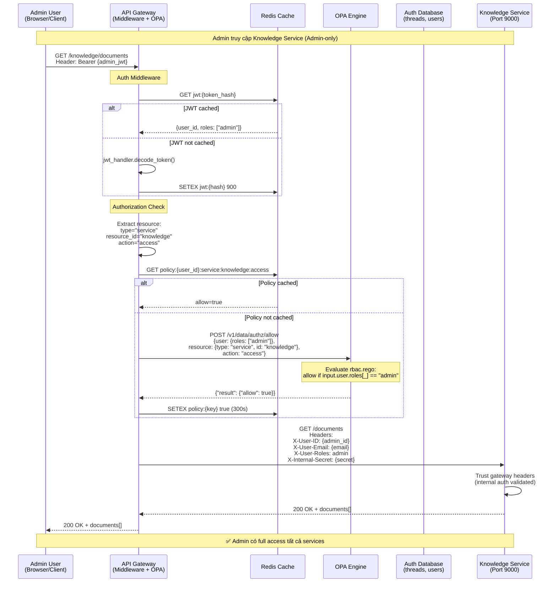
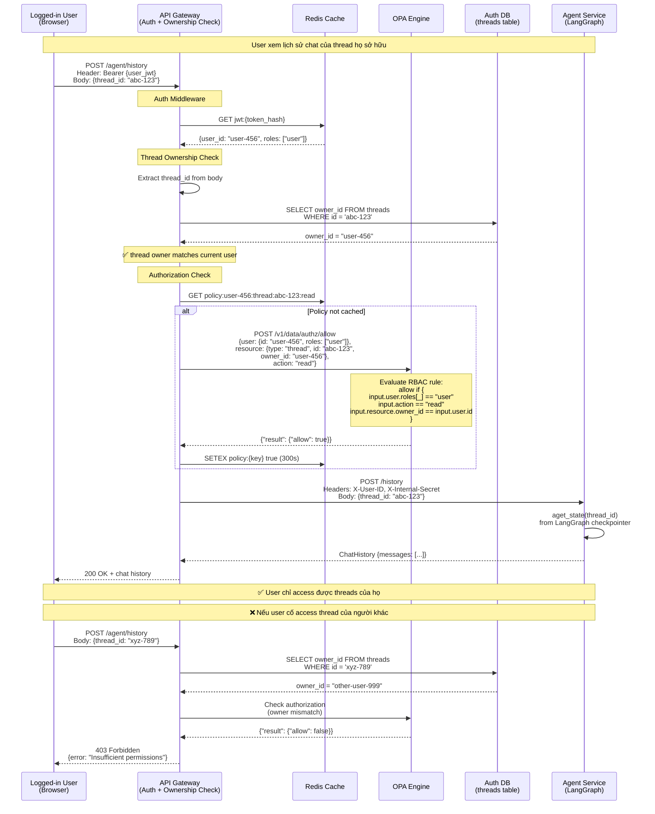
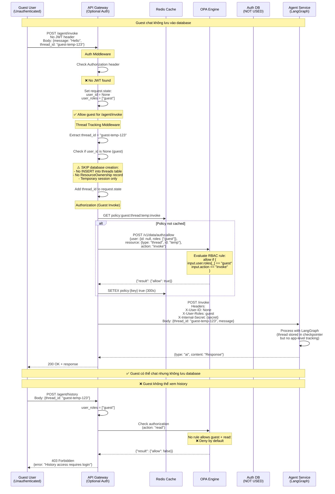
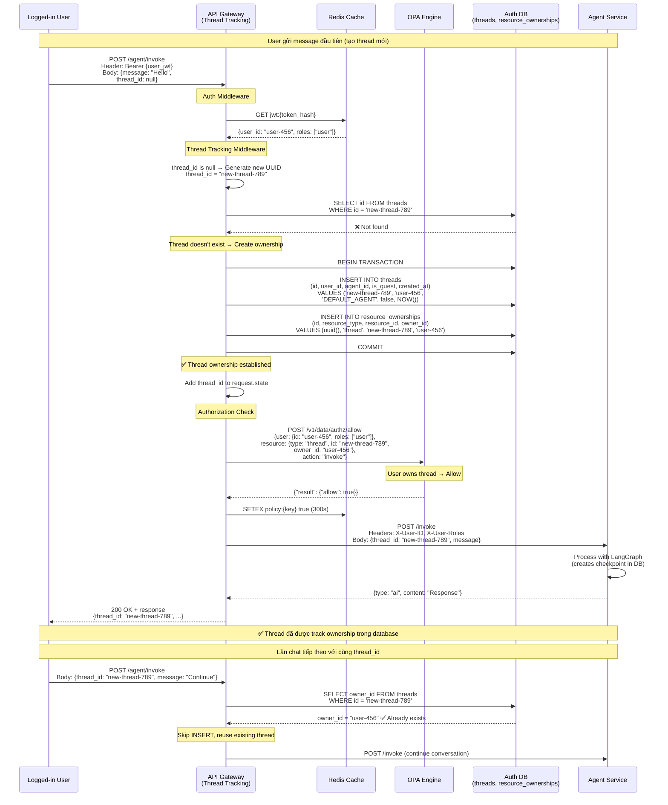
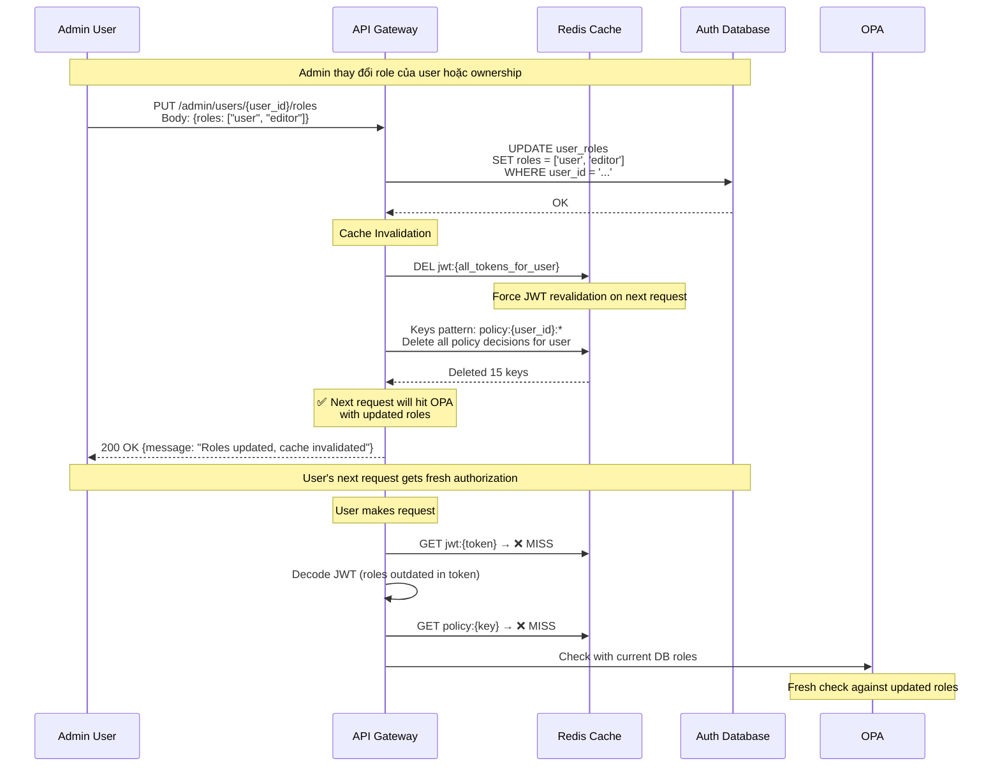
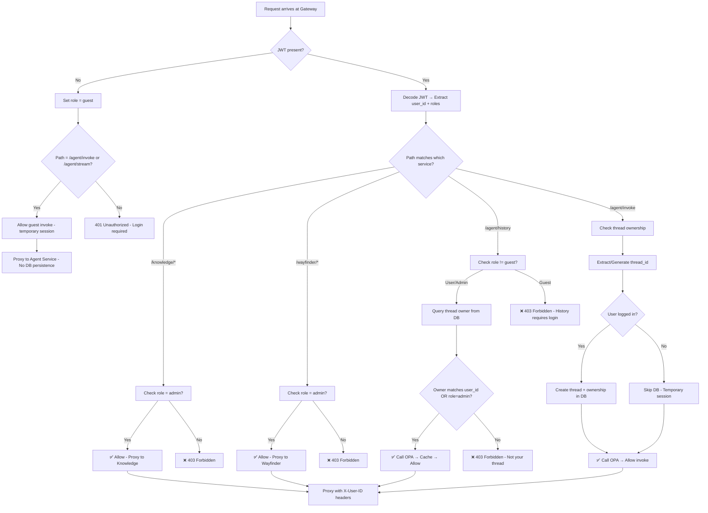

### 3. Integrate OPA policy engine
Deploy OPA container trong Docker Compose; gateway gọi OPA REST API (`POST /v1/data/authz/allow`) với input {user, resource, action}; viết RBAC policies trong `api_gateway/src/policies/rbac.rego` định nghĩa roles (admin, user, guest) và permissions: admin full access tất cả services/resources, user access own threads + invoke agent, guest chỉ invoke agent (temporary sessions).

### 4. Build unified user/role schema
Tạo shared database schema: User (id UUID string, email, hashed_password, is_active, created_at), Role (id, name: admin/user/guest), UserRole (user_id, role_id); Thread (id, user_id, agent_id, is_guest, created_at, updated_at) cho thread ownership tracking; ResourceOwnership (resource_type, resource_id, owner_id) cho extensibility; Alembic migrations trong `api_gateway/alembic/`.

### 5. Implement request routing middleware
Middleware trong `api_gateway/src/middleware/auth_middleware.py`: extract JWT (optional cho /agent/invoke) → validate → cache JWT (Redis) → inject user info to request state; nếu no JWT thì set role="guest"; Thread tracking middleware trong `api_gateway/src/middleware/thread_tracking_middleware.py`: intercept /agent/invoke|stream → extract/generate thread_id → create Thread + ResourceOwnership records for authenticated users only (skip for guests); Authorization helper trong `api_gateway/src/auth/authorization.py`: call OPA với owner_id từ threads table → cache decision (Redis 5min TTL) → raise 403 if denied; Proxy middleware trong `api_gateway/src/middleware/proxy_middleware.py`: proxy request đến agent-service (8080) hoặc knowledge (9000) via httpx → inject `X-User-ID`, `X-User-Email`, `X-User-Roles`, `X-Internal-Secret` headers → forward response.


### 8. Authorization Flow Implementation
**Route-level authorization**: Mỗi proxy route (agent_proxy, knowledge_proxy) extract resource info từ path (thread_id, doc_id) và determine action dựa trên HTTP method (GET=read, POST=invoke/create, PUT/PATCH=update, DELETE=delete). **Service-level authorization**: Knowledge và Wayfinder services chỉ allow admin role. **Resource ownership**: Query threads table để lấy owner_id, so sánh với current user_id. Call `check_authorization()` helper trước khi proxy request. **Guest handling**: /agent/invoke cho phép guests (no JWT) với temporary session, không tạo database records. **Error responses**: 401 Unauthorized nếu JWT required but missing; 403 Forbidden nếu OPA policy deny với detail message "Insufficient permissions to {action} {resource_type}". **Caching**: Policy decisions cached trong Redis với key pattern `policy:{user_id}:{resource_type}:{resource_id}:{action}`, TTL 5 phút.

### 9. Thread Ownership Tracking
**Thread lifecycle**: Threads table trong api_gateway database track ownership (id, user_id, agent_id, is_guest, created_at, updated_at). **Automatic creation**: Thread tracking middleware intercepts /agent/invoke, generates thread_id if missing, creates Thread + ResourceOwnership records for authenticated users. **Guest sessions**: Guests generate client-side thread_id, no database persistence, threads lost after session ends. **History access**: Requires user to be logged in and own the thread (verified via threads table owner_id). **Admin override**: Admin role can access all threads regardless of ownership.

### 10. Guest Sessions & Temporary Chat
**Unauthenticated access**: /agent/invoke và /agent/stream cho phép requests không có JWT (no Authorization header). **Guest role assignment**: Middleware detects missing JWT, sets `request.state.user_roles = ["guest"]` và `user_id = None`. **No database persistence**: Thread tracking middleware skips INSERT statements for guests, không tạo Thread hoặc ResourceOwnership records. **Client-side thread management**: Frontend generates và stores thread_id trong sessionStorage (not localStorage), thread bị lost khi đóng browser. **Restricted access**: Guests KHÔNG thể access /agent/history (403 Forbidden), /knowledge, /wayfinder, hoặc bất kỳ endpoint nào require read permissions. **Conversion flow**: Khi guest đăng ký/login, tạo user account và có thể track threads từ đó về sau (previous guest threads vẫn lost).

### 11. Service-Level Authorization
**Admin-only services**: Knowledge-base service và Wayfinder service CHỈ accessible bởi users với role="admin". **OPA policy check**: Gateway calls OPA với `resource.type="service"`, `resource.id="knowledge"|"wayfinder"`, `action="access"`. **403 response**: Non-admin users nhận "403 Forbidden: Admin access required" khi cố access các services này. **Proxy route protection**: knowledge_proxy.py và wayfinder_proxy.py implement authorization check trước khi proxy request downstream. **Service discovery**: Agent service accessible by all roles (admin, user, guest) nhưng action-specific permissions apply (invoke vs read).


# Further Considerations
### 2. RBAC → ReBAC Migration Path
Bắt đầu với RBAC đơn giản: roles = {admin, user, guest}, permissions cứng trong Rego. Sau khi stable, thêm ReBAC bằng cách: (a) thêm bảng ResourceRelation (subject_id, relation, object_id) như "user1 shares_with user2 thread123", (b) mở rộng Rego policies với graph traversal logic, (c) OPA built-in `walk()` function hỗ trợ relationship queries. **Không cần viết lại toàn bộ**, chỉ thêm rules mới.


## Sample RBAC Policy (Rego)

```rego
# api_gateway/src/policies/rbac.rego
package authz

import future.keywords.if
import future.keywords.in

# Default deny
default allow := false

# Admin role allows everything (all services, all resources)
allow if {
    input.user.roles[_] == "admin"
}

# Service-level authorization: Knowledge service (admin only)
allow if {
    input.user.roles[_] == "admin"
    input.resource.type == "service"
    input.resource.id == "knowledge"
    input.action == "access"
}

# Service-level authorization: Wayfinder service (admin only)
allow if {
    input.user.roles[_] == "admin"
    input.resource.type == "service"
    input.resource.id == "wayfinder"
    input.action == "access"
}

# User role can invoke agent (own threads only)
allow if {
    input.user.roles[_] == "user"
    input.action == "invoke"
    input.resource.type == "thread"
    input.resource.owner_id == input.user.id
}

# User role can read thread history (own threads only)
allow if {
    input.user.roles[_] == "user"
    input.action == "read"
    input.resource.type == "thread"
    input.resource.owner_id == input.user.id
}

# Guest role can only invoke agent (temporary sessions, no history access)
allow if {
    input.user.roles[_] == "guest"
    input.action == "invoke"
    input.resource.type == "thread"
}

# Migration path: Add ReBAC rules later without breaking existing RBAC
# Future: Check ResourceRelation table for "shared_with" relationships
```

## Performance Benchmark Targets

| Metric | Target | Strategy |
|--------|--------|----------|
| **JWT validation** | <5ms | Redis cache (100% hit ratio for active tokens) |
| **OPA policy decision** | <10ms | Redis cache (5min TTL) + OPA bundle mode |
| **Gateway overhead** | <20ms | Async httpx proxy, connection pooling |
| **Cache invalidation** | <1s | Pub/sub events when roles change |
| **Horizontal scale** | Linear to 10+ instances | Stateless design, shared Redis |

## RBAC → ReBAC Migration Example

### Phase 1 (RBAC): Roles cứng
```rego
allow if input.user.roles[_] == "user"
allow if input.user.roles[_] == "guest"
```

### Phase 2 (ReBAC): Thêm relationships
```rego
# User can access threads they own OR threads shared with them
allow if {
    relation := data.relations[_]
    relation.subject_id == input.user.id
    relation.object_id == input.resource.id
    relation.relation == "can_read"  # or "shared_with"
}
```

### Database schema mở rộng
```sql
CREATE TABLE resource_relations (
    subject_id UUID,
    relation VARCHAR(50),  -- "owns", "can_read", "can_edit", "shared_with"
    object_id UUID,
    resource_type VARCHAR(50)
);
```

## Implementation Checklist

- [x] Setup api_gateway/ folder structure
- [x] Install dependencies (PyJWT, redis, httpx, email-validator)
- [x] Create User/Role SQLAlchemy models
- [x] Write Alembic migrations
- [x] Implement JWT handler (create/decode/refresh)
- [x] Implement password hashing (SHA256 + bcrypt)
- [x] Create auth endpoints (/login, /register, /refresh)
- [x] Write RBAC Rego policies
- [x] Deploy OPA container (docker-compose)
- [x] Setup Redis cache service (docker-compose)
- [x] Implement auth middleware (JWT extraction & validation)
- [x] Implement OPA authorization checks (check_policy helper)
- [x] Build proxy middleware for routing
- [x] Add request/response caching (JWT + policy decisions)
- [x] Inject X-User-ID headers to downstream
- [x] Configure Docker Compose with Redis, OPA, PostgreSQL
- [x] Add health check endpoints
- [ ] Create threads table migration (id, user_id, agent_id, is_guest, created_at, updated_at)
- [ ] Add guest role to roles table migration
- [ ] Update RBAC Rego policies with admin/user/guest roles + service-level authz
- [ ] Implement thread tracking middleware (auto-create Thread + ResourceOwnership for users)
- [ ] Update auth middleware to allow guests for /agent/invoke endpoints
- [ ] Add service-level authorization for Knowledge (admin only)
- [ ] Add service-level authorization for Wayfinder (admin only)
- [ ] Enable resource ownership checks in agent proxy (query threads table for owner_id)
- [ ] Add thread management endpoints (GET /threads, GET /threads/{id}, DELETE /threads/{id})
- [ ] Create thread_service.py database layer (create_thread, get_thread_owner, list_user_threads)
- [ ] Update downstream services to validate X-Internal-Secret header
- [ ] Implement cache invalidation when roles/ownership change
- [ ] Update frontend to handle guest mode (sessionStorage for thread_id)
- [ ] Implement rate limiting
- [ ] Add Prometheus metrics
- [ ] Setup load balancer (Nginx/Traefik)
- [ ] Test horizontal scaling (3+ instances)
- [ ] Document API endpoints
- [ ] Write integration tests (admin access all, user access own, guest temporary only)

---

## Chi tiết Luồng Authorization theo Vai trò

### 1. Admin Role - Truy cập Knowledge Service (Admin-Only)



### 2. User Role - Truy cập Thread History (Resource Ownership)



### 3. Guest Role - Chat tạm thời (No Database Persistence)



### 4. User Role - Tạo Thread mới (Ownership Tracking)



### 5. Luồng Cache Invalidation (Role hoặc Ownership thay đổi)



---

## Tổng kết Phân quyền theo Role

| Role | Knowledge Service | Wayfinder Service | Agent Invoke | Agent History (Read) | Thread Ownership |
|------|-------------------|-------------------|--------------|----------------------|------------------|
| **Admin** | ✅ Full access | ✅ Full access | ✅ All threads | ✅ All threads | N/A (can access all) |
| **User** | ❌ Forbidden | ❌ Forbidden | ✅ Own threads only | ✅ Own threads only | ✅ Created in DB |
| **Guest** | ❌ Unauthorized | ❌ Unauthorized | ✅ Temporary only | ❌ Forbidden | ❌ No DB record |

### Chi tiết Actions theo Role

| Action | Admin | User (Logged In) | Guest (Unauthenticated) |
|--------|-------|------------------|-------------------------|
| **POST /auth/login** | ✅ | ✅ | ✅ |
| **POST /auth/register** | ✅ | ✅ | ✅ |
| **GET /knowledge/documents** | ✅ All documents | ❌ 403 Forbidden | ❌ 401 Unauthorized |
| **POST /knowledge/documents** | ✅ Can create | ❌ 403 Forbidden | ❌ 401 Unauthorized |
| **GET /wayfinder/navigate** | ✅ Full access | ❌ 403 Forbidden | ❌ 401 Unauthorized |
| **POST /agent/invoke** | ✅ All threads | ✅ Own threads | ✅ Temporary (no DB) |
| **POST /agent/stream** | ✅ All threads | ✅ Own threads | ✅ Temporary (no DB) |
| **POST /agent/history** | ✅ All threads | ✅ Own threads only | ❌ 403 Forbidden |
| **GET /threads** | ✅ All users' threads | ✅ Own threads only | ❌ 401 Unauthorized |
| **DELETE /threads/{id}** | ✅ Any thread | ✅ Own thread only | ❌ 401 Unauthorized |

### Resource-Level Access Matrix

| Resource Type | Admin | User (Owner) | User (Non-Owner) | Guest |
|---------------|-------|--------------|------------------|-------|
| **Thread (read history)** | ✅ | ✅ | ❌ 403 | ❌ 403 |
| **Thread (invoke/chat)** | ✅ | ✅ | ❌ 403 | ✅ (temp) |
| **Thread (delete)** | ✅ | ✅ | ❌ 403 | ❌ 401 |
| **Document (read)** | ✅ | ❌ 403 | ❌ 403 | ❌ 401 |
| **Document (write)** | ✅ | ❌ 403 | ❌ 403 | ❌ 401 |
| **Service: Knowledge** | ✅ | ❌ 403 | ❌ 403 | ❌ 401 |
| **Service: Wayfinder** | ✅ | ❌ 403 | ❌ 403 | ❌ 401 |

### Authorization Decision Flow Summary


