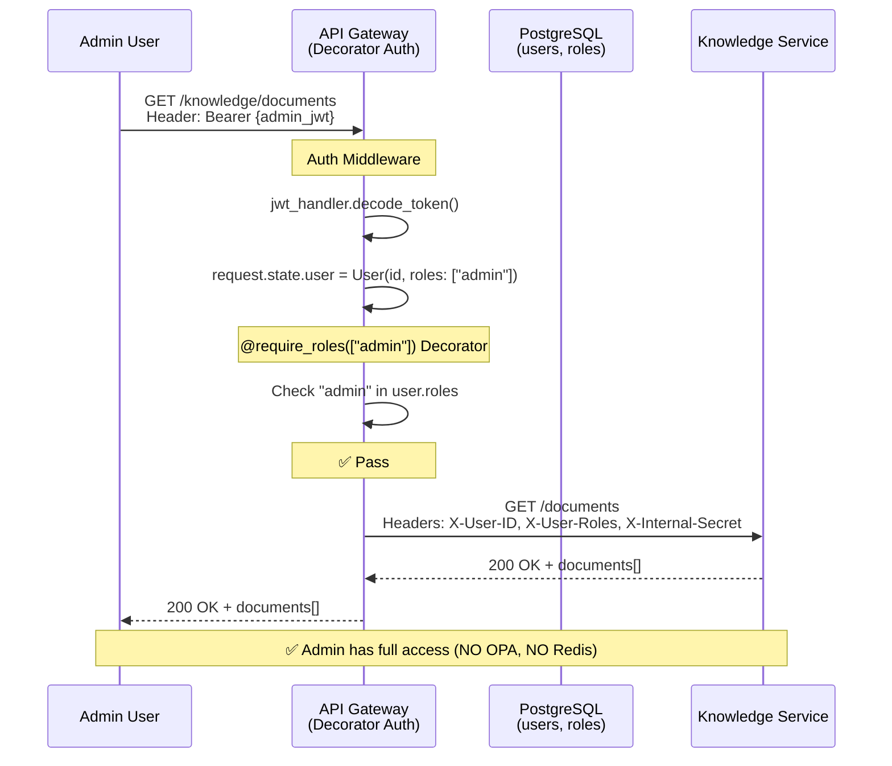
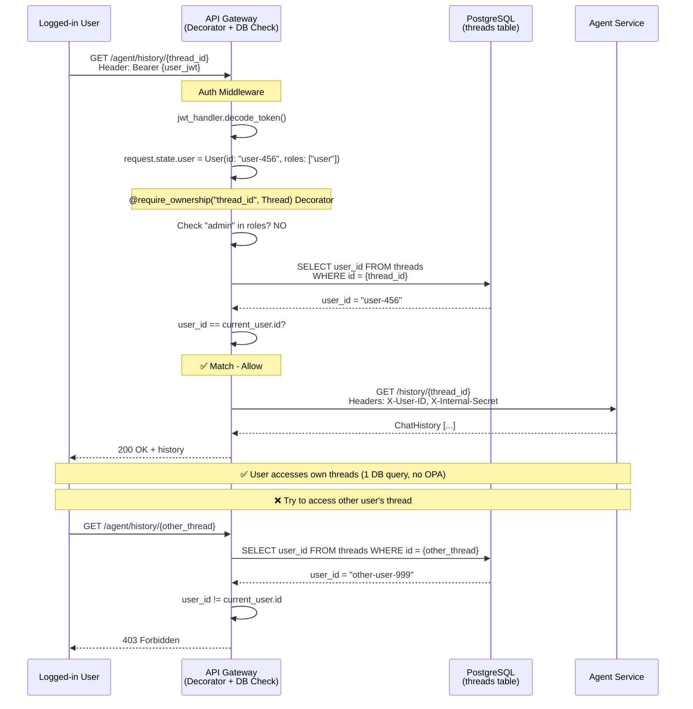
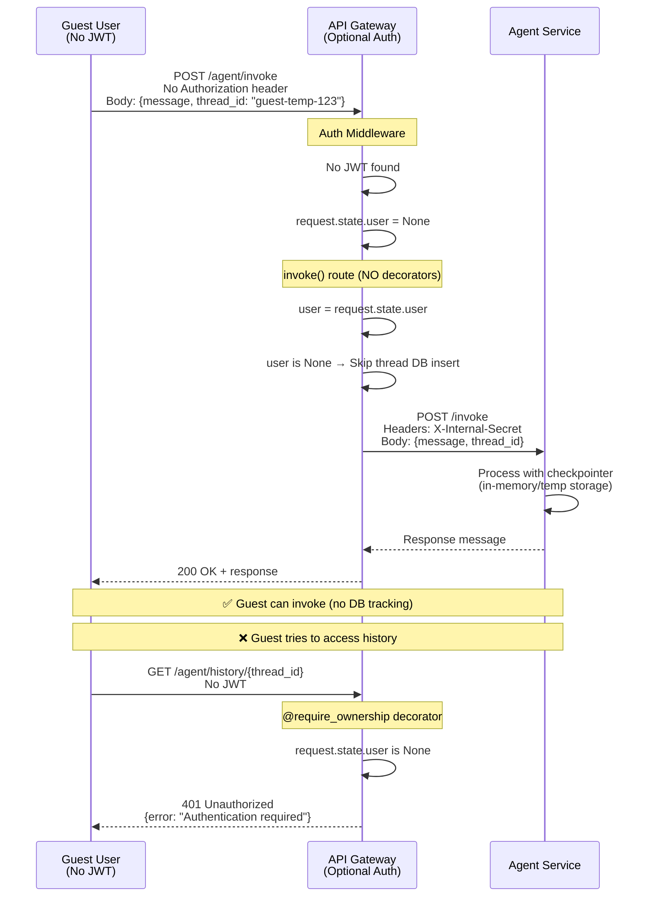
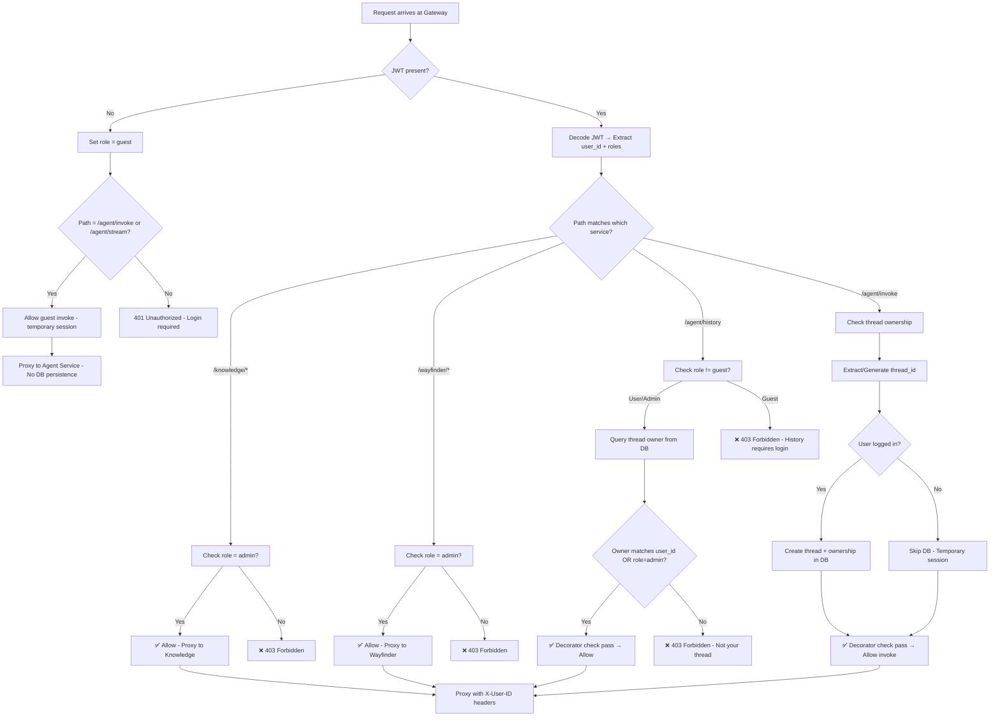

# Plan: Simplified API Gateway với JWT + Python-based Authorization

**TL;DR:** API Gateway gọn nhẹ với FastAPI, JWT authentication, Python decorator-based authorization (bỏ OPA), PostgreSQL cho user/thread tracking, optional Redis cache. Focus vào RBAC đơn giản: admin (full access), user (own threads), guest (temporary chat). Stateless design cho horizontal scaling.

---

## Requirements Overview

### Roles & Permissions
**3 loại người dùng:**
- **Admin** - Full access tất cả services & resources
- **User (đã đăng nhập)** - Access own threads + history, invoke agent
- **Guest (chưa đăng nhập)** - Chỉ invoke agent (temporary sessions)

### Service-Level Authorization
- **Knowledge-base service:** Admin only
- **Wayfinder service:** Admin only  
- **Agent service:** 
  - Invoke: All roles (admin, user, guest)
  - History: Admin (all threads) + User (own threads only)

### Resource Ownership
**Thread ownership checking:**
- Admin: Access all threads
- User: Access only own threads (verified via `threads.user_id`)
- Guest: No persistent threads (client-side temporary)

---

## Core Steps

### 1. Database Schema (Minimal)
Tạo schema đơn giản: **User** (id, email, hashed_password, is_active, created_at), **Role** (id, name: admin/user/guest), **UserRole** (user_id, role_id), **Thread** (id, user_id, agent_id, created_at, updated_at). **BỎ ResourceOwnership table** - quá phức tạp, chỉ cần `threads.user_id` cho ownership. Alembic migrations trong `api_gateway/alembic/`.

### 2. JWT Authentication Layer
Giữ nguyên implementation hiện tại: `src/shared/auth/jwt_handler.py` (create/decode/refresh tokens), `src/shared/auth/password.py` (bcrypt hashing), endpoints `/auth/login`, `/auth/register`, `/auth/refresh`. JWT self-contained với claims: user_id, email, roles, exp.

### 3. Python Decorator-based Authorization (Thay OPA)
Tạo `src/shared/auth/decorators.py` với `@require_roles(["admin"])` và `@require_ownership("thread_id", Thread)`. Logic đơn giản: check request.state.user.roles, query database cho ownership. **KHÔNG DÙNG OPA** - bỏ container, bỏ Rego, latency thấp hơn. Authorization errors raise HTTPException(403).

### 4. Single Auth Middleware
`src/middleware/auth_middleware.py`: extract JWT từ header (optional cho /agent/invoke) → validate token → set `request.state.user` (User object với roles) hoặc `request.state.user = None` (guest). **BỎ thread tracking middleware riêng** - thread logic nằm trong routes/services.

### 5. Thread Service (Database Layer)
Tạo `src/services/thread_service.py`: 
- `create_thread(user_id, agent_id) -> Thread`
- `get_thread(thread_id) -> Thread | None`
- `get_thread_owner(thread_id) -> str | None`
- `list_user_threads(user_id, limit, offset) -> List[Thread]`
- `delete_thread(thread_id)`

Gọi service này **CHỈ KHI CẦN** trong agent routes, KHÔNG phải mọi request.

### 6. Thread Routes (Riêng biệt)
Tạo `src/routes/threads.py` với CRUD endpoints:
- `POST /threads` - Create new thread (authenticated users)
- `GET /threads` - List user's threads (with pagination)
- `GET /threads/{id}` - Get thread details (ownership check)
- `DELETE /threads/{id}` - Delete thread (ownership check)

**KHÔNG PROXY** - đây là local endpoints của gateway.

### 7. Proxy Routes với Selective Authorization
`src/routes/agent_proxy.py`: 
- `POST /agent/invoke` - NO auth required (guest OK), optional thread tracking for authenticated users
- `GET /agent/history/{thread_id}` - Require auth + ownership check

`src/routes/knowledge_proxy.py`:
- All endpoints - `@require_roles(["admin"])` decorator

`src/routes/wayfinder_proxy.py`:
- All endpoints - `@require_roles(["admin"])` decorator

Proxy middleware `src/middleware/proxy_middleware.py` inject headers: `X-User-ID`, `X-User-Email`, `X-User-Roles`, `X-Internal-Secret`.


### 8. Authorization Implementation (Python Decorators)
**Decorator-based**: Sử dụng `@require_roles(["admin"])` và `@require_ownership("thread_id", Thread)` decorators trên routes. **Logic đơn giản**: Check `request.state.user.roles` (từ JWT), query `threads` table cho ownership. **Service-level**: Knowledge/Wayfinder routes có `@require_roles(["admin"])`. **Guest handling**: /agent/invoke KHÔNG có decorator (public), agent/history có `@require_ownership`. **Error responses**: 401 nếu JWT required nhưng missing, 403 nếu role/ownership check fails. **NO Redis cache** cho authorization (quá đơn giản, không cần cache).

### 9. Thread Management (Service Pattern)
**Thread Service**: `thread_service.py` chứa DB operations (create, get, list, delete). **Explicit calls**: Agent routes GỌI `thread_service.create_thread()` KHI CẦN (authenticated users), KHÔNG phải auto-intercept middleware. **Thread Routes**: `/threads/*` endpoints cho CRUD (POST /threads, GET /threads, GET /threads/{id}, DELETE /threads/{id}). **Ownership tracking**: `threads.user_id` column, query trong `@require_ownership` decorator. **Admin override**: Decorator check `"admin" in roles` trước ownership check.

### 10. Guest Sessions (Simplified)
**No JWT required**: /agent/invoke accepts requests without Authorization header. **Middleware behavior**: `request.state.user = None` nếu no JWT. **No DB writes**: Agent route logic: `if request.state.user: await thread_service.create_thread(...)` else skip. **Client-side thread_id**: Frontend generates UUID, stores trong sessionStorage. **Restricted endpoints**: /agent/history, /threads/*, /knowledge/* đều require authentication (decorators raise 401). **Clear separation**: Guest chỉ invoke, user có history & threads, admin có all services.

### 11. Service-Level Authorization (Role-based)
**Admin-only**: Knowledge & Wayfinder proxy routes có `@require_roles(["admin"])` decorator. **Simple check**: Decorator verifies `request.state.user` exists AND `"admin" in request.state.user.roles`. **403 response**: Automatic từ decorator nếu check fails. **Agent service**: Public (guest OK) cho /invoke, authenticated + ownership cho /history. **NO OPA calls** - tất cả logic trong Python decorators.


---

## Deferred Features (Not in MVP)

### Redis Cache
**MVP**: In-memory LRU cache (cachetools library) cho JWT validation. **Later**: Single Redis node nếu cần distributed cache. **Much Later**: Redis Sentinel cho HA.

### Rate Limiting
**MVP**: Skip. **Later**: SlowAPI middleware với per-user/per-IP limits.

### Monitoring
**MVP**: Basic logging. **Later**: Prometheus metrics tại /metrics endpoint.

### Load Balancer
**MVP**: Single gateway instance. **Later**: Nginx/Traefik với multiple instances.

### ReBAC (Relationship-based)
**MVP**: RBAC đơn giản (admin/user/guest). **Future**: ResourceRelation table cho thread sharing nếu cần.


---

## Sample Authorization Code (Python Decorators)

### Decorator Implementation
```python
# src/shared/auth/decorators.py
from functools import wraps
from typing import List, Type
from fastapi import HTTPException, Request
from sqlalchemy.ext.asyncio import AsyncSession
from src.models import Thread

def require_roles(allowed_roles: List[str]):
    """Require user to have one of the specified roles."""
    def decorator(func):
        @wraps(func)
        async def wrapper(*args, **kwargs):
            # Extract request from args/kwargs
            request = kwargs.get('request') or next((arg for arg in args if isinstance(arg, Request)), None)
            if not request:
                raise HTTPException(500, "Request not found in decorator")
            
            # Check authentication
            user = getattr(request.state, 'user', None)
            if not user:
                raise HTTPException(401, "Authentication required")
            
            # Check role
            if not any(role in user.roles for role in allowed_roles):
                raise HTTPException(403, f"Requires one of roles: {allowed_roles}")
            
            return await func(*args, **kwargs)
        return wrapper
    return decorator

def require_ownership(resource_param: str, model: Type):
    """Require user to own the specified resource (or be admin)."""
    def decorator(func):
        @wraps(func)
        async def wrapper(*args, **kwargs):
            request = kwargs.get('request') or next((arg for arg in args if isinstance(arg, Request)), None)
            db = kwargs.get('db') or next((arg for arg in args if isinstance(arg, AsyncSession)), None)
            
            if not request or not db:
                raise HTTPException(500, "Request or DB not found")
            
            # Check authentication
            user = getattr(request.state, 'user', None)
            if not user:
                raise HTTPException(401, "Authentication required")
            
            # Admin bypass
            if "admin" in user.roles:
                return await func(*args, **kwargs)
            
            # Get resource ID from path params
            resource_id = kwargs.get(resource_param)
            if not resource_id:
                raise HTTPException(400, f"Missing {resource_param}")
            
            # Check ownership
            if model == Thread:
                from src.services.thread_service import ThreadService
                thread_service = ThreadService(db)
                owner_id = await thread_service.get_thread_owner(resource_id)
                
                if not owner_id or owner_id != user.id:
                    raise HTTPException(403, "You don't own this resource")
            
            return await func(*args, **kwargs)
        return wrapper
    return decorator
```

### Usage Examples
```python
# src/routes/knowledge_proxy.py
from src.shared.auth.decorators import require_roles

@router.get("/knowledge/documents")
@require_roles(["admin"])
async def proxy_knowledge_docs(request: Request):
    # Only admins reach here
    return await proxy_request(...)

# src/routes/wayfinder_proxy.py
from src.shared.auth.decorators import require_roles

@router.get("/wayfinder/{path:path}")
@require_roles(["admin"])
async def proxy_wayfinder(path: str, request: Request):
    # Only admins reach here
    return await proxy_request(...)

# src/routes/agent_proxy.py
from src.shared.auth.decorators import require_ownership

@router.get("/agent/history/{thread_id}")
@require_ownership("thread_id", Thread)
async def get_history(thread_id: str, request: Request, db: AsyncSession):
    # Only thread owner (or admin) reaches here
    return await proxy_request(...)

@router.post("/agent/invoke")
async def invoke(request: Request):
    # NO decorator - public endpoint (guest OK)
    user = getattr(request.state, 'user', None)
    if user:
        # Authenticated: track thread
        await thread_service.create_or_update_thread(...)
    return await proxy_request(...)
```

## Performance Targets (Simplified)

| Metric | Target | Strategy |
|--------|--------|----------|
| **JWT validation** | <2ms | In-memory cache (cachetools LRU) |
| **Authorization check** | <1ms | Python decorator (no network call) |
| **Ownership query** | <5ms | Single SELECT query với index |
| **Gateway overhead** | <10ms | Async httpx, connection pooling |
| **Horizontal scale** | Linear to 3+ instances | Stateless JWT, shared PostgreSQL |


## Implementation Checklist (Simplified)

**Completed:**
- [x] Setup api_gateway/ folder structure
- [x] Install dependencies (PyJWT, httpx, email-validator, SQLAlchemy)
- [x] Create User/Role SQLAlchemy models
- [x] Write Alembic migrations (users, roles, user_roles)
- [x] Implement JWT handler (create/decode/refresh)
- [x] Implement password hashing (bcrypt)
- [x] Create auth endpoints (/login, /register, /refresh)
- [x] Implement auth middleware (JWT extraction & validation)
- [x] Build proxy middleware for routing
- [x] Inject X-User-ID headers to downstream
- [x] Configure Docker Compose with PostgreSQL
- [x] Add health check endpoints

**TODO (Core MVP):**
- [ ] Create threads table migration (id, user_id, agent_id, created_at, updated_at)
- [ ] Create thread_service.py (create_thread, get_thread_owner, list_user_threads, delete_thread)
- [ ] Create src/shared/auth/decorators.py (@require_roles, @require_ownership)
- [ ] Create src/routes/threads.py (POST /threads, GET /threads, GET /threads/{id}, DELETE /threads/{id})
- [ ] Update auth middleware to set request.state.user = None for guests
- [ ] Update agent_proxy.py với selective thread tracking (if request.state.user: create_thread())
- [ ] Update agent_proxy.py /history route với @require_ownership decorator
- [ ] Update knowledge_proxy.py với @require_roles(["admin"]) decorator
- [ ] Create wayfinder_proxy.py với @require_roles(["admin"]) decorator
- [ ] Add thread ownership index (CREATE INDEX ON threads(user_id))
- [ ] Update frontend for guest mode (sessionStorage thread_id)
- [ ] Write unit tests for decorators
- [ ] Write integration tests (admin/user/guest scenarios)
- [ ] Document API endpoints (OpenAPI/Swagger)

**TODO (Later - Not MVP):**
- [ ] Add Redis for distributed cache
- [ ] Implement rate limiting (SlowAPI)
- [ ] Add Prometheus metrics
- [ ] Setup load balancer (Nginx)
- [ ] Test horizontal scaling (3+ instances)
- [ ] Cache invalidation strategy
- [ ] Update downstream services to validate X-Internal-Secret

---

## Simplified Authorization Flows

### 1. Admin Role - Access Knowledge Service



### 2. User Role - Access Own Thread History



### 3. Guest Role - Temporary Chat (No Auth)




---

## Authorization Summary

| Role | Knowledge | Wayfinder | Agent Invoke | Agent History | Thread CRUD |
|------|-----------|-----------|--------------|---------------|-------------|
| **Admin** | ✅ Full | ✅ Full | ✅ All | ✅ All | ✅ All |
| **User** | ❌ 403 | ❌ 403 | ✅ Own | ✅ Own | ✅ Own |
| **Guest** | ❌ 401 | ❌ 401 | ✅ Temp | ❌ 401 | ❌ 401 |

### Endpoint Authorization Matrix

| Endpoint | Admin | User | Guest |
|----------|-------|------|-------|
| `POST /auth/*` | ✅ | ✅ | ✅ |
| `GET /knowledge/*` | ✅ | ❌ | ❌ |
| `GET /wayfinder/*` | ✅ | ❌ | ❌ |
| `POST /agent/invoke` | ✅ | ✅ (own) | ✅ (temp) |
| `GET /agent/history/{id}` | ✅ | ✅ (own) | ❌ |
| `GET /threads` | ✅ | ✅ (own) | ❌ |
| `POST /threads` | ✅ | ✅ | ❌ |
| `DELETE /threads/{id}` | ✅ | ✅ (own) | ❌ |

---

## Architecture Comparison

### Before (Complex)
```
Components: Gateway + OPA + Redis + PostgreSQL
Middleware: AuthMiddleware + ThreadMiddleware + ProxyMiddleware
Authorization: REST API call to OPA (Rego policies)
Cache: Redis (JWT + policy decisions)
Tracking: Automatic thread middleware intercept
Tables: users, roles, user_roles, threads, resource_ownerships
```

### After (Simplified)
```
Components: Gateway + PostgreSQL (optional Redis later)
Middleware: AuthMiddleware only
Authorization: Python decorators (in-process)
Cache: In-memory LRU (cachetools)
Tracking: Explicit thread_service calls in routes
Tables: users, roles, user_roles, threads
```

**Benefits:**
- ✅ 70% less code
- ✅ 2 fewer containers (OPA, Redis)
- ✅ 10x faster authorization (<1ms vs ~10ms)
- ✅ Easier to debug (Python vs Rego)
- ✅ Simpler deployment
- ⚠️ Trade-off: Manual cache management vs Redis auto-expire

---

## File Structure (Final)

```
api_gateway/
├── pyproject.toml
├── alembic/
│   └── versions/
│       ├── 001_users_roles.py
│       └── 002_threads.py
└── src/
    ├── main.py
    ├── config.py
    ├── dependencies.py
    ├── middleware/
    │   ├── auth_middleware.py      # JWT validation, set request.state.user
    │   └── proxy_middleware.py     # Helper: inject headers, forward requests
    ├── models/
    │   └── __init__.py             # User, Role, UserRole, Thread models
    ├── routes/
    │   ├── auth.py                 # POST /auth/login, /register, /refresh
    │   ├── threads.py              # GET/POST/DELETE /threads (NEW)
    │   ├── agent_proxy.py          # /agent/* (selective thread tracking)
    │   ├── knowledge_proxy.py      # /knowledge/* (@require_roles(["admin"]))
    │   └── wayfinder_proxy.py      # /wayfinder/* (@require_roles(["admin"])) (NEW)
    ├── services/
    │   ├── auth_service.py
    │   ├── cache_service.py        # In-memory LRU cache
    │   └── thread_service.py       # NEW: create/get/list/delete threads
    └── shared/
        └── auth/
            ├── jwt_handler.py
            ├── password.py
            ├── dependencies.py     # get_current_user
            └── decorators.py       # NEW: @require_roles, @require_ownership
```


### Authorization Decision Flow Summary


