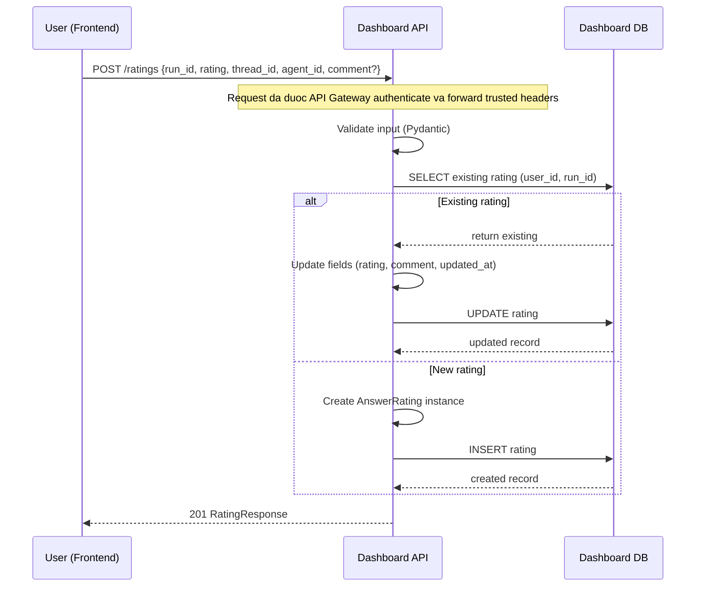
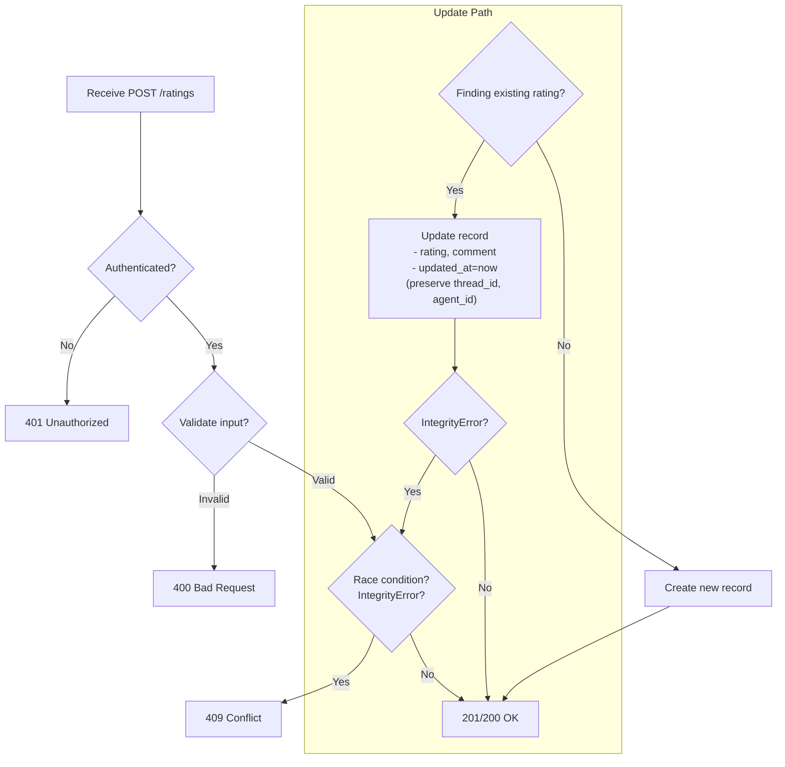

# Answer Rating Feature - Implementation Plan

## CONTEXT

**Vấn đề**: Dashboard service hiện tại chưa có cơ chế đánh giá câu trả lời AI. User và admin cần cách để:
- User: biểu đạt sự hài lòng/không hài lòng với câu trả lời từ chatbot
- Admin: thu thập feedback để phân tích và cải thiện hệ thống AI

**Giải pháp**: Thêm API rating (like/dislike + optional comment) vào dashboard service. Rating được xác định bằng `run_id` (UUID từ agent service) và lưu trong database riêng của dashboard với unique constraint và indexes.

**Kết quả mong đợi**:
- User có thể rate mỗi answer 1 lần, có thể update sau
- Admin có dashboard với stats theo agent và thread
- Feedback data dùng để improve AI models (future ML loop)

---

## PHẦN TỔNG QUAN

### Mục tiêu & Scope

Thêm tính năng đánh giá câu tr lời AI vào **dashboard service**:
- User (owner của thread) có thể **like** hoặc **dislike** câu trả lời
- Khi dislike, có thể thêm **comment optional** (max 1000 chars)
- Mỗi user chỉ có **1 rating/answer**, có thể thay đổi sau
- Admin có thể rating bất kỳ answer nào và xem stats
- Rating lưu trong **dashboard DB** (table `dashboard_answer_ratings`)
- Dùng cho admin analytics và AI feedback loop

**Không bao gồm**: Content moderation, rate limiting, public rating view.

### Yêu cầu người dùng (từ lịch sử hội thoại)

| Yêu cầu | Chi tiết |
|---------|----------|
| Rating identifier | Dùng `run_id` từ agent-service-toolkit (ChatMessage.run_id) |
| Storage | Lưu trong dashboard database |
| Authorization | Chỉ owner thread được rating thread của họ; admin có quyền rating mọi thread |
| Uniqueness | 1 like OR (1 dislike + optional comment) per user per message |
| Update rule | Có thể thay đổi rating; không được like + dislike cùng lúc; khi switch, updated_at được ghi nhận |
| Ownership validation | Trust frontend (frontend đã auth qua API Gateway) |
| Analytics | Cần stats theo agent (like/dislike count, percentage) |
| Purpose | User satisfaction, AI improvement feedback, admin dashboard |

### Clarifying Questions & Answers

| Câu hỏi | Trả lời |
|---------|---------|
| Ai được phép rating? | Chỉ user sở hữu thread (owner). Admin có quyền rating mọi thread. |
| 1 user rating mấy lần cho 1 answer? | Chỉ 1 rating (like HOẶC dislike+comment). Có thể thay đổi sau. |
| Có thể like và dislike cùng lúc? | Không. Chỉ 1 trong 2. |
| Lưu history rating changes không? | Option A: Không lưu history, chỉ `updated_at`. |
| Làm sao xác định ownership? | Option A: Trust frontend. Backend không validate với agent service. |
| `run_id` có reliable không? | Yes. UUID4, unique globally, luôn populated. |
| Rating mục đích gì? | User satisfaction measurement, AI feedback loop, admin analytics. |
| Comment bắt buộc với dislike? | Optional. Validate length ≤1000. |

### Assumptions (đã xác nhận)

1. Frontend nhận được `run_id` từ mỗi AI message qua agent service ChatHistory API.
2. Frontend biết `thread_id` và `agent_id` để gửi kèm (denormalization).
3. Rating không cần public view.
4. Stats query on-the-fly là đủ (không cần real-time aggregation).
5. Comment không cần content moderation ban đầu.
6. Không cần rate limiting.
7. Dashboard có database setup (PostgreSQL, SQLModel, Alembic).
8. Dashboard không import auth dependency từ service khác; request đã được API Gateway xác thực và forward trusted headers (`X-User-Id`, `X-User-Roles`).
9. Table naming **phải có prefix `dashboard_`** (ví dụ: `dashboard_answer_ratings`).

### Risks & Mitigations

| Rủi ro | Tác động | Khả năng | Giải pháp |
|--------|----------|----------|-----------|
| Race condition khi upsert cùng `(user_id, run_id)` | 2 ratings bị tạo | Low | Unique constraint + catch `IntegrityError` → raise 409 Conflict |
| User rating answer không thuộc thread của họ (frontend bug) | Analytics polluted | Medium | Trust frontend (theo yêu cầu). Future: optional validation qua thread service API. |
| Comment chứa nội dung độc hại | Bad UX | Medium | Validate length ≤1000. Future: content moderation. |
| Table lớn (mỗi message có rating) | Performance degrade | Medium | Indexes trên `run_id`, `user_id`, `thread_id`, `agent_id`. Future: partitioning. |
| Migration fail | Downtime | Low | Migration là ADD table. Test staging. Manual review migration file. |
| `run_id` không unique globally? | Cross-thread contamination | Very Low | UUID4 đã verified. No mitigation needed. |

---

## PHẦN CHI TIẾT IMPLEMENTATION

### Kiến trúc tổng quan

**Layered architecture** theo convention:
- **Models** (SQLModel): Database table definition
- **Schemas** (Pydantic): API request/response DTOs
- **Repositories**: Pure data access (CRUD)
- **Services**: Business logic, validation
- **Routes**: FastAPI endpoints với dependency injection

**Database**: PostgreSQL, SQLModel, Alembic migrations.

**Auth/Trust boundary**: Dashboard không phụ thuộc code auth từ service khác. API Gateway xử lý JWT và chuyển identity qua trusted headers; Dashboard chỉ parse headers để authorize theo nghiệp vụ rating.

**Tables**:
- `dashboard_answer_ratings`: rating data với unique constraint `(user_id, run_id)`
- Indexes: `user_id`, `run_id`, `thread_id`, `agent_id`

### Cấu trúc thư mục

```
dashboard/
├── src/
│   ├── models/__init__.py          # Thêm AnswerRating model
│   ├── schemas/rating.py           # New file: RatingCreate, Update, Response, Stats
│   ├── repositories/rating_repository.py  # New file: CRUD operations
│   ├── services/rating_service.py  # New file: Business logic
│   ├── routes/ratings.py           # New file: API endpoints
│   ├── core/database.py            # Đã có, verify get_db()
│   └── main.py                     # Include ratings router
├── tests/
│   ├── test_rating_service.py      # Unit tests
│   └── test_ratings_api.py         # Integration tests
└── docs/answer_rating.md           # Document này
```

### Chi tiết file cần tạo/cập nhật

#### 1. `dashboard/src/models/__init__.py`

**Cập nhật**: Thêm model `AnswerRating`.

**Chi tiết**:
- Là SQLModel với `table=True`, tên bảng `dashboard_answer_ratings` (theo prefix convention) và bắt buộc khai báo nằm trong schema `dashboard`.
- Các fields: `id` (uuid4 PK), `user_id` (indexed), `run_id` (indexed), `rating` (LIKE/DISLIKE), `comment` (optional, max 1000), `thread_id` (indexed), `agent_id` (optional, indexed), `created_at`, `updated_at`.
- Unique constraint trên `(user_id, run_id)` với tên `uq_dashboard_user_run_rating` để dễ drop sau này.
- **Convention**: Prefix `dashboard_` cho table; indexes trên các query columns; constraint naming rõ ràng cho migration.

#### 2. `dashboard/src/schemas/rating.py`

**Tạo file mới**.

**Chi tiết**:
- `RatingCreate`: request body cho tạo/update. Fields: `run_id` (str), `rating` (Literal['LIKE','DISLIKE']), `comment` (Optional[str], max 1000), `thread_id` (str), `agent_id` (Optional[str]). Validator: nếu `rating != DISLIKE` thì `comment` phải là None.
- `RatingUpdate`: chỉ cho phép update `rating` và `comment` (không cho phép thay đổi `run_id`, `thread_id`, `agent_id`). Cùng validator.
- `RatingResponse`: response model với đầy đủ fields từ database model, serializable to JSON.
- `RatingStats`: aggregate stats với fields `total`, `like_count`, `dislike_count`, `like_percentage` (float).
- **Convention**: Separate Pydantic schemas từ SQLModel models; validators enforce business rules; full type hints.

#### 3. `dashboard/src/repositories/rating_repository.py`

**Tạo file mới**.

**Chi tiết**:
- Class `RatingRepository` với các static async methods:
  - `get_by_user_run`: Tìm rating theo `user_id` và `run_id`. Trả về `AnswerRating` hoặc None.
  - `get_by_id`: Tìm rating theo primary key `rating_id`.
  - `create`: Thêm rating mới vào DB (db.add, commit, refresh).
  - `update`: Cập nhật rating (set `updated_at` về thời điểm hiện tại, commit, refresh).
  - `delete`: Xóa rating theo ID, trả về boolean (True nếu xóa được).
  - `get_thread_ratings`: Lấy tất cả ratings của một thread, có thể filter theo `user_id` nếu cần.
  - `get_agent_stats`: Tính aggregate stats (total, like count, dislike count, like percentage) cho một agent.
- Tất cả methods dùng `AsyncSession` để execute queries.
- Logging với module-level logger.
- **Convention**: Repository pattern - chỉ encapsulate DB operations, không chứa business logic. Pure data access.

#### 4. `dashboard/src/services/rating_service.py`

**Tạo file mới**.

**Chi tiết**:
- Class `RatingService` với các static async methods:
  - `create_or_update`:
    - Validate input: comment length ≤1000, nếu rating là LIKE thì comment phải None.
    - Lookup existing rating bằng `RatingRepository.get_by_user_run`.
    - Nếu có: update rating, comment, updated_at; giữ nguyên thread_id và agent_id (không cho phép thay đổi metadata).
    - Nếu không: tạo `AnswerRating` mới với `id=uuid4()`, timestamps.
    - Error handling: catch `IntegrityError` để chống race condition → rollback + 409; catch generic Exception → log với `exc_info=True`, rollback + 500.
  - `delete`:
    - Fetch rating by ID. Nếu không thấy → 404.
    - Kiểm tra ownership: nếu `rating.user_id != user_id` và không phải admin → 403.
    - Xóa rating.
    - Error handling với rollback và logging.
  - `get_thread_ratings`:
    - Nếu `is_admin` thì lấy tất cả ratings của thread; nếu không thì chỉ lấy ratings của user đó.
    - Trả về list of `RatingResponse`.
  - `get_agent_stats`: Trả về aggregate stats cho agent (admin only).
- **Convention**: Service layer chứa business logic; tách biệt khỏi repository; đầy đủ error handling với logging và user-friendly messages; type hints đầy đủ; SRP.

#### 5. `dashboard/src/routes/ratings.py`

**Tạo file mới**.

**Nội dung mô tả**:
- `router = APIRouter(prefix="/ratings", tags=["Ratings"])`
- **Auth**: **KHÔNG** có dependencies. Dashboard trust API Gateway đã xác thực và forward headers.
- Endpoints:
  - `POST /` (create_or_update_rating):
    - Body: `RatingCreate`
    - Lấy `user_id = request.headers.get("X-User-Id")`, nếu thiếu → raise 401
    - Gọi `RatingService.create_or_update(db, user_id, rating_data)`
    - Return RatingResponse, status 201
  - `DELETE /{rating_id}` (delete_rating):
    - Lấy `user_id = request.headers.get("X-User-Id")`, missing → 401
    - Lấy `user_roles = request.headers.get("X-User-Roles", "")`, parse csv → `is_admin`
    - Gọi `RatingService.delete(db, rating_id, user_id, is_admin)`
    - Return None, status 204
  - `GET /thread/{thread_id}` (get_thread_ratings):
    - Lấy `user_id`, `is_admin` tương tự
    - Gọi `RatingService.get_thread_ratings(db, thread_id, user_id, is_admin)`
    - Return list[RatingResponse]
  - `GET /stats/agent/{agent_id}` (get_agent_rating_stats):
    - Lấy `user_id`, `is_admin`
    - Nếu `not is_admin` → raise 403
    - Gọi `RatingService.get_agent_stats(db, agent_id)`
    - Return RatingStats
- **Convention applied**: Service isolation (không auth), proper HTTP status codes, simple header parsing, no external dependencies.

#### 6. `dashboard/src/core/database.py`

**Verify**: File này đã tồn tại? Nếu chưa thì tạo với:
- `async_engine = create_async_engine(settings.database_url_async, pool_size=..., max_overflow=..., pool_timeout=..., pool_recycle=...)`
- `async def get_db() -> AsyncSession`: yield session, try/except rollback, finally close.
- **Convention applied**: Connection pooling từ settings, proper session management.

#### 7. `dashboard/src/main.py`

**Cập nhật**:
- Import `ratings_router` từ `src.routes.ratings`
- `app.include_router(ratings_router)`
- Giữ nguyên app configuration (title, version)
- **Optional**: Health check endpoint `GET /health` trả về `{"status": "healthy"}`
- **Convention applied**: Modular router inclusion, không dùng startup event để create_all (dùng Alembic).

#### 8. Alembic Migration

**Pre-requisite**: Verify `dashboard/alembic.ini` và `dashboard/alembic/env.py` đã config, target_metadata = SQLModel.metadata.

**Steps**:
1. Chạy: `alembic revision --autogenerate -m "add dashboard_answer_ratings table"`
2. **Manual review** (CRITICAL - theo convention):
   - Tên bảng: `dashboard_answer_ratings`
   - Indexes: user_id, run_id, thread_id, agent_id
   - Constraints: unique constraint tên `uq_dashboard_user_run_rating`
   - Không có foreign keys (shared DB rule)
   - Cấu hình chuẩn xác Alembic (env.py) và SQLModel metadata để sử dụng database schema `dashboard` (bao gồm cả việc khởi tạo bảng alembic_version trong schema này) để tuân thủ triệt để convention.
3. Apply: `alembic upgrade head`
- **Convention applied**: Alembic autogenerate + manual verification, constraint naming rõ ràng để downgrade/upgrade safe.

#### 9. Testing

**Unit tests** (dashboard/tests/unit/ hoặc dashboard/tests/):
- Test coverage target: ≥80% cho services và repositories.
- Test cases cho `RatingService`:
  - Tạo rating LIKE (comment=None) và DISLIKE có comment.
  - Update: LIKE → DISLIKE (comment được set), DISLIKE → LIKE (comment cleared).
  - Update phải giữ nguyên `thread_id` và `agent_id` (không cho phép thay đổi metadata).
  - Validation: comment với LIKE → 400; comment >1000 chars → 400.
  - Delete: owner được phép, admin được phép, user khác → 403.
  - Xử lý `IntegrityError` khi có race condition (concurrent requests).
- Mock database với `unittest.mock.AsyncMock` hoặc `pytest-asyncio`.
- **Convention**: Test trong thư mục `tests/`, full coverage, isolate với mocks.

**Integration tests** (dashboard/tests/integration/):
- Sử dụng `TestClient` (FastAPI) hoặc `httpx.AsyncClient`.
- Test full API flow:
  - Auth: POST không có header → 401 (hoặc 400 nếu thiếu header).
  - Create/update rating thành công, upsert behavior.
  - GET thread ratings: regular user chỉ thấy của mình; admin thấy tất cả.
  - GET agent stats: admin → 200, regular user → 403.
  - DELETE: owner → 204, admin → 204, khác → 403.
  - Unique constraint race condition → 409.
- **Convention**: Integration tests trong thư mục riêng, đủ coverage cho endpoints.

#### 10. Code Review, Chất lượng mã, Hiệu suất, Triển khai

**Code review plan**:
- Checklist review tập trung vào: service isolation, tách lớp schema/service/repository/models, naming constraints rõ ràng, không hardcode config nhạy cảm.
- Mandatory reviewer check cho các phần có rủi ro cao: upsert race condition, authorization theo owner/admin, migration downgrade safety.
- Áp dụng static checks trong CI: lint, type check, unit tests, integration tests trước khi merge.

**Code quality plan**:
- Tất cả function/class public có docstring rõ mục đích, input/output, lỗi có thể raise.
- Error handling chuẩn hóa: log đầy đủ ngữ cảnh, trả status code nhất quán, message thân thiện cho client.
- Tách logic nghiệp vụ ra service, route chỉ giữ nhiệm vụ orchestration và HTTP mapping.

**Performance plan**:
- Đo và theo dõi latency cho các endpoint rating/stats sau khi có dữ liệu thực tế.
- Review query plan cho endpoint stats theo agent khi data tăng; bổ sung index composite nếu cần.
- Kiểm tra pool settings bằng load test nhỏ (burst requests) để tránh timeout không cần thiết.

**Deployment plan**:
- Triển khai migration theo thứ tự: review migration -> staging verify -> production rollout.
- Rollback strategy gồm cả rollback schema (`alembic downgrade -1`) và rollback application release.
- Post-deploy verification bắt buộc cho các luồng create/update/delete/stats và quan sát error logs.

#### 11. Documentation

**File**: `dashboard/docs/answer_rating.md` (chính file này) sẽ được cập nhật với diagrams.

**Thêm**:
- **Sequence diagram** (mermaid) cho rating flow
- **Decision flow** (mermaid flowchart) cho business logic
- **Trade-offs table** (đã có trong Tổng quan)
- **API Reference** (đã có trong Routes)
- **Database Schema** (DDL SQL)
- **Security Considerations**
- **Performance notes**
- **Future Enhancements**

Sau khi implement, cập nhật `dashboard/README.md` với API endpoints và link đến docs.

---

## ARCHITECTURAL DECISIONS & TRADE-OFFS

| Decision | Lý do | Alternatives |
|----------|-------|--------------|
| Trust frontend cho ownership validation | Đơn giản; agent service auth đã đảm bảo user owns thread | Backend call đến api_gateway để verify thread ownership (thêm latency) |
| Store `thread_id` & `agent_id` denormalized | Tránh cross-service calls; query performance tốt | Query agent service tại runtime (phức tạp, chậm) |
| Không lưu rating history (chỉ `updated_at`) | DB đơn giản, đủ cho analytics | Separate `rating_history` table cho full audit trail |
| Unique constraint `(user_id, run_id)` | Guarantee 1 rating/answer | Application-level check + race condition handling (không đủ) |
| Comment only cho DISLIKE | Khuyến khích actionable feedback | Allow comment cho cả LIKE (thêm data nhưng ít signal) |
| Prefix table `dashboard_` | Namespace clarity trong shared DB | No prefix (không rõ ràng) |

### Why these decisions?

- **Trust frontend**: Tốc độ development, giảm complexity. Frontend đã authenticate với API Gateway nên có thể tin tưởng. Nếu sau này cần stronger security, thêm validation bằng cách gọi thread service.
- **Denormalization**: Dashboard cần query stats theo agent/thread; việc join với agent service là expensive. Lưu trữ `thread_id` và `agent_id` cùng rating là acceptable duplication.
- **No history**: Business requirement chỉ cần rating hiện tại. Nếu cần track changes, có thể thêm bảng `rating_history` sau.
- **Unique constraint**: Database-level guarantee là duy nhất để chống race condition; application-level check không đủ trong async environment.

---

## DIAGRAMS

### Sequence Diagram: Create/Update Rating



### Decision Flow: Rating Business Logic



  ### State Diagram: Rating Lifecycle

  ```mermaid
  stateDiagram-v2
    [*] --> Unrated
    Unrated --> Liked: POST /ratings (rating=LIKE)
    Unrated --> Disliked: POST /ratings (rating=DISLIKE, comment optional)

    Liked --> Disliked: Update rating to DISLIKE
    Disliked --> Liked: Update rating to LIKE (clear comment)

    Liked --> Deleted: DELETE /ratings/{rating_id}
    Disliked --> Deleted: DELETE /ratings/{rating_id}
    Deleted --> [*]
  ```

  ---

  ## INTEGRATION POINTS & OTHER CONSIDERATIONS

  - **API Gateway -> Dashboard**: Gateway chịu trách nhiệm authenticate JWT và inject trusted identity headers; Dashboard chỉ xử lý authorization nghiệp vụ rating.
  - **Dashboard -> Dashboard DB**: Chỉ ghi/đọc các bảng có prefix `dashboard_`; không thao tác trực tiếp bảng thuộc service khác.
  - **Admin Analytics**: Endpoint stats phục vụ dashboard nội bộ; chưa expose public endpoint để tránh lộ dữ liệu sentiment nội bộ.
  - **Observability**: Cần log theo correlation id/request id (nếu có từ gateway) để trace lỗi xuyên service dễ hơn.
  - **Future cross-service validation**: Nếu cần nâng mức trust, thêm integration qua API owner service (read-only verify ownership) thay vì phụ thuộc code trực tiếp.

---

## DATABASE SCHEMA CHANGES

**New table**: `dashboard_answer_ratings` (thuộc schema `dashboard`)

```sql
CREATE SCHEMA IF NOT EXISTS dashboard;

CREATE TABLE dashboard.dashboard_answer_ratings (
    id VARCHAR(36) PRIMARY KEY,
    user_id VARCHAR(36) NOT NULL,
    run_id VARCHAR(255) NOT NULL,
    rating VARCHAR(10) NOT NULL CHECK (rating IN ('LIKE', 'DISLIKE')),
    comment TEXT CHECK (LENGTH(comment) <= 1000),
    thread_id VARCHAR(36) NOT NULL,
    agent_id VARCHAR(100),
    created_at TIMESTAMPTZ NOT NULL DEFAULT NOW(),
    updated_at TIMESTAMPTZ NOT NULL DEFAULT NOW(),

    CONSTRAINT uq_dashboard_user_run_rating UNIQUE (user_id, run_id)
);

-- Indexes (theo convention: index on query columns)
CREATE INDEX idx_dashboard_answer_ratings_user_id ON dashboard.dashboard_answer_ratings(user_id);
CREATE INDEX idx_dashboard_answer_ratings_run_id ON dashboard.dashboard_answer_ratings(run_id);
CREATE INDEX idx_dashboard_answer_ratings_thread_id ON dashboard.dashboard_answer_ratings(thread_id);
CREATE INDEX idx_dashboard_answer_ratings_agent_id ON dashboard.dashboard_answer_ratings(agent_id);
```

**Migration file**: Alembic autogenerate, manual review indexes và constraint names.

---

## SECURITY CONSIDERATIONS

**Auth model**: Dashboard **không** tự xác thực. API Gateway xử lý JWT và forward trusted headers.

- **Authentication**: Không có. Gateway phải đảm bảo request đã xác thực trước khi forward. Dashboard trust `X-User-Id` header.
- **Authorization**:
  - Ownership: `RatingService` so sánh `rating.user_id` với `X-User-Id` từ header. Nếu không khớp → 403 (trừ admin).
  - Admin check: parse `X-User-Roles` header, `is_admin = "admin" in roles`. Stats endpoint yêu cầu `is_admin`.
- **Input validation**:
  - Pydantic: rating ∈ {'LIKE','DISLIKE'}, comment ≤1000 chars, comment chỉ cho DISLIKE.
  - Length checks, type safety.
- **SQL injection**: SQLModel parameterized queries - an toàn.
- **Race condition**: Unique constraint `(user_id, run_id)` ngăn duplicate; `IntegrityError` → 409.
- **Rate limiting**: Chưa có. Có thể thêm ở gateway level.
- **Content moderation**: Chưa có. Dislike comments có thể chứa nội dung độc hại (future: keyword filter).
- **Trust boundary**: Dashboard **100% trusts** gateway. Nếu gateway bị compromise, dashboard không thể bảo vệ được.
- **Header injection**: Gateway phải remove any client-provided `X-User-*` headers trước khi thêm của mình.

---

## PERFORMANCE OPTIMIZATION

- **Indexes**: Đã có trên tất cả trường query (`user_id`, `run_id`, `thread_id`, `agent_id`).
- **Connection pooling**: Dùng `db_pool_size`, `db_max_overflow`, `db_pool_timeout`, `db_pool_recycle` từ settings.
- **Query optimization**: Repository dùng simple SELECT, không N+1.
- **Future**: Nếu table lớn, có thể partition theo `created_at` (quarterly) hoặc daily aggregates table cho analytics.

---

## TESTING STRATEGY

**Unit tests** (dashboard/tests/ hoặc tests/unit/):
- Mock database với `unittest.mock.AsyncMock`.
- Test all service methods: create_or_update (LIKE, DISLIKE+comment), update transitions, validation errors, delete authorization, repo methods.
- Target: ≥80% coverage.

**Integration tests** (dashboard/tests/integration/):
- Test full API flow với `TestClient` hoặc `httpx.AsyncClient`.
- Auth required, upsert behavior, admin vs user data visibility, unique constraint.
- Target: ≥80% coverage.

**Manual verification**:
- Health check.
- Create rating, update, delete.
- Admin stats endpoint.

---

## DEPLOYMENT & VERIFICATION

**Pre-deployment**:
- Alembic migration đã reviewed (indexes, constraints, table name).
- Tests pass locally và trên CI.
- Database backup (nếu production).

**Post-deployment**:
1. Health check: `GET /health` → 200.
2. Test create rating với valid JWT → 201.
3. Test update rating (upsert) → 200.
4. Test concurrent requests (race) → 409.
5. Test admin endpoints với admin token → 200.
6. Test regular user stats → 403.
7. Kiểm tra DB: `SELECT COUNT(*) FROM dashboard.dashboard_answer_ratings` tăng.
8. Kiểm tra logs: không có error logs.

**Rollback**:
- Migration rollback: `alembic downgrade -1`.
- Code rollback: git revert commit, redeploy.

---

## FUTURE ENHANCEMENTS

1. Content moderation cho DISLIKE comments (keyword filter hoặc ML).
2. Rate limiting per user/IP.
3. Public aggregation endpoints: `GET /ratings/run/{run_id}/summary`.
4. Historical rating tracking (separate `dashboard_rating_history` table) với change log.
5. Batch analytics: daily aggregates table cho performance.
6. Enhanced admin dashboard UI với charts (like/dislike over time, per agent).
7. Feedback loop: Tự động gửi dislike comments đến ML pipeline để fine-tune agent.

---


