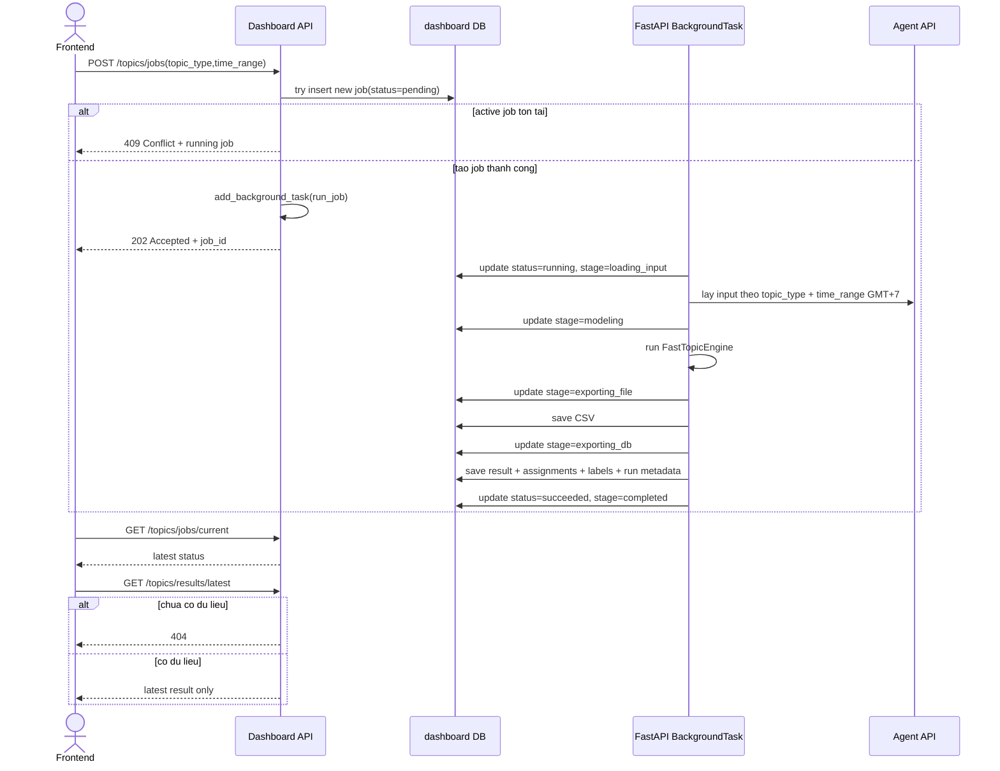
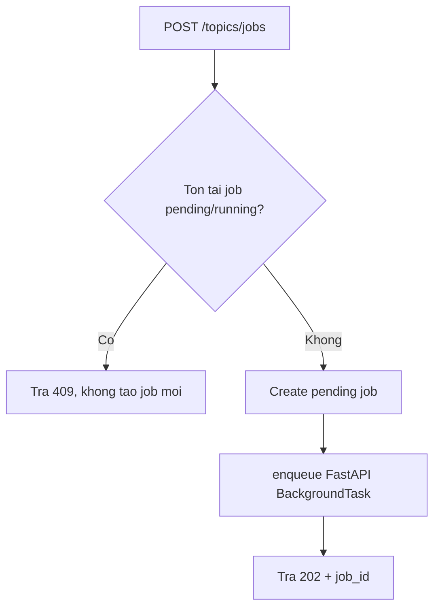
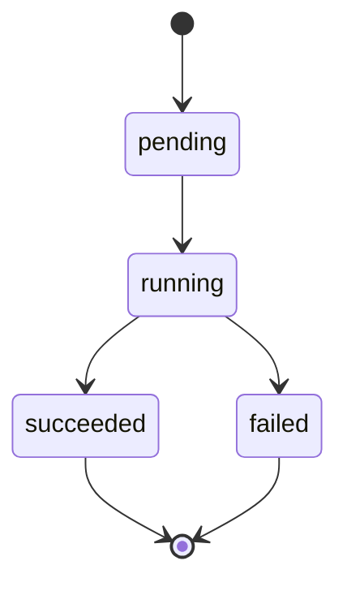

# Plan Kiến Trúc Topic Modeling Pipeline cho Dashboard Service (Phiên bản đã chốt)

## 1. Mục tiêu, scope và yêu cầu đã xác nhận

### 1.1 Mục tiêu
- Tích hợp pipeline topic modeling vào dashboard theo hướng đơn giản, ổn định, dễ vận hành.
- Không dùng Celery, chỉ dùng FastAPI BackgroundTasks.
- Chỉ cho phép 1 job đang chạy trên toàn hệ thống dashboard tại mọi thời điểm.
- Idempotent khi trigger: nếu đang có job `pending/running` thì không tạo job mới.
- Frontend polling luôn thấy đúng trạng thái tiến độ vì backend cập nhật DB theo từng stage.
- Lưu toàn bộ lịch sử các lần chạy, nhưng API kết quả chỉ trả về lần chạy mới nhất.

### 1.2 Yêu cầu người dùng đã chốt
- Time range tính theo GMT+7 (Asia/Ho_Chi_Minh).
- Khi đang có job chạy: không cho job mới chạy.
- Không cho phép cancel job.
- Khi chưa có dữ liệu kết quả: trả `404`.
- CSV output giữ 4 cột chuẩn `Document,Topic,Label,Question` và thêm các cột metadata.
- DB phải lưu đầy đủ thông tin tất cả run trong schema `dashboard` để phục vụ API.

### 1.3 Input/Output mặc định
- Input loại "THIẾU TRI THỨC": `agent_schema.missing_knowledge_logs`, cột `query`, filter theo time range GMT+7.
- Input loại "CÂU HỎI PHỔ BIẾN": toàn bộ lịch sử hội thoại của tất cả user theo time range GMT+7.
- Output mặc định:
  - CSV tại `dashboard/topic_modeling_results/`.
  - Database output cho API frontend.
- Topic engine mặc định: `TopicEngineABC` implement từ `experiments/topic_modeling/fast_topic_modeling.py`.
- Config mặc định lấy từ `dashboard/.env`.

## 2. Hiện trạng hệ thống và quyết định integration point

### 2.1 Agent-service-toolkit đang lưu dữ liệu hội thoại permanent ở đâu
- Metadata thread/hội thoại lưu tại bảng `agent_schema.conversations`.
- Dữ liệu message/conversation state lưu qua LangGraph checkpointer (`AsyncPostgresSaver`) và được tạo bằng `setup()` của thư viện, không phải schema nghiệp vụ ổn định do đội mình tự định nghĩa.

### 2.2 Quyết định lấy dữ liệu cho popular_questions
- Với quy tắc "nếu đọc DB trực tiếp được thì ưu tiên DB":
  - `missing_knowledge`: đọc DB trực tiếp được, an toàn vì bảng nghiệp vụ rõ ràng.
  - `popular_questions`: không nên đọc trực tiếp từ bảng checkpointer LangGraph vì cấu trúc nội bộ, coupling cao, rủi ro đổi version thư viện.
- Quyết định kiến trúc:
  - Dashboard vẫn ưu tiên read qua nguồn chính chủ của agent service cho `popular_questions` bằng API read-only mới.
  - API này chạy sau api_gateway, có auth nội bộ admin/service-to-service.

## 3. Kiến trúc tổng thể

```mermaid
graph TB
    subgraph FE[Frontend Admin Topic]
        FE1[Trigger job]
        FE2[Polling status]
        FE3[Fetch latest result]
    end

    subgraph DASH[Dashboard Service]
        R[Topics Route]
        JS[TopicJobService]
        ORCH[PipelineOrchestrator]
        IN1[MissingKnowledgeInput]
        IN2[PopularQuestionsInput]
        ENG[FastTopicEngine]
        OUT1[CSVExporter]
        OUT2[DBExporter]
        REPO[Topic Job + Result Repositories]
    end

    subgraph AG[Agent/API Gateway]
        AG1[Admin Conversations API]
        AG2[agent_schema.missing_knowledge_logs]
    end

    subgraph DB[(PostgreSQL)]
        D1[(dashboard schema)]
        D2[(agent_schema)]
    end

    FE1 --> R
    FE2 --> R
    FE3 --> R

    R --> JS
    JS --> REPO
    JS --> ORCH

    ORCH --> IN1
    ORCH --> IN2
    ORCH --> ENG
    ORCH --> OUT1
    ORCH --> OUT2

    IN1 --> AG2
    IN2 --> AG1

    REPO --> D1
    OUT2 --> D1
    AG2 --> D2
```

## 4. Luồng xử lý

### 4.1 Sequence diagram (pipeline execution)



### 4.2 Decision flow (trigger)



### 4.3 State diagram (job lifecycle)



## 5. Architectural Decisions và trade-offs

### ADR-001: Bỏ Celery, dùng FastAPI BackgroundTasks
- Why:
  - Giảm độ phức tạp hạ tầng, phù hợp scope hiện tại.
- Trade-off:
  - Không có cơ chế retry/phân tán mạnh như Celery; cần logging và timeout chặt hơn.

### ADR-002: Single active job toàn hệ thống
- Why:
  - Tránh tranh chấp tài nguyên model và sai lệch trạng thái UI.
- Trade-off:
  - Throughput thấp hơn, nhưng đổi lại tính nhất quán cao.

### ADR-003: Lưu full run history nhưng API chỉ trả latest
- Why:
  - Đảm bảo audit và so sánh lịch sử, đồng thời frontend đơn giản khi chỉ dùng latest.
- Trade-off:
  - Dung lượng DB tăng theo thời gian; cần chính sách retention sau này.

### ADR-004: Popular questions lấy qua API agent service
- Why:
  - Tránh phụ thuộc trực tiếp vào schema checkpointer nội bộ của LangGraph.
- Trade-off:
  - Cần thêm endpoint ở agent/api_gateway.

## 6. Security, DB schema changes, integration points

### 6.1 Security considerations
- Endpoint trigger/polling/latest cho admin.
- Không expose dữ liệu nhạy cảm trong log.
- API gọi sang agent cần service token nội bộ.
- Validate chặt `topic_type`, `time_range`.

### 6.2 DB schema changes (dashboard)
- Thêm bảng quản lý job run và bảng kết quả chi tiết theo run.
- Mọi table dùng prefix `dashboard_` và schema `dashboard`.
- Có named constraints/index để dễ migrate/downgrade.
- Dữ liệu thời gian lưu UTC nhưng mọi filter time range quy đổi theo GMT+7 khi query.

### 6.3 Integration points
- Dashboard -> Agent/API Gateway: API read-only lấy user messages toàn hệ thống theo time range.
- Dashboard -> Agent DB trực tiếp: chỉ dùng cho `agent_schema.missing_knowledge_logs` (READ only).

## 7. Rủi ro và giải pháp

| Rủi ro | Mức độ | Giải pháp |
|---|---|---|
| Background task chết giữa chừng | Medium | cập nhật stage thường xuyên + timeout + mark failed khi exception |
| Trùng job do race condition | High | partial unique index + transaction insert job |
| Lệch timezone | Medium | chuẩn hóa logic GMT+7 ở service layer + test boundary |
| API agent chưa sẵn | Medium | tạo task bổ sung endpoint agent/api_gateway trước khi go-live |
| DB tăng nhanh do lưu full history | Medium | retention policy phase sau |

## 8. Những gì plan này chưa thể hiện bằng code hiện tại
- Agent API mới cho popular_questions chưa tồn tại, cần tài liệu API contract riêng ở agent/api_gateway.
- Chưa bao gồm chiến lược retention/archival dữ liệu lịch sử run.

## 9. Success criteria
- Trigger job dùng BackgroundTasks, không còn Celery dependency.
- Không bao giờ có hơn 1 job `pending/running` cùng lúc.
- Polling luôn trả đúng status/stage/progress mới nhất từ DB.
- Kết quả API chỉ trả latest run; chưa có dữ liệu thì trả 404.
- CSV có đủ 4 cột chuẩn + metadata columns.
- DB lưu đầy đủ lịch sử mọi run trong schema `dashboard`.
- Popular questions được lấy qua API agent service mới; missing knowledge đọc trực tiếp DB `agent_schema` (READ only).

---

**Version**: 3.1  
**Updated**: 2026-04-22  
**Status**: Ready for implementation planning alignment
