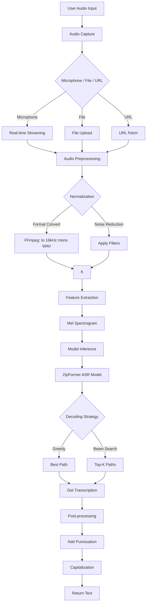
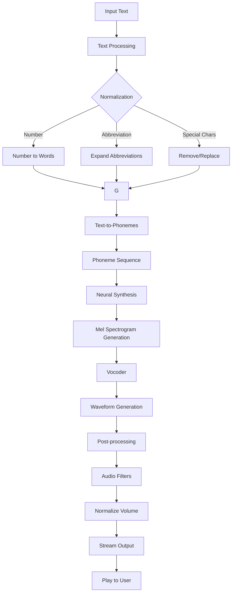
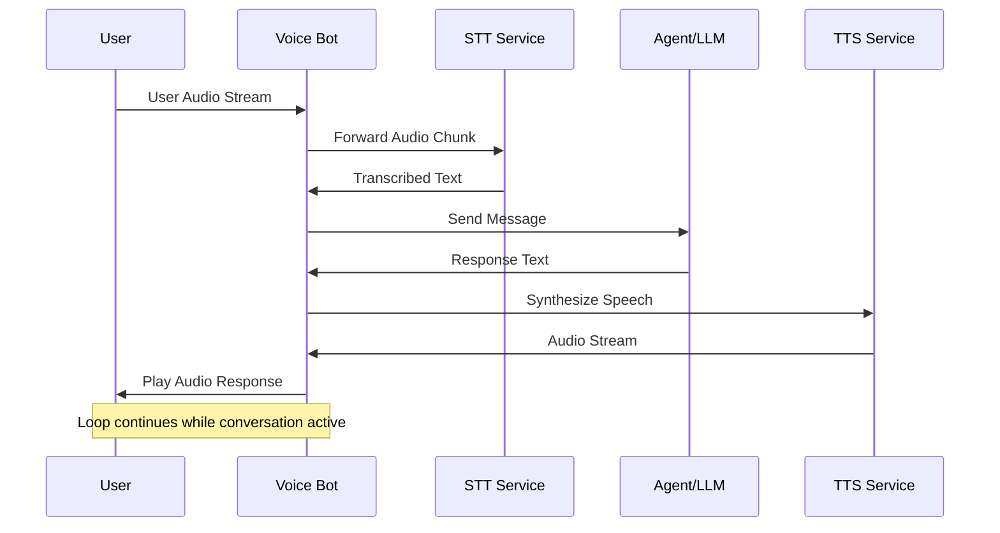
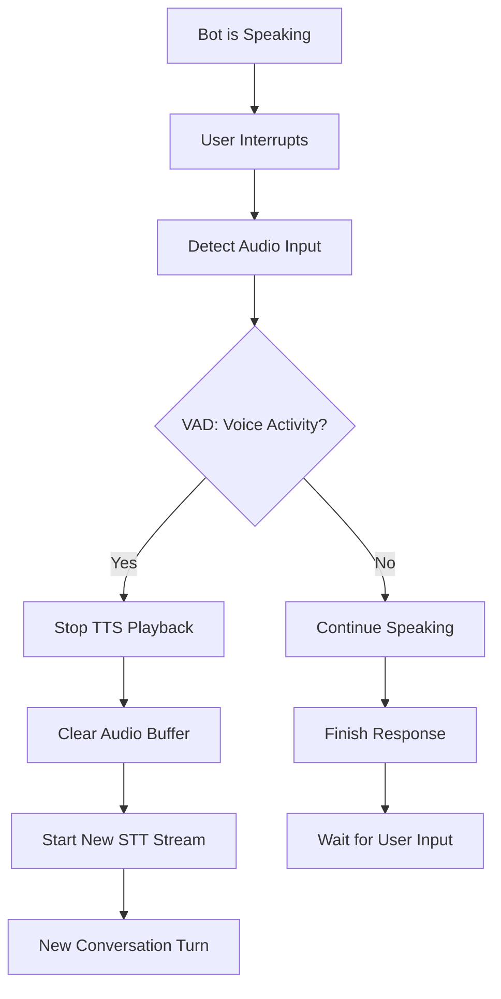

# Voice Service - Tài liệu Chi tiết

## Tổng quan

Voice Service cung cấp khả năng xử lý giọng nói cho hệ thống chatbot, bao gồm Speech-to-Text (STT) và Text-to-Speech (TTS). Service sử dụng các mô hình AI hiện đại để chuyển đổi giọng nói thành văn bản và ngược lại, cho phép tương tác bằng giọng nói với chatbot.

## Công nghệ sử dụng

| Công nghệ | Mục đích |
|-----------|----------|
| **Sherpa-ONNX** | Speech-to-Text (STT) engine |
| **ZipFormer** | ASR model architecture |
| **Gradio** | Web interface cho STT demo |
| **PyTorch** | Deep learning framework |
| **Torchaudio** | Audio processing |
| **FFmpeg** | Audio conversion |
| **Piper TTS** | Neural text-to-speech |

### Kiến trúc hệ thống

```
┌─────────────────────────────────────────────────────────────────┐
│                      User Interface                             │
│                  (Browser / Mobile App)                        │
└─────────────────────────────┬───────────────────────────────────┘
                              │
                              ▼
┌─────────────────────────────────────────────────────────────────┐
│                      Voice Bot Service                          │
│                    (Full-duplex Handler)                        │
│  ┌─────────────┐ ┌─────────────┐ ┌─────────────┐              │
│  │Audio Stream │ │Context Mgr  │ │LLM Agent    │              │
│  └─────────────┘ └─────────────┘ └─────────────┘              │
└───────────┬───────────────────┬─────────────────────────────────┘
            │                   │
            ▼                   ▼
┌───────────────────┐  ┌───────────────────┐
│   STT Service     │  │   TTS Service     │
│   (Port 7860)     │  │   (Port 7861)     │
│                   │  │                   │
│ ┌─────────────┐   │  │ ┌─────────────┐    │
│ │Sherpa-ONNX │   │  │ │  Piper TTS  │    │
│ │ZipFormer   │   │  │ │   Server    │    │
│ └─────────────┘   │  │ └─────────────┘    │
└───────────────────┘  └───────────────────┘
```

## Luồng hoạt động

### 1. Luồng Speech-to-Text (STT)



**Chi tiết luồng:**
1. User cung cấp audio input (microphone, file, hoặc URL)
2. Audio được preprocess:
   - Convert format (FFmpeg)
   - Normalize sample rate (16kHz)
   - Mono channel conversion
   - Noise reduction
3. Extract features (Mel Spectrogram)
4. Model inference với ZipFormer ASR
5. Decoding (greedy hoặc beam search)
6. Post-processing:
   - Add punctuation
   - Capitalize sentences
   - Language-specific formatting

### 2. Luồng Text-to-Speech (TTS)



**Chi tiết luồng:**
1. Nhận input text
2. Text normalization:
   - Convert numbers to words
   - Expand abbreviations
   - Handle special characters
3. Convert text to phonemes
4. Neural synthesis (Piper TTS model)
5. Vocoder generate waveform
6. Post-processing:
   - Apply audio filters
   - Normalize volume
7. Stream output cho real-time playback

### 3. Luồng Voice Bot (Full-duplex Conversation)



**Chi tiết luồng:**
1. User gửi audio stream
2. Bot forward audio chunk đến STT service
3. STT trả về transcribed text
4. Bot gửi text đến LLM/Agent
5. Agent trả về response text
6. Bot gửi text đến TTS service
7. TTS synthesize thành audio
8. Bot play audio cho user
9. Lặp lại cho đến khi conversation kết thúc

### 4. Luồng xử lý interruption



## Services và Ports

| Service | Port | Description |
|---------|------|-------------|
| STT Service (Gradio) | 7860 | Web interface và STT API |
| TTS Service (Piper) | 7861 | TTS synthesis server |
| Voice Bot | Custom | Full-duplex voice bot |

## API Endpoints

### STT Service (Gradio)

| Method | Endpoint | Description |
|--------|----------|-------------|
| GET | `/` | STT web interface |
| POST | `/api/stt/transcribe` | Transcribe audio file |
| POST | `/api/stt/stream` | Streaming transcription |
| GET | `/api/stt/models` | Available ASR models |

### TTS Service (Piper)

| Method | Endpoint | Description |
|--------|----------|-------------|
| POST | `/api/tts/synthesize` | Synthesize speech |
| POST | `/api/tts/stream` | Streaming TTS |
| GET | `/api/tts/voices` | Available voices |
| GET | `/api/tts/speaker-info` | Voice information |

### Voice Bot

| Method | Endpoint | Description |
|--------|----------|-------------|
| POST | `/api/bot/chat` | Voice conversation |
| WebSocket | `/ws/bot` | Real-time voice chat |
| GET | `/api/bot/status` | Bot status |

## Cấu hình

### STT Configuration

```python
# Model configuration
LANGUAGE_MODELS = {
    "English": ["csukuangfj/sherpa-onnx-paraformer-zipformer-en-2023-06-26"],
    "Chinese": ["csukuangfj/sherpa-onnx-zipformer-zh-14M-2023-02-23"],
    "Vietnamese": ["custom-vietnamese-model"]
}

# Decoding parameters
DECODING_METHOD = "modified_beam_search"
NUM_ACTIVE_PATHS = 15
SAMPLE_RATE = 16000
```

### TTS Configuration

```python
# Voice models
VOICE_MODELS = {
    "en-US": "lessac/en_US-lessac-medium",
    "vi-VN": "custom-vietnamese-voice"
}

# Audio settings
SAMPLE_RATE = 22050
BIT_DEPTH = 16
FORMAT = "wav"
```

### Environment Variables

```env
# STT Settings
STT_MODEL_PATH=/app/models
STT_LANGUAGE=English
STT_SAMPLE_RATE=16000

# TTS Settings
TTS_VOICE_MODEL=lessac/en_US-lessac-medium
TTS_SAMPLE_RATE=22050
TTS_SPEED=1.0

# Service Settings
GRADIO_SERVER_NAME=0.0.0.0
GRADIO_SERVER_PORT=7860
```

## Audio Processing Pipeline

### STT Pipeline chi tiết

```mermaid
flowchart LR
    subgraph Input
        A[Raw Audio] --> B[16kHz Mono WAV]
    end
    
    subgraph Preprocessing
        B --> C[Normalization]
        C --> D[Noise Reduction]
        D --> E[VAD Filter]
    end
    
    subgraph FeatureExtraction
        E --> F[Mel Spectrogram]
        F --> G[Feature Vector]
    end
    
    subgraph ASR
        G --> H[ZipFormer Model]
        H --> I[Log Probabilities]
    end
    
    subgraph Decoding
        I --> J[Greedy/Beam Search]
        J --> K[Token Sequence]
    end
    
    subgraph PostProcess
        K --> L[Punctuation]
        L --> M[Capitalization]
        M --> N[Final Text]
    end
```



### TTS Pipeline chi tiết

```mermaid
flowchart LR
    subgraph TextProcess
        A[Input Text] --> B[Normalization]
        B --> C[Text Cleanup]
        C --> D[Word Segmentation]
    end
    
    subgraph Phonemize
        D --> E[Grapheme to Phoneme]
        E --> F[Phoneme Sequence]
    end
    
    subgraph Synthesis
        F --> G[Piper Model]
        G --> H[Mel Spectrogram]
    end
    
    subgraph Vocoder
        H --> I[Neural Vocoder]
        I --> J[Waveform]
    end
    
    subgraph Output
        J --> K[Volume Norm]
        K --> L[Audio Output]
    end
```



## Use Cases

### 1. Transcribe audio file
```python
import requests

with open('audio.wav', 'rb') as f:
    files = {'audio': f}
    response = requests.post(
        'http://localhost:7860/api/stt/transcribe',
        files=files,
        data={'language': 'English'}
    )
    
transcript = response.json()['text']
print(f"Transcript: {transcript}")
```

### 2. Synthesize speech
```python
response = requests.post(
    'http://localhost:7861/api/tts/synthesize',
    json={
        'text': 'Hello, how can I help you today?',
        'voice': 'en-US-lessac-medium',
        'speed': 1.0
    }
)

with open('output.wav', 'wb') as f:
    f.write(response.content)
```

### 3. Voice bot conversation
```python
import websocket

ws = websocket.WebSocketApp(
    'ws://localhost:7860/ws/bot',
    on_message=lambda ws, msg: print(f"Bot: {msg}")
)

# Send audio data
audio_data = capture_microphone()
ws.send(audio_data, opcode=websocket.BINARY_FRAME)

ws.run_forever()
```

## Performance Optimization

### 1. Model Optimization
- Model quantization (INT8)
- ONNX runtime optimization
- Batch processing
- GPU acceleration

### 2. Audio Processing
- Efficient audio I/O
- Streaming buffers
- Memory management
- Parallel processing

### 3. Network Optimization
- Audio compression (Opus)
- Chunked transfer
- Connection pooling
- Result caching

## Quality Metrics

### STT Quality
| Metric | Description | Target |
|--------|-------------|--------|
| WER | Word Error Rate | < 10% |
| CER | Character Error Rate | < 5% |
| RTF | Real-time Factor | < 0.5 |

### TTS Quality
| Metric | Description | Target |
|--------|-------------|--------|
| MOS | Mean Opinion Score | > 4.0 |
| Latency | Synthesis time | < 500ms |
| Naturalness | Human-likeness | > 4.2 |

## Integration Examples

### With Agent Service
```python
# Agent processes transcribed text
transcript = transcribe_audio(audio_file)
# Thêm agent_config để sử dụng khả năng phân tích sâu (Deep Mode)
response = agent_client.invoke(
    transcript, 
    agent_config={"query_mode": "deep"}
)
audio_response = synthesize_speech(response['content'])
play_audio(audio_response)
```

### With Frontend
```javascript
// Browser-based voice interaction
const mediaRecorder = new MediaRecorder(stream);
mediaRecorder.ondataavailable = async (event) => {
    const transcript = await transcribeAudio(event.data);
    const response = await sendMessage(transcript);
    const audioUrl = await synthesizeSpeech(response);
    playAudio(audioUrl);
};
```

## Monitoring

### Performance Metrics
- Transcription accuracy
- Synthesis quality
- Processing latency
- Resource utilization

### Usage Analytics
- Language distribution
- Audio duration statistics
- Error patterns
- User engagement metrics
