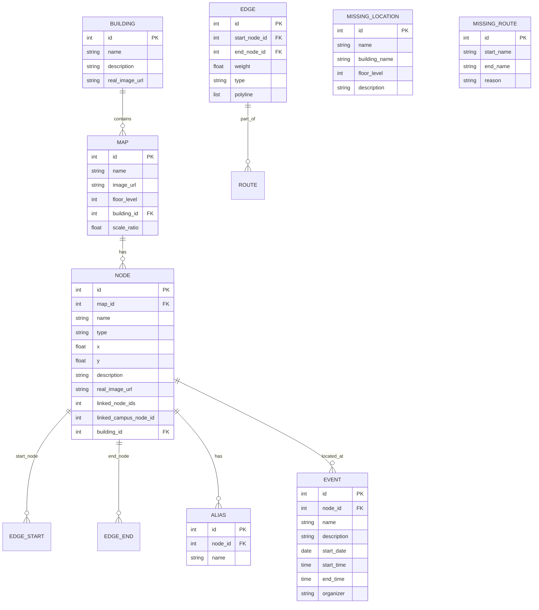

# Wayfinder Service - Tài liệu Chi tiết

## Tổng quan

Wayfinder Service là hệ thống định vị và dẫn đường nội thất (indoor navigation) cung cấp API để quản lý bản đồ, tòa nhà, và tính toán đường đi trong các không gian trong nhà. Service hỗ trợ tìm kiếm địa điểm (fuzzy matching với alias), đề xuất tuyến đường đa tầng (multi-floor), và tích hợp với Agent Service qua bộ công cụ LangChain để trả lời câu hỏi chỉ đường bằng ngôn ngữ tự nhiên.

## Công nghệ sử dụng

| Công nghệ | Mục đích |
|-----------|----------|
| **FastAPI** | REST API framework cho service |
| **SQLModel** | ORM cho PostgreSQL/SQLite |
| **NetworkX** | Thuật toán đồ thị cho routing (Dijkstra) |
| **RapidFuzz** | Fuzzy matching cho tìm kiếm địa điểm và alias |
| **Unidecode** | Chuẩn hóa tiếng Việt không dấu cho tìm kiếm |
| **LangChain Tools** | Tích hợp với Agent Service (FindRoute, GuessLocationByDescription, ...) |

## Kiến trúc hệ thống

```
┌─────────────────────────────────────────────────────────────────┐
│                        Frontend                                 │
│                  (frontend-wayfinding/)                         │
└─────────────────────────────┬───────────────────────────────────┘
                              │ HTTP
                              ▼
┌─────────────────────────────────────────────────────────────────┐
│                      API Layer (FastAPI)                        │
│                      Port: 8004                                 │
│  ┌──────────┐ ┌──────────┐ ┌──────────┐ ┌──────────┐          │
│  │/api/maps │ │/api/nodes│ │/api/find │ │/api/     │          │
│  │          │ │/api/     │ │/api/query│ │aliases/  │          │
│  │          │ │buildings │ │          │ │search    │          │
│  └──────────┘ └──────────┘ └──────────┘ └──────────┘          │
│  ┌──────────┐ ┌──────────┐ ┌──────────┐ ┌──────────┐          │
│  │/api/     │ │/api/     │ │/api/     │ │/api/     │          │
│  │locations │ │events    │ │missing-  │ │missing-  │          │
│  │          │ │          │ │locations │ │routes    │          │
│  └──────────┘ └──────────┘ └──────────┘ └──────────┘          │
└─────────────────────────────┬───────────────────────────────────┘
                              │
                              ▼
┌─────────────────────────────────────────────────────────────────┐
│                    Business Logic Layer                         │
│  ┌─────────────┐ ┌─────────────┐ ┌───────────────────────┐    │
│  │GeoService   │ │NLPService   │ │RoutingService         │    │
│  │(edge weight)│ │(normalize,  │ │(Dijkstra, instructions│    │
│  │             │ │ extract A-B)│ │ graph cache)          │    │
│  └─────────────┘ └─────────────┘ └───────────────────────┘    │
└─────────────────────────────┬───────────────────────────────────┘
                              │
                              ▼
┌─────────────────────────────────────────────────────────────────┐
│                    Data Access Layer                            │
│                    (SQLite / PostgreSQL)                        │
│  ┌──────────┐ ┌──────┐ ┌──────┐ ┌────────┐ ┌───────┐          │
│  │Map       │ │Node  │ │Edge  │ │Alias   │ │Building│          │
│  │(floor,   │ │(x,y, │ │(poly │ │(name   │ │(name, │          │
│  │ scale)   │ │type) │ │line) │ │fuzzy)  │ │image) │          │
│  └──────────┘ └──────┘ └──────┘ └────────┘ └───────┘          │
└─────────────────────────────────────────────────────────────────┘
                              ▲
                              │ HTTP (tools)
┌─────────────────────────────────────────────────────────────────┐
│                    Agent Service Toolkit                        │
│  ┌───────────────────────────────────────────────────┐         │
│  │  LangGraph Agent (map_assistant)                   │         │
│  │  Tools: FindRoute, GuessLocationByDescription,     │         │
│  │         GetLandmarkImages, SearchEvents, ...       │         │
│  └───────────────────────────────────────────────────┘         │
└─────────────────────────────────────────────────────────────────┘
```

## Luồng hoạt động — Full Flowchart (Mermaid)

Đây là flowchart đầy đủ bao quát mọi nhánh có thể xảy ra trong hệ thống.

```mermaid
flowchart TD
    Start([User: Yêu cầu chỉ đường]) --> AgentCheck{Agent: Đã có<br/>start_location VÀ<br/>end_location?}
    
    %% ====== THIẾU THÔNG TIN ======
    AgentCheck -->|Thiếu start| AskStart[Agent hỏi: "Bạn đang ở đâu?"]
    AgentCheck -->|Thiếu end| AskEnd[Agent hỏi: "Bạn muốn đi đâu?"]
    
    AskStart --> UserStartReply{User trả lời}
    AskEnd --> UserEndReply{User trả lời}
    
    UserStartReply --> AgentCheck
    UserEndReply --> AgentCheck
    
    UserStartReply --> UserNoStart{User biết<br/>mình đang ở đâu?}
    UserEndReply --> UserNoEnd{User biết<br/>điểm đến cụ thể?}
    
    %% ====== KHÔNG BIẾT ĐIỂM BẮT ĐẦU ======
    UserNoStart -->|Không biết| CanDescribe{User mô tả<br/>được cảnh vật?}
    CanDescribe -->|Có| GuessDesc[Agent gọi<br/>GuessLocationByDescription]
    CanDescribe -->|Không| GuessImg[Agent gọi<br/>GetLandmarkImages]
    
    GuessDesc --> GuessAPI1[GET /api/locations/guess<br/>fuzzy match vs buildings/nodes/aliases]
    GuessImg --> LandmarkAPI[GET /api/locations/landmarks<br/>trả về nodes/buildings có ảnh thật]
    
    GuessAPI1 --> GuessResults{Có kết quả?}
    LandmarkAPI --> UserPickImg[User chọn ảnh quen thuộc]
    
    GuessResults -->|Có ≥1| GuessOptions[Agent hiện top candidates<br/>cho user chọn]
    GuessResults -->|Không| RetryGuess[Agent hỏi mô tả khác<br/>hoặc chuyển sang ảnh]
    
    GuessOptions --> UserGuessPick[User xác nhận vị trí]
    UserPickImg --> UserGuessPick
    UserGuessPick --> StartResolved{Start<br/>resolved?}
    
    RetryGuess --> CanDescribe
    StartResolved -->|Yes| AgentCheck
    StartResolved -->|No| AskStart
    
    %% ====== KHÔNG BIẾT ĐIỂM ĐẾN ======
    UserNoEnd -->|Không rõ| AskEndDetail[Agent hỏi cụ thể hơn<br/>VD: "Thư viện nào? Tòa nào?"]
    AskEndDetail --> UserEndReply
    
    %% ====== ĐỦ THÔNG TIN → GỌI FINDROUTE ======
    AgentCheck -->|Đủ cả hai| CallFindRoute[Agent gọi<br/>FindRoute tool]
    
    CallFindRoute --> GenericCheck{Check generic<br/>patterns?<br/>"đây","đó","vị trí hiện tại"...}
    
    GenericCheck -->|Trùng| GenericError[Trả lỗi<br/>unknown_start / unknown_end]
    GenericError --> AgentAskGeneric[Agent hỏi lại<br/>vị trí/điểm đến cụ thể]
    AgentAskGeneric --> UserStartReply
    
    GenericCheck -->|Không trùng| HasStartID{Có<br/>from_node_id?}
    
    %% ====== TÌM START ======
    HasStartID -->|Có| GetStartNode[GET /api/nodes/{from_node_id}<br/>+ /api/maps/{map_id}<br/>+ /api/buildings/{building_id}]
    HasStartID -->|Không| SearchStart[GET /api/aliases/search<br/>?q=from_location&limit=20]
    
    GetStartNode --> StartResults[start_results = 1 kết quả<br/>score=100]
    SearchStart --> StartEmpty{start_results<br/>rỗng?}
    
    StartEmpty -->|Rỗng| ReportMissingStart[_report_missing_location_internal<br/>description="tìm từ...đến..."]
    ReportMissingStart --> ErrorStart[Trả lỗi<br/>start_not_found]
    ErrorStart --> AgentAskStartDetail[Agent hỏi thông tin<br/>cụ thể hơn VD: "Phòng mấy?"]
    AgentAskStartDetail --> UserStartReply
    
    StartEmpty -->|Có| StartAmbiguity{start_results<br/>có ≥2 kết quả?}
    StartResults --> StartAmbiguity
    
    StartAmbiguity -->|Chỉ 1| StartOK[Start node xác định]
    StartAmbiguity -->|≥2| StartScoreCheck{score1 - score2<br/>≥ 20?}
    
    StartScoreCheck -->|≥ 20: rõ ràng| StartOK
    StartScoreCheck -->|< 20: mơ hồ| StartAmbiguous[status: needs_confirmation<br/>start_options = top 3 results<br/>mỗi option có [ID: X]]
    
    %% ====== TÌM END ======
    HasEndID{Có<br/>to_node_id?}
    HasEndID -->|Có| GetEndNode[GET /api/nodes/{to_node_id}<br/>+ /api/maps/{map_id}<br/>+ /api/buildings/{building_id}]
    HasEndID -->|Không| SearchEnd[GET /api/aliases/search<br/>?q=to_location&limit=20]
    
    GetEndNode --> EndResults[end_results = 1 kết quả<br/>score=100]
    SearchEnd --> EndEmpty{end_results<br/>rỗng?}
    
    EndEmpty -->|Rỗng| ReportMissingEnd[_report_missing_location_internal]
    ReportMissingEnd --> ErrorEnd[Trả lỗi<br/>end_not_found]
    ErrorEnd --> AgentAskEndDetail[Agent hỏi thông tin<br/>cụ thể hơn]
    AgentAskEndDetail --> UserEndReply
    
    EndEmpty -->|Có| EndAmbiguity{end_results<br/>có ≥2 kết quả?}
    EndResults --> EndAmbiguity
    
    EndAmbiguity -->|Chỉ 1| EndOK[End node xác định]
    EndAmbiguity -->|≥2| EndScoreCheck{score1 - score2<br/>≥ 20?}
    
    EndScoreCheck -->|≥ 20: rõ ràng| EndOK
    EndScoreCheck -->|< 20: mơ hồ| EndAmbiguous[status: needs_confirmation<br/>end_options = top 3 results<br/>mỗi option có [ID: X]]
    
    %% ====== KẾT HỢP AMBIGUITY ======
    StartOK --> CheckBoth1
    StartAmbiguous --> CheckBoth1
    EndOK --> CheckBoth1
    EndAmbiguous --> CheckBoth1
    
    CheckBoth1{Start HOẶC End<br/>cần xác nhận?}
    CheckBoth1 -->|Cả 2 rõ ràng| BothResolved
    CheckBoth1 -->|Ít nhất 1 mơ hồ| ReturnAmbiguous
    
    ReturnAmbiguous[Trả JSON:<br/>status: needs_confirmation<br/>start_options (nếu start mơ hồ)<br/>end_options (nếu end mơ hồ)]
    ReturnAmbiguous --> AgentShowOptions[Agent hiện options<br/>cho user chọn]
    AgentShowOptions --> UserConfirm[User chọn<br/>start và/hoặc end]
    UserConfirm --> CallFindRouteWithID[Agent gọi lại FindRoute<br/>với from_node_id / to_node_id<br/>từ [ID: ...] trong option]
    
    CallFindRouteWithID --> HasStartID
    CallFindRouteWithID --> HasEndID
    
    %% ====== TÌM ĐƯỜNG ======
    BothResolved[Start node_id + End node_id<br/>đã xác định]
    BothResolved --> CallFindAPI[GET /api/find<br/>start_node_id + end_node_id]
    
    CallFindAPI --> ValidateNodes{Nodes<br/>tồn tại trong graph?}
    ValidateNodes -->|Không| InvalidNode[400: invalid_node<br/>"Node không hợp lệ"]
    InvalidNode --> AgentReportInvalid[Agent báo lỗi]
    
    ValidateNodes -->|Có| RunDijkstra[Dijkstra shortest path<br/>với weight]
    
    RunDijkstra --> PathFound{Tìm thấy<br/>đường đi?}
    PathFound -->|Không| ReportMissingRoute[_report_missing_route_internal<br/>reason="disconnected_graph"]
    ReportMissingRoute --> RouteNotFound[404: route_not_found<br/>"Không tìm được đường đi"]
    RouteNotFound --> AgentReportNoRoute[Agent báo không có đường<br/>hệ thống đã ghi nhận]
    
    PathFound -->|Có| GenerateInstr[Generate human instructions:<br/>- rẽ trái/phải calculate_angle<br/>- lên/xuống tầng floor change<br/>- ra/vào tòa entrance type<br/>- arrive destination]
    
    GenerateInstr --> BuildResponse[Return RouteResponse:<br/>status: success<br/>path_coords, path_node_ids<br/>total_distance_m, instructions<br/>is_multi_floor, route_maps]
    
    BuildResponse --> AgentFormat[Agent format tiếng Việt<br/>hiển thị cho user]
    AgentFormat --> End([Kết thúc])
    AgentReportNoRoute --> End
    AgentReportInvalid --> End
    AgentAskStartDetail --> End
    AgentAskEndDetail --> End
```

### Chi tiết các nhánh

#### Nhánh 1: Biết cả điểm bắt đầu và điểm đến

```
User: "Chỉ đường từ phòng 101 tòa B4 đến thư viện chính"
  → Agent đã đủ from + to → gọi FindRoute
  → Search start → 1 kết quả (score=95) → start OK
  → Search end → 1 kết quả (score=90) → end OK
  → GET /api/find → Dijkstra → success
```

#### Nhánh 2: Biết điểm bắt đầu, KHÔNG biết điểm đến

```
User: "Tôi đang ở phòng 101 tòa B4, chỉ đường đến hội thảo"
  → Agent: from có, nhưng end mơ hồ ("hội thảo" không cụ thể)
  → Hỏi: "Bạn muốn đến hội thảo nào?"
  → User: "Hội thảo AI"
  → Search events → có event → lấy location → làm end_location
  → Gọi FindRoute
```

#### Nhánh 3: KHÔNG biết điểm bắt đầu, biết điểm đến

```
User: "Chỉ đường đến thư viện"
  → Agent: Thiếu start → Hỏi "Bạn đang ở đâu?"
  → User: "Tôi không biết"
  → Agent: "Bạn có mô tả được cảnh vật xung quanh không?"
  → User: "Có, tôi thấy biển 'Thư viện' và thang máy"
  → GuessLocationByDescription → GET /api/locations/guess
  → Top 3 candidates → User chọn "Tòa B4, Tầng 1"
  → Start resolved → Search end "thư viện" → ambiguous (2 thư viện)
  → needs_confirmation → User chọn "Thư viện chính"
  → Gọi FindRoute với cả 2 ID
```

#### Nhánh 4: Không biết cả 2

```
User: "Tôi lạc đường, giúp tôi với"
  → Agent: Thiếu cả start + end
  → GetLandmarkImages → hiện ảnh các landmark
  → User: "Đây nè, tôi ở chỗ này" (chọn ảnh tòa B4)
  → Start resolved = entrance B4
  → Agent: "Bạn muốn đi đâu?"
  → User: "Ra cổng trường"
  → Search end → tìm "cổng" → OK
  → FindRoute
```

#### Nhánh 5: Nhiều kết quả cho ĐIỂM BẮT ĐẦU (Ambiguous Start)

```
User: "Chỉ đường từ phòng họp đến căn tin"
  → Search "phòng họp" → 3 kết quả:
    1. Phòng họp A (Tòa B4, Tầng 1) [ID: 10] score=88
    2. Phòng họp B (Tòa B4, Tầng 2) [ID: 15] score=85
    3. Phòng họp C (Tòa A, Tầng 3) [ID: 20] score=60
  → score1-score2 = 88-85 = 3 < 20 → AMBIGUOUS
  → status: needs_confirmation
  → Agent: "Bạn đang ở phòng họp nào?"
      1. Phòng họp A (Tòa B4, Tầng 1)
      2. Phòng họp B (Tòa B4, Tầng 2)
      3. Phòng họp C (Tòa A, Tầng 3)
  → User: "Phòng họp A"
  → Agent gọi lại FindRoute(from_node_id=10, to_location="căn tin")
```

#### Nhánh 6: Nhiều kết quả cho ĐIỂM ĐẾN (Ambiguous End)

```
User: "Chỉ đường từ sảnh B4 đến thư viện"
  → Search start "sảnh B4" → 1 kết quả score=92 → OK
  → Search end "thư viện" → 2 kết quả:
    1. Thư viện chính (Tòa A, Tầng 3) [ID: 23] score=88
    2. Thư viện số (Tòa C, Tầng 2) [ID: 45] score=82
  → score1-score2 = 88-82 = 6 < 20 → AMBIGUOUS
  → status: needs_confirmation, end_options = 2 thư viện
  → Agent: "Bạn muốn đến thư viện nào?"
  → User: "Thư viện chính"
  → Agent gọi lại FindRoute(from_node_id=sảnh, to_node_id=23)
```

#### Nhánh 7: Mơ hồ CẢ HAI (Ambiguous Both)

```
User: "Chỉ đường từ phòng họp đến căn tin"
  → Start: 2 phòng họp (score chênh 5) → ambiguous
  → End: 2 căn tin (score chênh 8) → ambiguous
  → status: needs_confirmation
  → start_options: [Phòng họp A [ID:10], Phòng họp B [ID:15]]
  → end_options: [Căn tin chính [ID:30], Căn tin phụ [ID:35]]
  → Agent hỏi user chọn CẢ HAI
  → User: "Phòng họp A" + "Căn tin chính"
  → Agent gọi FindRoute(from_node_id=10, to_node_id=30)
```

#### Nhánh 8: Không tìm thấy địa điểm

```
User: "Chỉ đường từ phòng 999 đến căn tin"
  → Search "phòng 999" → 0 kết quả
  → _report_missing_location_internal(name="phòng 999")
  → status: error, error_type: start_not_found
  → Agent: "Không tìm thấy 'phòng 999'. Bạn có thể kiểm tra lại không?"
```

#### Nhánh 9: Không có đường đi

```
User: "Chỉ đường từ Tầng 1 Tòa B4 đến Tầng 5 Tòa Z"
  → Both nodes found → GET /api/find
  → Dijkstra → NetworkXNoPath
  → _report_missing_route_internal(reason="disconnected_graph")
  → 404: route_not_found
  → Agent: "Không tìm được đường đi. Hệ thống đã ghi nhận vấn đề này."
```

## Luồng hoạt động chi tiết theo từng bước

### 1. Nhận diện điểm bắt đầu & điểm đến

**Bước 1 — Agent thu thập thông tin (trước khi gọi tool):**
- Agent được hướng dẫn trong system prompt: *"PHẢI HỎI và XÁC NHẬN đủ 2 thông tin: vị trí hiện tại và điểm đến. CHỈ GỌI FindRoute khi đã có đủ cả hai."*
- Nếu user không biết mình đang ở đâu:
  - Dùng `GuessLocationByDescription` nếu user mô tả được cảnh vật xung quanh
  - Dùng `GetLandmarkImages` nếu user không mô tả được → hiện ảnh cho user chọn

**Bước 2 — FindRoute tool kiểm tra generic patterns:**
- Nếu `from_location` chứa: "vị trí hiện tại", "đây", "tôi đang ở", "current location", "here"... → trả lỗi `unknown_start`
- Nếu `to_location` chứa: "điểm đến", "đó", "nơi đó", "destination", "there"... → trả lỗi `unknown_end`
- Agent nhận lỗi → hỏi user cung cấp tên cụ thể

**Bước 3 — Tìm kiếm địa điểm:**
- Nếu đã có `from_node_id`/`to_node_id` (từ bước xác nhận trước): gọi `/api/nodes/{id}` → lấy info node, map, building
- Nếu chưa có ID: gọi `/api/aliases/search?q=...&limit=20` → fuzzy match với alias names + building names

**Bước 4 — Ambiguity Check (get_best_node):**
- **1 kết quả duy nhất** → dùng luôn
- **Nhiều kết quả**: so sánh `score1 - score2`:
  - `>= 20` → kết quả đầu tiên rõ ràng tốt hơn → dùng luôn
  - `< 20` → không rõ ràng → trả `needs_confirmation` kèm tối đa 3 options
- Format mỗi option: `"{Tên} ({Tòa}, Tầng X) [ID: {node_id}]"`

**Bước 5 — User xác nhận (nếu ambiguous):**
- Agent hiện danh sách options cho user chọn
- User chọn → Agent gọi lại `FindRoute` với `from_node_id` / `to_node_id` tương ứng
- System prompt nhắc agent: *"Nếu kết quả từ công cụ có chứa [ID: ...], hãy sử dụng tham số from_node_id hoặc to_node_id tương đương"*

**Bước 6 — Tính đường đi:**
- Khi cả start_node_id và end_node_id đã xác định → gọi `/api/find` → Dijkstra → trả kết quả

### 2. Tính toán đường đi (Routing)

**Generate instructions:**
- **Start**: "Bắt đầu từ {tên node}"
- **Normal turn**: Tính góc 3 điểm → rẽ trái/phải/chếch phải/chếch trái/thẳng (ngưỡng 45°)
- **Floor change**: "Đi thang máy/cầu thang lên/xuống Tầng X"
- **Exit building**: "Ra {tên tòa}" → "Ra khỏi tòa nhà"
- **Enter building**: "Vào {tên tòa}"
- **Arrive**: "Đã đến {tên đích}" (skip nếu đích là stairs/elevator vừa mới dùng)

### 3. Xác định vị trí khi user không biết mình đang ở đâu

- **Có mô tả**: `GuessLocationByDescription` → `GET /api/locations/guess` → fuzzy match vs building name + description + node name + aliases → top 5 candidates
- **Không mô tả**: `GetLandmarkImages` → `GET /api/locations/landmarks` → buildings/nodes có `real_image_url != NULL` → user chọn ảnh

### 4. Multi-floor navigation

**Cross-floor connections:**
1. Mỗi node có `linked_node_ids` (list các node ở tầng khác kết nối với nó)
2. Khi build graph, tự động thêm edge weight=50 giữa các linked nodes
3. Edge type xác định từ node type: stairs/elevator → dùng type đó, default "stairs"
4. Entrance nodes có `linked_campus_node_id` → edge weight=10 type="entrance"

## Database Schema

### Entities Relationship



## API Endpoints chi tiết

### Maps & Buildings

| Method | Endpoint | Description |
|--------|----------|-------------|
| GET | `/api/maps` | List all maps (floor plans) |
| GET | `/api/maps/{id}` | Get map details |
| GET | `/api/buildings` | List all buildings |
| GET | `/api/buildings/{id}` | Get building details |

### Nodes & Edges

| Method | Endpoint | Description |
|--------|----------|-------------|
| GET | `/api/nodes` | List all nodes (filter by `map_id`) |
| GET | `/api/nodes/{id}` | Get node details |
| GET | `/api/edges` | List all edges (filter by `map_id`) |

### Aliases (Location Search)

| Method | Endpoint | Description |
|--------|----------|-------------|
| GET | `/api/aliases/search?q=...&limit=20` | Fuzzy search locations |
| GET | `/api/aliases/all` | Get all locations (with nodes that have no alias) |
| GET | `/api/aliases?node_id=X` | Get aliases for a specific node |
| POST | `/api/aliases` | Create new alias for a node |

### Routing

| Method | Endpoint | Description |
|--------|----------|-------------|
| GET | `/api/find?start_node_id=X&end_node_id=Y` | Find route between two nodes |
| GET | `/api/query?q=...&map_id=X` | Route by natural language query |
| POST | `/api/refresh-cache` | Clear and rebuild graph cache |

### Locations (Guessing & Landmarks)

| Method | Endpoint | Description |
|--------|----------|-------------|
| GET | `/api/locations/guess?query=...&limit=5` | Guess location from description |
| GET | `/api/locations/landmarks` | Get landmarks with real images |

### Events

| Method | Endpoint | Description |
|--------|----------|-------------|
| GET | `/api/events/search?q=...&limit=5` | Search events by keyword |
| GET | `/api/events/upcoming?limit=5` | Get upcoming events |
| GET | `/api/events/{id}` | Get event details |

### Missing Reports

| Method | Endpoint | Description |
|--------|----------|-------------|
| POST | `/api/missing-locations` | Report missing location |
| POST | `/api/missing-routes` | Report missing route |

## Agent Tools (LangChain)

Agent Service Toolkit tích hợp Wayfinder qua các tools sau:

### Map Tools

| Tool Name | Function | Description |
|-----------|----------|-------------|
| `FindRoute` | `find_route_func` | Tìm đường đi giữa 2 điểm (theo tên hoặc node_id) |
| `GuessLocationByDescription` | `guess_location_by_description_func` | Gợi ý vị trí từ mô tả |
| `GetLandmarkImages` | `get_landmark_images_func` | Lấy ảnh địa điểm nổi bật để nhận diện |
| `ReportMissingLocation` | `report_missing_location` | Báo cáo địa điểm bị thiếu |
| `ReportMissingRoute` | `report_missing_route` | Báo cáo tuyến đường bị thiếu |

### Event Tools

| Tool Name | Function | Description |
|-----------|----------|-------------|
| `SearchEvents` | `search_events_func` | Tìm sự kiện theo từ khóa |
| `GetUpcomingEvents` | `get_upcoming_events_func` | Lấy sự kiện sắp diễn ra |
| `GetEventDetail` | `get_event_detail_func` | Lấy chi tiết sự kiện theo ID |

### Luồng Agent xử lý chỉ đường

```
BƯỚC 1 — THU THẬP THÔNG TIN
User: "Chỉ đường đến thư viện"
  ↓
Agent: (System prompt: PHẢI có đủ from VÀ to) → Hỏi "Bạn đang ở đâu?"
  ↓
User: "Tôi đang ở gần phòng 101 tòa B4"
  ↓
Agent: Đã đủ from_location="phòng 101 tòa B4", to_location="thư viện"

BƯỚC 2 — GỌI FINDROUTE LẦN 1 (chưa có ID)
Agent: Gọi FindRoute(from_location="phòng 101 tòa B4", to_location="thư viện")
  ↓
Tool: Check generic patterns → Không trùng → OK
  ↓
Tool: GET /api/aliases/search?q=phòng+101+tòa+B4 → found 1 result, node_id=5, score=95
Tool: GET /api/aliases/search?q=thư+viện → found 3 results:
  - node_id=23, score=88, "Thư viện chính (Tòa A, Tầng 3)"
  - node_id=45, score=82, "Thư viện số (Tòa C, Tầng 2)"
  → Chênh lệch 88-82=6 < 20 → AMBIGUOUS
  ↓
Tool: Return {
  type: "route",
  status: "needs_confirmation",
  start_options: ["Phòng 101 (Tòa B4, Tầng 1) [ID: 5]"],
  end_options: [
    "Thư viện chính (Tòa A, Tầng 3) [ID: 23]",
    "Thư viện số (Tòa C, Tầng 2) [ID: 45]"
  ]
}

BƯỚC 3 — USER XÁC NHẬN
Agent: "Có 2 thư viện, bạn muốn đến cái nào?"
  1. Thư viện chính (Tòa A, Tầng 3)
  2. Thư viện số (Tòa C, Tầng 2)
  ↓
User: "Thư viện chính"
  ↓
Agent: (System prompt: dùng ID từ kết quả) → Gọi lại FindRoute với ID
  ↓
Agent: FindRoute(from_node_id=5, to_node_id=23)

BƯỚC 4 — GỌI FINDROUTE LẦN 2 (có ID chính xác)
Tool: GET /api/nodes/5 → node info + map + building
Tool: GET /api/nodes/23 → node info + map + building
  ↓
Tool: GET /api/find?start_node_id=5&end_node_id=23
  ↓
Backend: Dijkstra → path: [5, 8, 12, 15, 23]
Backend: Generate instructions → [
  "Bắt đầu từ Phòng 101",
  "Đi bộ 12.5m. Rẽ trái",
  "Đi 25.0m. Đi thang máy lên Tầng 3",
  "Đi 8.0m. Đã đến Thư viện chính"
]
  ↓
Tool: Return {type: "route", status: "success", path_coords: [...], instructions: [...], is_multi_floor: true}
  ↓
Agent: Format thành tiếng Việt cho user
```

**Các trường hợp lỗi:**

| Tình huống | error_type | Agent xử lý |
|-----------|-----------|-------------|
| User dùng từ chung chung ("đây", "đó") | `unknown_start` / `unknown_end` | Hỏi vị trí cụ thể |
| Không tìm thấy địa điểm xuất phát | `start_not_found` | Hỏi thông tin chi tiết hơn |
| Không tìm thấy địa điểm đến | `end_not_found` | Hỏi thông tin chi tiết hơn |
| Không có đường đi | `route_not_found` | Báo không tìm được đường, ghi nhận báo cáo |
| Thiếu from/to | error message | Hỏi bổ sung thông tin |

## Cấu hình

### Environment Variables

```env
# Wayfinder Backend
DATABASE_URL=sqlite:///./backend/wayfinding.db
DEBUG=true
CORS_ORIGINS=["*"]
PORT=8004

# Agent Service Toolkit
WAYFINDER_API=http://127.0.0.1:8004
DEFAULT_MODEL=llama3
```

## Cơ chế Graph Cache

Để tối ưu hiệu năng tính toán đường đi đa tầng, hệ thống sử dụng cơ chế cache đồ thị:

1. **Khởi tạo**: Khi service start, đồ thị được build từ toàn bộ Nodes và Edges trong DB
2. **Persistence**: Đồ thị được lưu dưới dạng JSON tại `data/graph_cache.json`
3. **In-memory**: Đồ thị được giữ trong biến global (`_global_graph`) để truy xuất tức thì
4. **Cập nhật**: Admin có thể clear cache qua `POST /api/refresh-cache` để rebuild khi dữ liệu thay đổi

Graph structure bao gồm:
- **Nodes**: `id`, `name`, `map_id`, `floor`, `type`, `linked_node_ids`, `pos`
- **Edges**: `weight`, `type`, `polyline`
- **Cross-floor connections**: Tự động thêm edges cho `linked_node_ids` (stairs/elevator)

## Response Formats

### RouteResponse — Success

```json
{
  "type": "route",
  "status": "success",
  "start_name": "Phòng 101 Tòa B4 [ID: 5]",
  "end_name": "Phòng họp A [ID: 23]",
  "path_coords": [[x1, y1], [x2, y2], ...],
  "path_node_ids": [5, 8, 12, 15, 23],
  "total_distance_m": 45.5,
  "instructions": [
    {"step": 1, "text": "Bắt đầu từ Phòng 101", "action": "start", "distance_m": 0, "coordinate": [x, y]},
    {"step": 2, "text": "Đi bộ 12.5m. Rẽ trái", "action": "turn_left", "distance_m": 12.5, "coordinate": [x, y]},
    {"step": 3, "text": "Đi 25.0m. Đi thang máy lên Tầng 2", "action": "use_elevator", "distance_m": 25.0, "coordinate": [x, y]},
    {"step": 4, "text": "Đi 8.0m. Đã đến Phòng họp A", "action": "arrive", "distance_m": 8.0, "coordinate": [x, y]}
  ],
  "is_multi_floor": true,
  "route_maps": [...],
  "floor_count": 2
}
```

### RouteResponse — Needs Confirmation

```json
{
  "type": "route",
  "status": "needs_confirmation",
  "message": "Tìm thấy nhiều địa điểm phù hợp. Vui lòng chọn địa điểm chính xác:",
  "start_name": "phòng họp",
  "end_name": "căn tin",
  "start_options": [
    "Phòng họp A (Tòa B4, Tầng 1) [ID: 10]",
    "Phòng họp B (Tòa B4, Tầng 2) [ID: 15]"
  ],
  "end_options": [
    "Căn tin chính (Tòa A, Tầng 1) [ID: 30]",
    "Căn tin phụ (Tòa C, Tầng 1) [ID: 35]"
  ]
}
```

### RouteResponse — Error

```json
{
  "type": "route",
  "status": "error",
  "error_type": "unknown_start | unknown_end | start_not_found | end_not_found | route_not_found | invalid_node | request_error",
  "message": "Thông báo lỗi cho user",
  "start_name": "...",
  "end_name": "..."
}
```

## NLP Processing

### Normalize Name

Hàm `normalize_name()` trong `services/nlp.py`:
- Chuyển về chữ thường
- Loại bỏ ký tự đặc biệt (giữ ký tự tiếng Việt)
- Xóa khoảng trắng thừa

### Extract A-B

Hàm `extract_a_b()` trích xuất điểm đi và điểm đến từ câu query:
- Pattern 1: "Từ A đến B" → (A, B)
- Pattern 2: "Đến B" → (None, B)
- Pattern 3: Chỉ tên địa điểm → (None, B)

### Fuzzy Matching

Sử dụng `RapidFuzz` với `token_set_ratio`:
- So khớp query với alias names
- Kết hợp alias + building name để tăng accuracy
- Bonus score nếu khớp từ khóa trong query
- Threshold tối thiểu: 40-50

## Cách chạy

### Local Development

```bash
cd wayfinder

# Install Python dependencies
pip install -r requirements.txt

# Start FastAPI service
uvicorn backend.main:app --reload --host 0.0.0.0 --port 8004
```

### Với Docker Compose

```bash
cd wayfinder
docker-compose up -d
```

## Integration với Agent Service

Agent Service Toolkit kết nối với Wayfinder qua HTTP:

```python
# agent-service-toolkit/src/agents/tool_map.py
WAYFINDER_API = "http://127.0.0.1:8004"

# Tools gọi API Wayfinder
find_route → GET /api/find?start_node_id=X&end_node_id=Y
guess_location → GET /api/locations/guess?query=...
landmarks → GET /api/locations/landmarks
search_events → GET /api/events/search?q=...
```

Agent state machine (`agent_map.py`):
1. **guard_input**: LlamaGuard kiểm tra input unsafe
2. **model**: LLM nhận instruction + tools, quyết định gọi tool nào
3. **tools**: Thực thi tools (FindRoute, SearchEvents, ...)
4. **pending_tool_calls**: Nếu có tool calls → quay lại tools, không thì END

## Performance Optimization

### 1. Graph Cache
- Build graph 1 lần, lưu JSON file
- Load từ cache khi service restart
- Refresh qua API khi data thay đổi

### 2. Fuzzy Search Optimization
- Load tất cả aliases/nodes vào memory
- Batch processing thay vì query từng cái
- Use `token_set_ratio` cho kết quả tốt nhất với tiếng Việt

### 3. Multi-floor Routing
- Single graph cho tất cả floors
- Cross-floor edges tự động thêm từ `linked_node_ids`
- Dijkstra tìm đường tối ưu xuyên tầng

## Testing

```bash
cd wayfinder/backend
pytest tests/ -v
```

## Monitoring

### Metrics quan trọng
- Route calculation time
- Search response time
- Fuzzy match accuracy
- Cache hit/miss ratio
- Missing location/route reports
