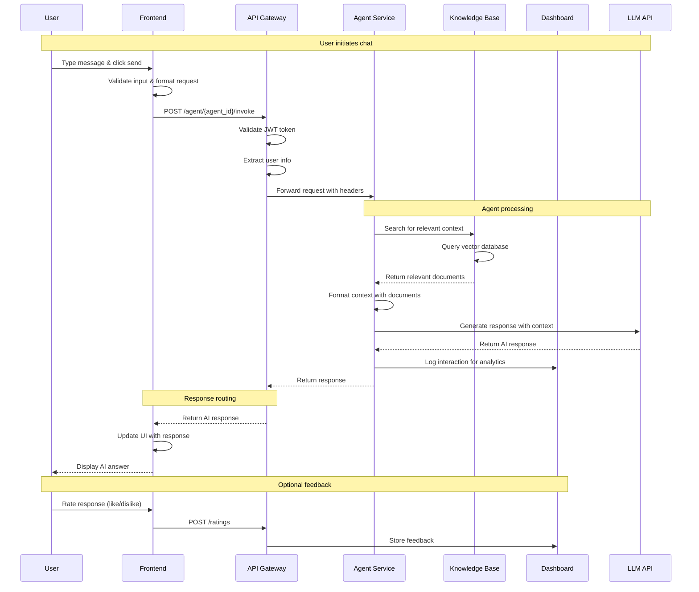
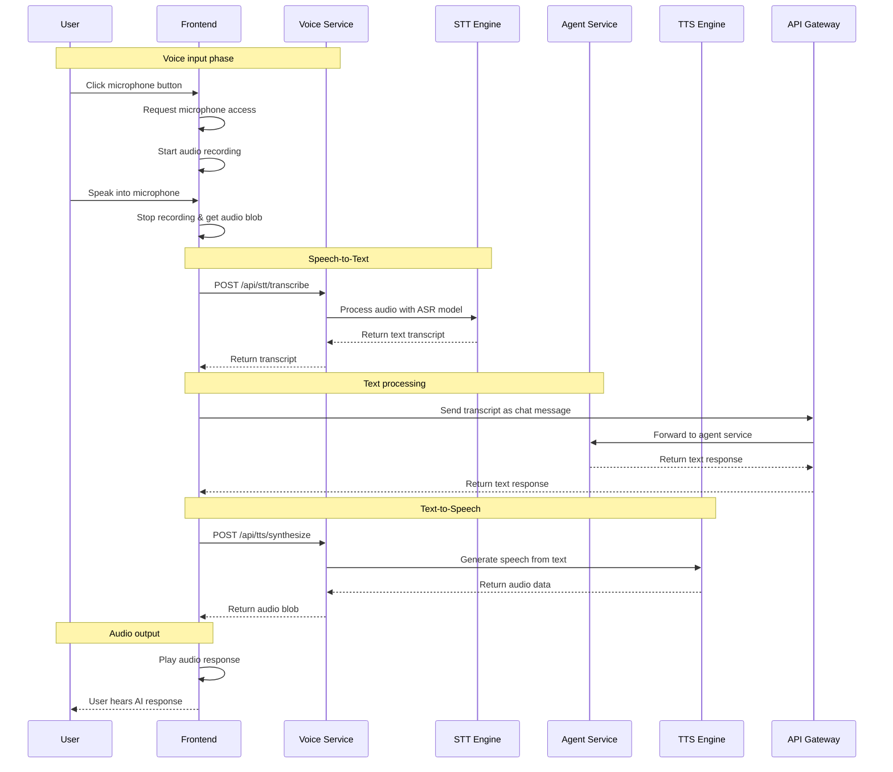
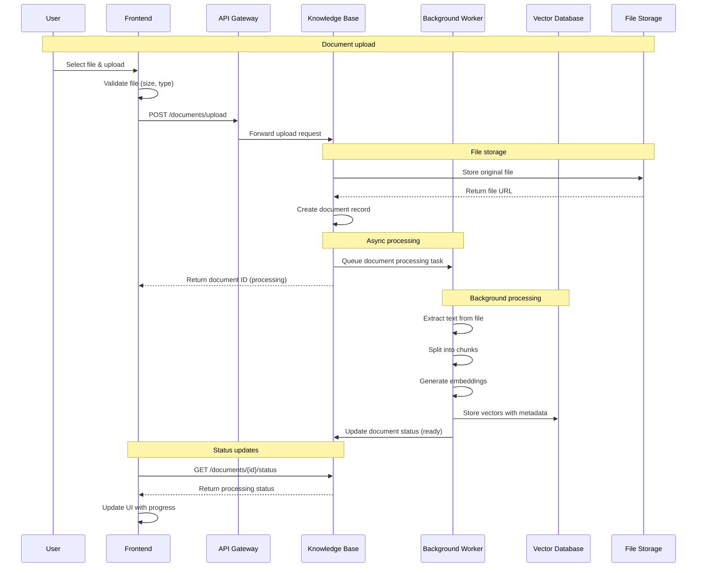
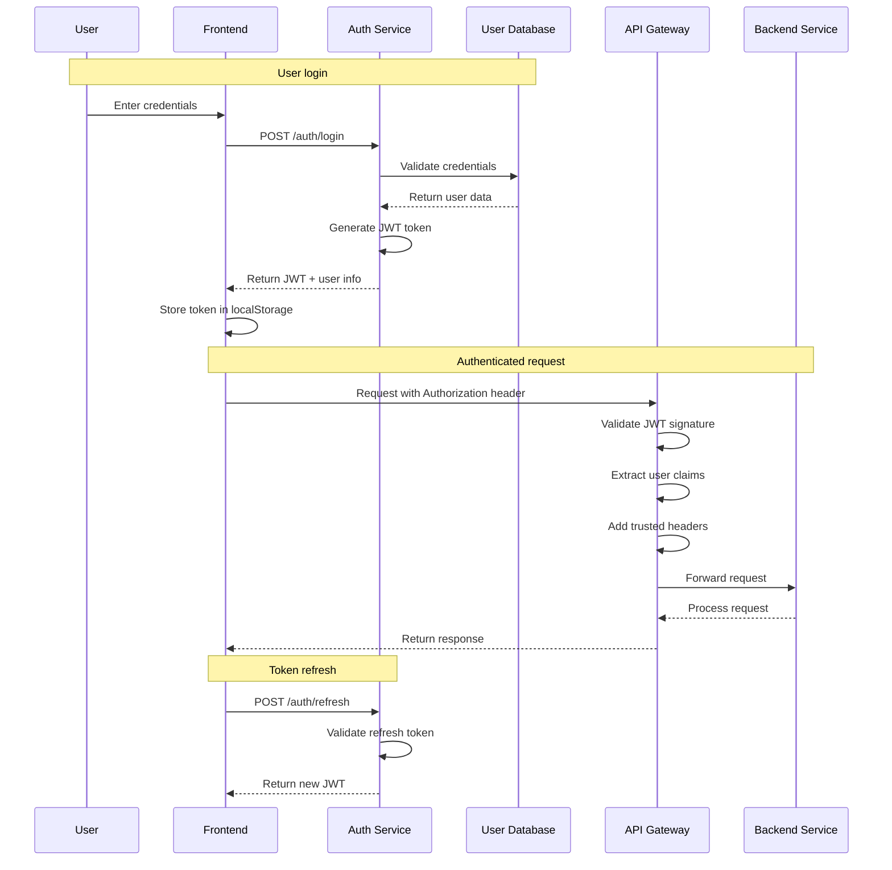
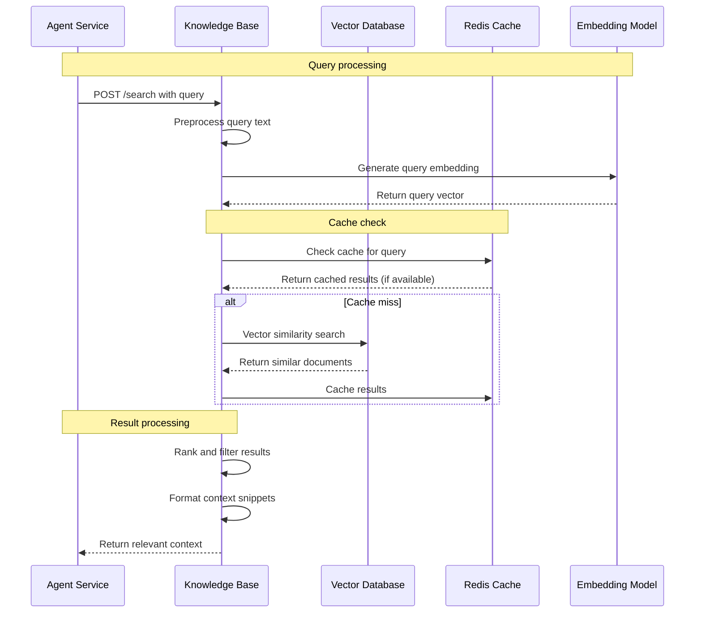
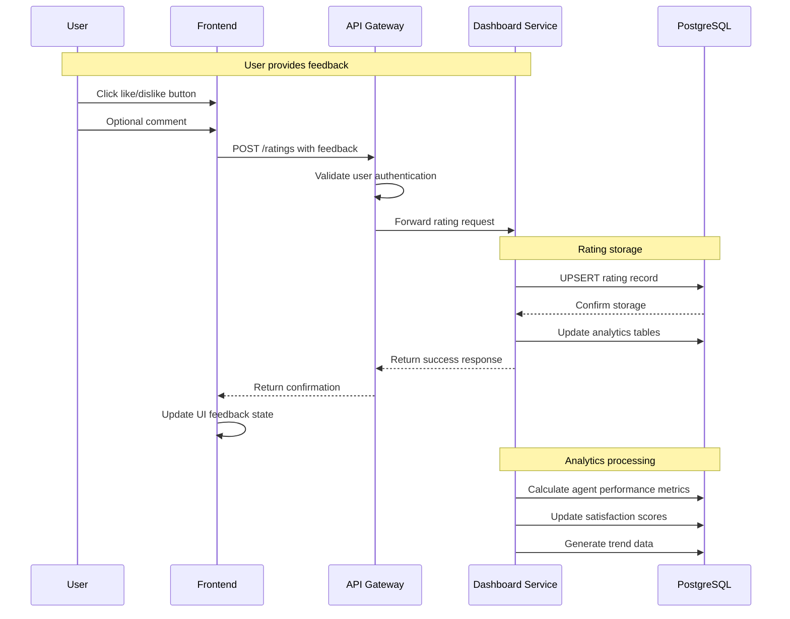
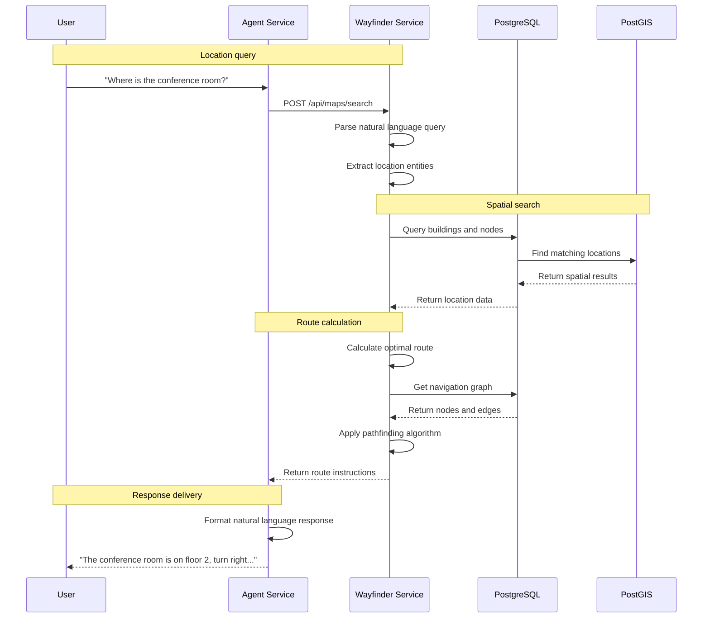
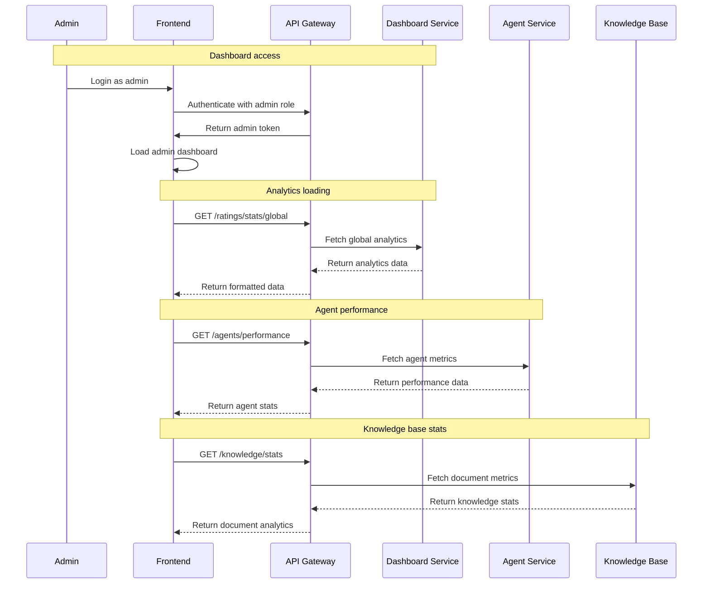
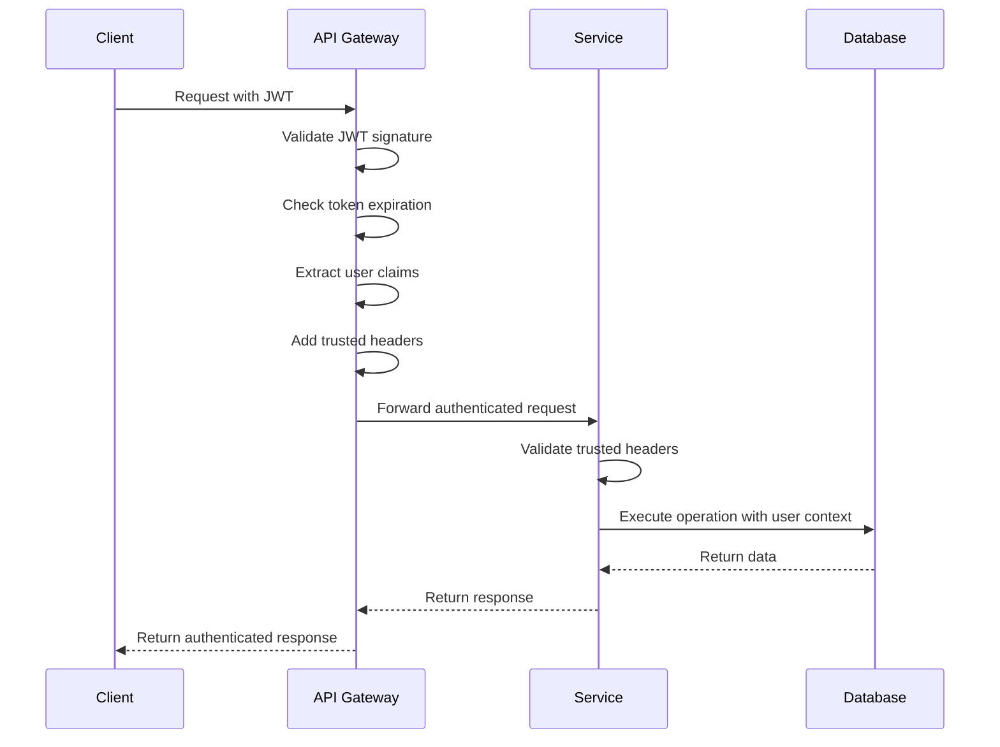

# DATN Chatbot System Flows Documentation

## Tổng quan

Documentation này chứa các PlantUML flow diagrams chi tiết để mô tả các luồng xử lý trong hệ thống DATN Chatbot. Mỗi flow được tách thành file riêng để dễ dàng quản lý và visualize.

## 📁 Diagram Types

### **Activity Diagrams** (Recommended for process flows)
Các activity diagrams mô tả luồng xử lý step-by-step với decision points và parallel processing:

### **Sequence Diagrams** 
Các sequence diagrams mô tả interaction giữa các components với timeline chi tiết.

## 📁 Activity Diagrams

### 1. [Authentication Activity](./authentication-activity.puml)
Mô tả luồng xác thực và phân quyền người dùng:
- User registration & validation
- Login với email/password và Google OAuth
- JWT token management (access/refresh)
- Token refresh và logout
- Forward-auth cho external services
- Admin token revocation

### 2. [Chat Activity](./chat-activity.puml)
Mô tả luồng chat với AI agents:
- Message input & validation
- API Gateway routing & JWT validation
- Agent Service processing với LangGraph
- Knowledge retrieval (RAG) từ Qdrant
- LLM API integration
- Response logging & analytics
- Tool calling examples

### 3. [Voice Activity](./voice-activity.puml)
Mô tả luồng tương tác giọng nói:
- WebRTC audio streaming
- Speech-to-Text với Sherpa-ONNX
- Voice Service orchestration
- Text-to-Speech với Piper TTS
- TURN server configuration
- Error handling & fallbacks

### 4. [Document Processing Activity](./document-processing-activity.puml)
Mô tả luồng xử lý tài liệu:
- File upload & validation
- Background processing pipeline
- Text extraction & chunking
- Embedding generation
- Vector storage trong Qdrant
- Status updates & notifications
- Search integration

### 5. [Navigation Activity](./navigation-activity.puml)
Mô tả luồng định vị nội thất:
- Natural language location search
- Database query & fuzzy matching
- Route calculation với NetworkX
- Accessibility considerations
- Turn-by-turn directions
- Missing location reporting

### 6. [Microservices Communication](./microservices-communication.puml)
Mô tả luồng giao tiếp giữa các services:
- Service startup sequences
- Request routing patterns
- Service-to-service communication
- Database connection patterns
- Async processing & background tasks
- Caching strategies
- Health monitoring & discovery

### 7. [Error Handling Flow](./error-handling-flow.puml)
Mô tả luồng xử lý lỗi:
- Request validation errors
- Authentication & authorization errors
- Rate limiting & circuit breaker
- Service unavailability handling
- Voice service specific errors
- Database connection errors
- Error recovery mechanisms
- Error analytics & monitoring

## 🏗️ System Architecture Overview

### Services & Ports
- **Frontend**: Next.js (Port 3000)
- **API Gateway**: FastAPI (Port 8008)
- **Agent Service**: LangGraph (Port 8080)
- **Knowledge Base**: FastAPI (Port 8000)
- **Wayfinder**: FastAPI (Port 8004)
- **Dashboard**: FastAPI (Port 8007)
- **Voice Service**: FastAPI (Port 7860)
- **Piper TTS**: FastAPI (Port 5000)

### Data Layer
- **PostgreSQL**: 5432-5435 (databases cho từng service)
- **Qdrant**: 6333 (vector database cho semantic search)
- **Redis**: 6379 (cache, message queue, session storage)

### External Services
- **LLM APIs**: OpenAI, Anthropic, Ollama
- **Google OAuth**: Authentication
- **TURN Server**: WebRTC NAT traversal

## 🛠️ How to Use

### Prerequisites
```bash
# Install PlantUML
npm install -g plantuml

# VS Code extension
code --install-extension jebbs.plantuml
```

### Generate Diagrams
```bash
# Generate PNG from all flows
for file in *.puml; do
  plantuml -tpng "$file"
done

# Generate SVG (recommended for web)
for file in *.puml; do
  plantuml -tsvg "$file"
done
```

### VS Code Preview
1. Mở file `.puml` trong VS Code
2. Sử dụng `Ctrl+Shift+P` → "PlantUML: Preview"
3. Hoặc `Alt+D` để preview diagram hiện tại

## 📊 Flow Categories

### **User-Facing Flows**
- Authentication & Authorization
- Chat Interactions
- Voice Commands
- Document Management
- Indoor Navigation

### **System Flows**
- Microservices Communication
- Service Health Monitoring
- Error Handling & Recovery
- Background Processing
- Data Synchronization

### **Integration Flows**
- Third-party API Integration
- Database Operations
- Caching Strategies
- Security & Compliance

## 🔍 Key Features Documented

### **Authentication & Security**
- JWT-based authentication
- OAuth2 integration (Google)
- Role-based access control
- Rate limiting & brute force protection
- Forward-auth pattern

### **AI & Machine Learning**
- LangGraph agent orchestration
- RAG (Retrieval-Augmented Generation)
- Vector similarity search
- Multiple LLM provider support
- Tool calling framework

### **Real-time Features**
- WebRTC audio streaming
- Live status updates
- Real-time notifications
- Background job processing

### **Scalability & Reliability**
- Microservices architecture
- Circuit breaker pattern
- Multi-level caching
- Database sharding
- Health monitoring

## 🚀 Deployment Considerations

### **Development Environment**
- Local services với different ports
- SQLite cho development databases
- In-memory Redis
- Development certificates

### **Production Environment**
- Docker containerization
- PostgreSQL clusters
- Redis cluster
- Load balancers
- SSL/TLS termination

### **Monitoring & Observability**
- Structured logging
- Error tracking
- Performance metrics
- Health checks
- Alerting

## 📝 Contributing

Khi thêm flows mới:
1. Tạo file `.puml` mới với descriptive name
2. Sử dụng consistent theme và styling
3. Include detailed notes và annotations
4. Update README với flow description
5. Test diagram generation

## 🔗 Related Documentation

- [Complete System Architecture](./complete-system-architecture.puml) - Full system overview
- [Original PlantUML Documentation](./plantuml-diagrams.md) - Legacy single-file version
- [API Documentation](../services/) - Detailed API specs
- [Deployment Guide](../../README.md) - Setup and deployment instructions

---

## 1. User Chat Flow

### Flow Overview
Luồng chat cơ bản từ user đến AI agent và response trả về.

### Sequence Diagram


### Detailed Steps

#### Step 1: User Input
```typescript
// Frontend: User sends message
const sendMessage = async (message: string, agentId: string) => {
  // 1. Validate input
  if (!message.trim()) return;
  
  // 2. Add to local state for immediate UI update
  addMessage({ content: message, role: 'user', agentId });
  
  // 3. Send to backend
  const response = await fetch('/api/agent/sales-agent/invoke', {
    method: 'POST',
    headers: {
      'Content-Type': 'application/json',
      'Authorization': `Bearer ${token}`
    },
    body: JSON.stringify({ message })
  });
  
  return response.json();
};
```

#### Step 2: API Gateway Processing
```python
# API Gateway: Request validation and routing
@app.route("/agent/<agent_id>/invoke", methods=['POST'])
def agent_invoke(agent_id):
    # 1. Validate JWT token
    token = request.headers.get('Authorization')
    user_info = validate_jwt(token)
    
    # 2. Add trusted headers
    headers = {
        'X-User-Id': user_info['user_id'],
        'X-User-Roles': ','.join(user_info['roles'])
    }
    
    # 3. Route to agent service
    response = requests.post(
        f'http://agent-service:8080/{agent_id}/invoke',
        json=request.json,
        headers=headers
    )
    
    return response.json(), response.status_code
```

#### Step 3: Agent Service Processing
```python
# Agent Service: Generate response
async def generate_response(message: str, user_id: str, agent_id: str):
    # 1. Search knowledge base for context
    context = await search_knowledge_base(message)
    
    # 2. Format prompt with context
    prompt = format_prompt_with_context(message, context)
    
    # 3. Generate AI response
    ai_response = await llm_client.generate(prompt)
    
    # 4. Log interaction
    await log_interaction(user_id, agent_id, message, ai_response)
    
    return ai_response
```

### Error Scenarios
- **Authentication Error**: 401 Unauthorized
- **Service Unavailable**: 503 Service Unavailable
- **Invalid Input**: 400 Bad Request
- **Rate Limit**: 429 Too Many Requests

---

## 2. Voice Interaction Flow

### Flow Overview
Luồng xử lý giọng nói từ input microphone đến AI response và voice output.

### Sequence Diagram


### Technical Implementation

#### Audio Recording (Frontend)
```typescript
const startRecording = async () => {
  try {
    const stream = await navigator.mediaDevices.getUserMedia({ 
      audio: {
        echoCancellation: true,
        noiseSuppression: true,
        sampleRate: 16000
      }
    });
    
    const mediaRecorder = new MediaRecorder(stream, {
      mimeType: 'audio/webm;codecs=opus'
    });
    
    const chunks: Blob[] = [];
    mediaRecorder.ondataavailable = (event) => {
      chunks.push(event.data);
    };
    
    mediaRecorder.onstop = async () => {
      const audioBlob = new Blob(chunks, { type: 'audio/wav' });
      const transcript = await transcribeAudio(audioBlob);
      sendChatMessage(transcript);
    };
    
    mediaRecorder.start();
    return mediaRecorder;
  } catch (error) {
    console.error('Error accessing microphone:', error);
  }
};
```

#### Speech-to-Text Processing
```python
# Voice Service: STT Processing
@app.post("/api/stt/transcribe")
async def transcribe_audio(file: UploadFile):
    # 1. Validate audio format
    if not file.content_type.startswith('audio/'):
        raise HTTPException(400, "Invalid audio format")
    
    # 2. Convert to WAV format if needed
    audio_data = await file.read()
    wav_audio = convert_to_wav(audio_data)
    
    # 3. Process with ASR model
    transcript = await asr_model.transcribe(wav_audio)
    
    # 4. Post-processing (punctuation, capitalization)
    cleaned_transcript = post_process_text(transcript)
    
    return {"text": cleaned_transcript, "confidence": transcript.confidence}
```

#### Text-to-Speech Synthesis
```python
# Voice Service: TTS Processing
@app.post("/api/tts/synthesize")
async def synthesize_speech(request: TTSRequest):
    # 1. Text preprocessing
    cleaned_text = normalize_text(request.text)
    
    # 2. Generate speech
    audio_data = await tts_model.synthesize(
        text=cleaned_text,
        voice=request.voice,
        speed=request.speed
    )
    
    # 3. Audio post-processing
    enhanced_audio = enhance_audio_quality(audio_data)
    
    return Response(
        content=enhanced_audio,
        media_type="audio/wav",
        headers={"Content-Disposition": "attachment; filename=speech.wav"}
    )
```

### Performance Considerations
- **Audio Latency**: Minimize processing time for real-time feel
- **Network Bandwidth**: Compress audio data for transmission
- **Model Optimization**: Use quantized models for faster inference
- **Buffer Management**: Handle audio streaming efficiently

---

## 3. Document Processing Flow

### Flow Overview
Luồng xử lý khi user upload document vào knowledge base.

### Sequence Diagram


### Detailed Processing Pipeline

#### Step 1: File Upload & Validation
```python
# Knowledge Base: Document upload
@app.post("/documents/upload")
async def upload_document(
    file: UploadFile = File(...),
    title: str = Form(...),
    description: str = Form(""),
    tags: str = Form("")
):
    # 1. Validate file
    if file.size > MAX_FILE_SIZE:
        raise HTTPException(400, "File too large")
    
    if file.content_type not in ALLOWED_TYPES:
        raise HTTPException(400, "Unsupported file type")
    
    # 2. Store file
    file_url = await storage_service.upload_file(file)
    
    # 3. Create document record
    document = Document(
        title=title,
        description=description,
        file_url=file_url,
        status=ProcessingStatus.PENDING,
        tags=parse_tags(tags)
    )
    
    await db.save(document)
    
    # 4. Queue processing task
    await queue_document_processing(document.id)
    
    return {"document_id": document.id, "status": "processing"}
```

#### Step 2: Background Processing
```python
# Celery Task: Document processing
@celery.task(bind=True)
def process_document(self, document_id: str):
    try:
        # 1. Update status
        update_document_status(document_id, ProcessingStatus.PROCESSING)
        
        # 2. Extract text
        document = get_document(document_id)
        text_content = extract_text_from_file(document.file_url)
        
        # 3. Split into chunks
        chunks = split_text_into_chunks(text_content)
        
        # 4. Generate embeddings
        embeddings = []
        for chunk in chunks:
            embedding = embedding_model.encode(chunk.text)
            embeddings.append({
                'text': chunk.text,
                'embedding': embedding,
                'metadata': {
                    'document_id': document_id,
                    'chunk_index': chunk.index,
                    'page_number': chunk.page_number
                }
            })
        
        # 5. Store in vector database
        vector_db.store_embeddings(document_id, embeddings)
        
        # 6. Update status
        update_document_status(document_id, ProcessingStatus.READY)
        
    except Exception as exc:
        update_document_status(document_id, ProcessingStatus.FAILED)
        raise self.retry(exc, countdown=60, max_retries=3)
```

#### Step 3: Text Extraction Strategies
```python
# Multi-format text extraction
def extract_text_from_file(file_url: str) -> str:
    file_extension = Path(file_url).suffix.lower()
    
    if file_extension == '.pdf':
        return extract_from_pdf(file_url)
    elif file_extension in ['.docx', '.doc']:
        return extract_from_docx(file_url)
    elif file_extension == '.txt':
        return extract_from_txt(file_url)
    elif file_extension in ['.jpg', '.jpeg', '.png']:
        return extract_from_image(file_url)  # OCR
    else:
        raise ValueError(f"Unsupported file type: {file_extension}")

def extract_from_pdf(file_url: str) -> str:
    # Use PyPDF2 or pdfplumber
    import pdfplumber
    
    with pdfplumber.open(download_file(file_url)) as pdf:
        text = ""
        for page in pdf.pages:
            text += page.extract_text() + "\n"
    
    return text

def extract_from_image(file_url: str) -> str:
    # Use OCR with Tesseract or EasyOCR
    import easyocr
    
    reader = easyocr.Reader(['en', 'vi'])
    results = reader.readtext(download_file(file_url))
    
    text = " ".join([result[1] for result in results])
    return text
```

### Error Handling & Recovery
- **Processing Failures**: Retry logic with exponential backoff
- **Corrupted Files**: Validation and error reporting
- **Memory Issues**: Chunk processing for large files
- **Network Issues**: Resumable uploads and processing

---

## 4. Authentication Flow

### Flow Overview
Luồng xác thực user từ login đến JWT token generation và validation.

### Sequence Diagram


### JWT Token Structure
```json
{
  "header": {
    "alg": "HS256",
    "typ": "JWT"
  },
  "payload": {
    "sub": "user-uuid",
    "email": "user@example.com",
    "roles": ["user", "admin"],
    "iat": 1640995200,
    "exp": 1641081600,
    "iss": "datn-chatbot"
  }
}
```

### Implementation Details

#### Login Endpoint
```python
# Auth Service: User login
@app.post("/auth/login")
async def login(credentials: LoginCredentials):
    # 1. Validate credentials
    user = await authenticate_user(credentials.email, credentials.password)
    if not user:
        raise HTTPException(401, "Invalid credentials")
    
    # 2. Generate tokens
    access_token = create_access_token(
        data={"sub": user.id, "email": user.email, "roles": user.roles}
    )
    refresh_token = create_refresh_token(data={"sub": user.id})
    
    # 3. Return tokens
    return {
        "access_token": access_token,
        "refresh_token": refresh_token,
        "token_type": "bearer",
        "user": {
            "id": user.id,
            "email": user.email,
            "roles": user.roles
        }
    }
```

#### API Gateway Validation
```python
# API Gateway: JWT validation middleware
def validate_jwt_token(request):
    auth_header = request.headers.get('Authorization')
    if not auth_header or not auth_header.startswith('Bearer '):
        raise HTTPException(401, "Missing or invalid token")
    
    token = auth_header.split(' ')[1]
    try:
        payload = jwt.decode(token, SECRET_KEY, algorithms=[ALGORITHM])
        return payload
    except jwt.ExpiredSignatureError:
        raise HTTPException(401, "Token expired")
    except jwt.InvalidTokenError:
        raise HTTPException(401, "Invalid token")

def add_trusted_headers(request, user_payload):
    request.headers['X-User-Id'] = user_payload['sub']
    request.headers['X-User-Email'] = user_payload['email']
    request.headers['X-User-Roles'] = ','.join(user_payload['roles'])
    return request
```

---

## 5. Knowledge Retrieval Flow

### Flow Overview
Luồng tìm kiếm và truy xuất thông tin từ knowledge base để cung cấp context cho AI agent.

### Sequence Diagram


### Search Algorithm Implementation

#### Vector Search with Hybrid Approach
```python
# Knowledge Base: Hybrid search implementation
async def search_documents(query: str, limit: int = 5):
    # 1. Generate query embedding
    query_embedding = await embedding_model.encode(query)
    
    # 2. Vector similarity search
    vector_results = await vector_db.similarity_search(
        query_vector=query_embedding,
        limit=limit * 2,  # Get more for re-ranking
        threshold=0.7
    )
    
    # 3. Keyword search (optional for hybrid)
    keyword_results = await keyword_search(query, limit=limit)
    
    # 4. Merge and re-rank results
    merged_results = merge_search_results(vector_results, keyword_results)
    ranked_results = rank_results(merged_results, query)
    
    # 5. Format context
    context = format_search_context(ranked_results[:limit])
    
    return {
        "context": context,
        "sources": [doc["metadata"] for doc in ranked_results[:limit]],
        "total_found": len(ranked_results)
    }
```

#### Context Formatting
```python
def format_search_context(documents: List[Dict]) -> str:
    context_parts = []
    
    for i, doc in enumerate(documents, 1):
        context_part = f"""
Source {i}:
Title: {doc['metadata']['title']}
Content: {doc['text']}
Relevance: {doc['score']:.2f}
"""
        context_parts.append(context_part)
    
    return "\n".join(context_parts)
```

### Performance Optimization
- **Caching Strategy**: Redis cache for frequent queries
- **Batch Processing**: Process multiple queries simultaneously
- **Index Optimization**: Optimize vector indexes for faster search
- **Result Pagination**: Implement pagination for large result sets

---

## 6. Rating & Feedback Flow

### Flow Overview
Luồng thu thập và xử lý feedback từ user về chất lượng AI responses.

### Sequence Diagram


### Rating Logic Implementation

#### Rating API Endpoint
```python
# Dashboard Service: Create/update rating
@app.post("/ratings")
async def create_or_update_rating(
    rating: RatingCreate,
    user_id: str = Header(...),
    user_roles: str = Header(...)
):
    # 1. Validate permissions
    if not user_id:
        raise HTTPException(401, "User ID required")
    
    # 2. Check for existing rating
    existing = await get_rating_by_user_and_run(user_id, rating.run_id)
    
    if existing:
        # Update existing rating
        updated_rating = await update_rating(existing.id, rating)
        action = "updated"
    else:
        # Create new rating
        new_rating = await create_rating(rating, user_id)
        action = "created"
    
    # 3. Update analytics
    await update_agent_analytics(rating.agent_id)
    
    return {
        "rating_id": updated_rating.id if existing else new_rating.id,
        "action": action,
        "status": "success"
    }
```

#### Analytics Calculation
```python
# Dashboard Service: Performance metrics
async def calculate_agent_performance(agent_id: str):
    # 1. Get all ratings for agent
    ratings = await get_ratings_by_agent(agent_id)
    
    # 2. Calculate metrics
    total_ratings = len(ratings)
    like_count = sum(1 for r in ratings if r.rating == "LIKE")
    dislike_count = total_ratings - like_count
    like_percentage = (like_count / total_ratings * 100) if total_ratings > 0 else 0
    
    # 3. Calculate trends
    recent_ratings = [r for r in ratings if r.created_at >= datetime.now() - timedelta(days=7)]
    recent_like_percentage = (
        sum(1 for r in recent_ratings if r.rating == "LIKE") / len(recent_ratings) * 100
        if recent_ratings else 0
    )
    
    # 4. Store analytics
    analytics = AgentAnalytics(
        agent_id=agent_id,
        total_ratings=total_ratings,
        like_count=like_count,
        dislike_count=dislike_count,
        like_percentage=like_percentage,
        recent_like_percentage=recent_like_percentage,
        calculated_at=datetime.now()
    )
    
    await save_analytics(analytics)
    
    return analytics
```

---

## 7. Indoor Navigation Flow

### Flow Overview
Luồng xử lý yêu cầu định vị và dẫn đường trong nhà.

### Sequence Diagram


### Navigation Algorithm

#### Path Finding Implementation
```python
# Wayfinder Service: Route calculation
async def calculate_route(
    from_location: str,
    to_location: str,
    accessible: bool = False
):
    # 1. Parse and find locations
    from_node = await find_location_by_name(from_location)
    to_node = await find_location_by_name(to_location)
    
    if not from_node or not to_node:
        raise ValueError("Location not found")
    
    # 2. Build navigation graph
    graph = await build_navigation_graph(accessible)
    
    # 3. Find shortest path
    path = nx.shortest_path(
        graph,
        source=from_node.id,
        target=to_node.id,
        weight='travel_time'
    )
    
    # 4. Generate step-by-step directions
    directions = []
    for i in range(len(path) - 1):
        current_node = graph.nodes[path[i]]
        next_node = graph.nodes[path[i + 1]]
        edge = graph.edges[path[i], path[i + 1]]
        
        direction = {
            "step": i + 1,
            "instruction": generate_direction(current_node, next_node, edge),
            "distance": edge["distance"],
            "estimated_time": edge["travel_time"],
            "floor": current_node["floor"]
        }
        directions.append(direction)
    
    return {
        "route_id": str(uuid.uuid4()),
        "directions": directions,
        "total_distance": sum(d["distance"] for d in directions),
        "total_time": sum(d["estimated_time"] for d in directions),
        "accessible": accessible
    }
```

#### Natural Language Processing
```python
# Wayfinder Service: Location name parsing
def parse_location_query(query: str) -> Dict:
    # 1. Extract key entities
    doc = nlp(query.lower())
    
    entities = {
        "locations": [],
        "room_types": [],
        "floors": [],
        "directions": []
    }
    
    # 2. Identify room types
    room_types = ["conference room", "office", "restroom", "elevator", "stairs"]
    for room_type in room_types:
        if room_type in query.lower():
            entities["room_types"].append(room_type)
    
    # 3. Extract floor numbers
    floor_pattern = r'floor\s*(\d+)|(\d+)(?:st|nd|rd|th)\s*floor'
    matches = re.findall(floor_pattern, query.lower())
    entities["floors"] = [int(match[0] or match[1]) for match in matches]
    
    # 4. Find direction cues
    directions = ["left", "right", "straight", "up", "down"]
    for direction in directions:
        if direction in query.lower():
            entities["directions"].append(direction)
    
    return entities
```

---

## 8. Error Handling Flow

### Flow Overview
Luồng xử lý errors từ detection đến user notification và recovery.

### Error Classification
- **Client Errors (4xx)**: Invalid input, authentication issues
- **Server Errors (5xx)**: Service failures, database issues
- **Network Errors**: Connection timeouts, service unavailable
- **Business Logic Errors**: Invalid operations, constraint violations

### Error Handling Implementation

#### Global Error Handler (API Gateway)
```python
# API Gateway: Error handling middleware
@app.errorhandler(Exception)
def handle_global_error(error):
    # 1. Log error details
    logger.error(f"Global error: {str(error)}", exc_info=True)
    
    # 2. Categorize error
    if isinstance(error, ValidationError):
        return error_response(400, "Validation error", str(error))
    elif isinstance(error, AuthenticationError):
        return error_response(401, "Authentication failed", str(error))
    elif isinstance(error, PermissionError):
        return error_response(403, "Permission denied", str(error))
    elif isinstance(error, NotFoundError):
        return error_response(404, "Resource not found", str(error))
    elif isinstance(error, RateLimitError):
        return error_response(429, "Rate limit exceeded", str(error))
    elif isinstance(error, ServiceUnavailableError):
        return error_response(503, "Service unavailable", str(error))
    else:
        return error_response(500, "Internal server error", "An unexpected error occurred")

def error_response(status_code: int, message: str, details: str):
    return {
        "error": {
            "status_code": status_code,
            "message": message,
            "details": details,
            "timestamp": datetime.utcnow().isoformat(),
            "request_id": request.headers.get("X-Request-ID", "unknown")
        }
    }, status_code
```

#### Circuit Breaker Pattern
```python
# Service resilience: Circuit breaker
class CircuitBreaker:
    def __init__(self, failure_threshold: int = 5, timeout: int = 60):
        self.failure_threshold = failure_threshold
        self.timeout = timeout
        self.failure_count = 0
        self.last_failure_time = None
        self.state = "CLOSED"  # CLOSED, OPEN, HALF_OPEN
    
    async def call(self, func, *args, **kwargs):
        if self.state == "OPEN":
            if time.time() - self.last_failure_time > self.timeout:
                self.state = "HALF_OPEN"
            else:
                raise ServiceUnavailableError("Circuit breaker is OPEN")
        
        try:
            result = await func(*args, **kwargs)
            if self.state == "HALF_OPEN":
                self.reset()
            return result
        except Exception as e:
            self.record_failure()
            raise e
    
    def record_failure(self):
        self.failure_count += 1
        self.last_failure_time = time.time()
        
        if self.failure_count >= self.failure_threshold:
            self.state = "OPEN"
    
    def reset(self):
        self.failure_count = 0
        self.state = "CLOSED"
```

---

## 9. Admin Dashboard Flow

### Flow Overview
Luồng xử lý các hoạt động trong admin dashboard.

### Sequence Diagram


### Admin Features Implementation

#### Real-time Analytics Dashboard
```typescript
// Frontend: Real-time analytics
const AdminDashboard = () => {
  const [analytics, setAnalytics] = useState(null);
  const [isLoading, setIsLoading] = useState(true);
  
  // WebSocket for real-time updates
  useEffect(() => {
    const ws = new WebSocket('ws://localhost:8002/ws/analytics');
    
    ws.onmessage = (event) => {
      const data = JSON.parse(event.data);
      setAnalytics(prev => ({
        ...prev,
        ...data,
        lastUpdated: new Date()
      }));
    };
    
    return () => ws.close();
  }, []);
  
  // Fetch initial data
  useEffect(() => {
    const fetchAnalytics = async () => {
      try {
        const response = await fetch('/api/dashboard/analytics');
        const data = await response.json();
        setAnalytics(data);
      } catch (error) {
        console.error('Failed to fetch analytics:', error);
      } finally {
        setIsLoading(false);
      }
    };
    
    fetchAnalytics();
  }, []);
  
  return (
    <div className="admin-dashboard">
      <AnalyticsOverview data={analytics} isLoading={isLoading} />
      <AgentPerformance agents={analytics?.agents} />
      <UserActivity activity={analytics?.activity} />
      <SystemHealth health={analytics?.health} />
    </div>
  );
};
```

---

## 10. Service Health Check Flow

### Flow Overview
Luồng kiểm tra sức khỏe của tất cả services trong hệ thống.

### Health Check Implementation

#### Service Health Endpoints
```python
# Each service: Health check endpoint
@app.get("/health")
async def health_check():
    checks = {
        "status": "healthy",
        "timestamp": datetime.utcnow().isoformat(),
        "version": os.getenv("SERVICE_VERSION", "1.0.0"),
        "checks": {}
    }
    
    # Database connectivity
    try:
        await db.execute("SELECT 1")
        checks["checks"]["database"] = {"status": "healthy"}
    except Exception as e:
        checks["checks"]["database"] = {"status": "unhealthy", "error": str(e)}
        checks["status"] = "degraded"
    
    # External services
    try:
        response = await http_client.get("https://api.openai.com/v1/models")
        checks["checks"]["openai"] = {"status": "healthy"}
    except Exception as e:
        checks["checks"]["openai"] = {"status": "unhealthy", "error": str(e)}
        checks["status"] = "degraded"
    
    # Memory usage
    memory_usage = psutil.virtual_memory().percent
    checks["checks"]["memory"] = {
        "status": "healthy" if memory_usage < 80 else "degraded",
        "usage": f"{memory_usage}%"
    }
    
    status_code = 200 if checks["status"] == "healthy" else 503
    return checks, status_code
```

#### System-wide Health Monitoring
```python
# API Gateway: Aggregate health check
@app.get("/system/health")
async def system_health():
    services = [
        {"name": "agent-service", "url": "http://agent-service:8080/health"},
        {"name": "knowledge-base", "url": "http://knowledge:8000/health"},
        {"name": "wayfinder", "url": "http://wayfinder:8001/health"},
        {"name": "dashboard", "url": "http://dashboard:8010/health"},
        {"name": "voice-service", "url": "http://voice:7860/health"}
    ]
    
    system_status = {
        "overall_status": "healthy",
        "timestamp": datetime.utcnow().isoformat(),
        "services": {}
    }
    
    for service in services:
        try:
            response = await http_client.get(service["url"], timeout=5)
            health_data = response.json()
            system_status["services"][service["name"]] = {
                "status": health_data.get("status", "unknown"),
                "response_time": response.elapsed.total_seconds(),
                "details": health_data.get("checks", {})
            }
        except Exception as e:
            system_status["services"][service["name"]] = {
                "status": "unhealthy",
                "error": str(e)
            }
            system_status["overall_status"] = "degraded"
    
    return system_status
```

---

## Performance Monitoring & Metrics

### Key Performance Indicators (KPIs)

#### Response Time Metrics
- **API Gateway**: < 100ms average response time
- **Agent Service**: < 2s for AI response generation
- **Knowledge Base**: < 500ms for document search
- **Voice STT**: < 1s for audio transcription
- **Voice TTS**: < 500ms for speech synthesis

#### Availability Metrics
- **Uptime Target**: 99.9%
- **Error Rate**: < 1%
- **Service Health**: All services healthy
- **Database Performance**: < 100ms query time

#### Business Metrics
- **User Satisfaction**: > 80% positive ratings
- **Response Quality**: > 85% relevant responses
- **Document Processing**: < 30s average processing time
- **Voice Interaction Accuracy**: > 90% transcription accuracy

### Monitoring Implementation

#### Metrics Collection
```python
# Prometheus metrics integration
from prometheus_client import Counter, Histogram, Gauge

# Define metrics
REQUEST_COUNT = Counter('http_requests_total', 'Total HTTP requests', ['method', 'endpoint', 'status'])
REQUEST_DURATION = Histogram('http_request_duration_seconds', 'HTTP request duration')
ACTIVE_CONNECTIONS = Gauge('active_connections', 'Active connections')

@app.middleware("http")
async def metrics_middleware(request: Request, call_next):
    start_time = time.time()
    
    response = await call_next(request)
    
    # Record metrics
    REQUEST_COUNT.labels(
        method=request.method,
        endpoint=request.url.path,
        status=response.status_code
    ).inc()
    
    REQUEST_DURATION.observe(time.time() - start_time)
    
    return response
```

---

## Security Flows

### Security Implementation Patterns

#### Request Security Flow


#### Data Encryption Flow
```python
# Data encryption at rest
def encrypt_sensitive_data(data: str) -> str:
    key = os.getenv('ENCRYPTION_KEY')
    cipher = Fernet(key)
    encrypted_data = cipher.encrypt(data.encode())
    return encrypted_data.decode()

def decrypt_sensitive_data(encrypted_data: str) -> str:
    key = os.getenv('ENCRYPTION_KEY')
    cipher = Fernet(key)
    decrypted_data = cipher.decrypt(encrypted_data.encode())
    return decrypted_data.decode()
```

---

## Conclusion

System flows documentation này cung cấp cái nhìn chi tiết về cách các services tương tác với nhau trong hệ thống DATN Chatbot. Understanding các flows này giúp:

1. **Development**: Hiểu rõ data flow để implement features
2. **Troubleshooting**: Xác định issues trong system interactions
3. **Optimization**: Tìm bottlenecks và cải thiện performance
4. **Maintenance**: Maintain và upgrade system hiệu quả

Các flows được thiết kế với focus on:
- **Reliability**: Error handling và recovery mechanisms
- **Performance**: Efficient data processing và caching
- **Security**: Authentication, authorization, và data protection
- **Scalability**: Horizontal scaling và load distribution
- **Maintainability**: Clear separation of concerns và modularity
