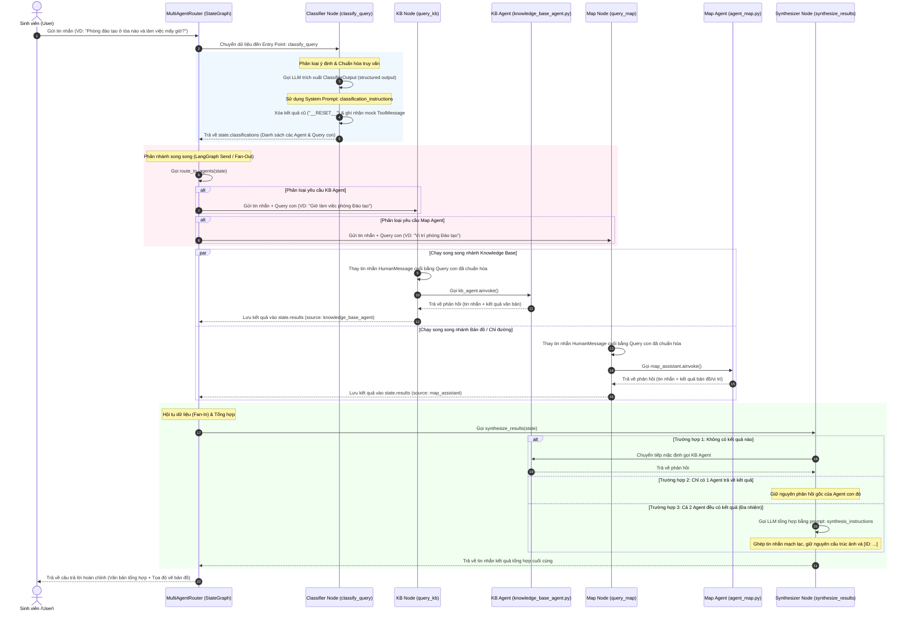

# Sơ đồ Sequence Chi tiết của Multi-Agent Router - BK-TBOT

Tài liệu này mô tả chi tiết kiến trúc điều phối đa tác nhân (Multi-Agent Routing) của hệ thống **BK-TBOT**, được định nghĩa tại [multi_agent_router.py](file:///d:/Code/DATN/DATN-Chatbot/agent-service-toolkit/src/agents/multi_agent_router.py). Hệ thống sử dụng thư viện **LangGraph** để phân loại truy vấn người dùng và phân nhánh xử lý song song (Parallel Routing) tới các Agent con chuyên biệt.

---

## 1. Sơ đồ Sequence (Mermaid Diagram)

Sơ đồ thể hiện luồng đi của dữ liệu từ khi nhận yêu cầu của người dùng, phân loại (classify), phân nhánh song song (fan-out), và hội tụ tổng hợp (fan-in/synthesis).

---

## 2. Chi tiết Vận hành và các Cơ chế Kỹ thuật

### 2.1 Cấu trúc State của Router (`RouterState`)
Router sử dụng lớp `RouterState` kế thừa từ `MessagesState` với một số trường mở rộng:
*   `classifications`: Lưu trữ các quyết định phân loại Agent đích và câu truy vấn con tương ứng sau khi chạy mô hình phân loại.
*   `results`: Lưu trữ kết quả đầu ra của các sub-agent dưới dạng `AgentOutput` (gồm `source` và `result`). 
    *   Trường này sử dụng một **custom reducer** `merge_results`. Reducer này cho phép hệ thống reset danh sách kết quả về rỗng khi bắt đầu một lượt truy vấn mới (`__RESET__`), nhưng vẫn hỗ trợ ghép nối danh sách kết quả (`addition`) khi các Agent con chạy song song và trả về dữ liệu đồng thời.

### 2.2 Phân loại truy vấn (`classify_query`)
Node này chịu trách nhiệm phân tích ngữ cảnh hội thoại để đưa ra quyết định định tuyến:
1. **Mô hình hóa Output cấu trúc:** Sử dụng `.with_structured_output(ClassifierOutput)` để đảm bảo LLM trả về đúng định dạng JSON chứa danh sách các Agent đích và truy vấn con.
2. **Reformulate Query (Viết lại câu truy vấn):** Đây là bước cực kỳ quan trọng. LLM Classifier sẽ phân giải toàn bộ các đại từ hoặc ngữ cảnh ẩn trong lịch sử hội thoại (ví dụ: *"ở đó"*, *"họ"*, *"nó"*, *"đang ở đây"*) thành các danh từ/vị trí cụ thể trong tiếng Việt trước khi chuyển đến Agent con. Nhờ đó, các Agent con có thể hoạt động độc lập và chính xác.
3. **Chặn Stream Token:** Hệ thống chèn tag `skip_stream` vào cấu hình để chặn việc gửi các token phân loại thô về cho Client, giúp tăng tính thẩm mỹ cho UI.

### 2.3 Cơ chế định tuyến động (`route_to_agents` - Dynamic Fan-Out)
Sử dụng đối tượng `Send` của LangGraph để thực hiện định tuyến động:
*   Nếu `classifications` trống $\rightarrow$ Mặc định tạo ra một `Send` gửi đến node `query_kb`.
*   Nếu có nhiều phân loại $\rightarrow$ Tạo ra nhiều đối tượng `Send` độc lập chạy song song. Mỗi đối tượng `Send` sẽ nhân bản trạng thái tin nhắn và chuyển kèm tham số `query` đã được chuẩn hóa riêng cho node đích đó (`query_kb` hoặc `query_map`).

### 2.4 Hội tụ và Tổng hợp (`synthesize_results` - Fan-In)
Khi các luồng song song chạy xong, LangGraph tự động gom kết quả vào `state["results"]`:
1. **Lọc trường hợp đơn nhiệm:** Nếu chỉ có duy nhất 1 Agent phản hồi, hệ thống sẽ bỏ qua bước tổng hợp của LLM để tiết kiệm chi phí token và tránh suy giảm chất lượng phản hồi gốc của Agent chuyên biệt.
2. **Tổng hợp đa nhiệm (Synthesis LLM):** Nếu người dùng hỏi tích hợp (ví dụ: vừa hỏi vị trí tòa nhà vừa hỏi giờ làm việc phòng ban), Synthesizer sẽ ghép dữ liệu của cả hai bên thành một đoạn prompt tổng hợp và gọi LLM để viết lại thành một phản hồi liền mạch duy nhất.
3. **Bảo toàn định dạng bản đồ:** Prompt tổng hợp ép buộc LLM không được thay đổi các ký tự landmark, tọa độ hoặc cú pháp ID đặc biệt (ví dụ: `[ID: 15]`) để frontend không bị lỗi hiển thị bản đồ.
