# PlantUML Activity Diagrams for DATN Chatbot System

## Tổng quan

Documentation này chứa các PlantUML activity diagrams chi tiết để mô tả các luồng xử lý trong hệ thống DATN Chatbot. PlantUML hỗ trợ visualization tốt hơn cho complex system flows so với Mermaid.

## Table of Contents

1. [Complete System Architecture](#1-complete-system-architecture)
2. [User Registration & Login Activity](#2-user-registration--login-activity)
3. [Chat Interaction Activity](#3-chat-interaction-activity)
4. [Voice Chat Activity](#4-voice-chat-activity)
5. [Document Upload Activity](#5-document-upload-activity)
6. [Knowledge Search Activity](#6-knowledge-search-activity)
7. [Rating & Feedback Activity](#7-rating--feedback-activity)
8. [Indoor Navigation Activity](#8-indoor-navigation-activity)
9. [Admin Dashboard Activity](#9-admin-dashboard-activity)
10. [Error Handling Activity](#10-error-handling-activity)
11. [Service Health Check Activity](#11-service-health-check-activity)
12. [Microservices Communication Flow](#12-microservices-communication-flow)

---

## 1. Complete System Architecture

### PlantUML Architecture Diagram

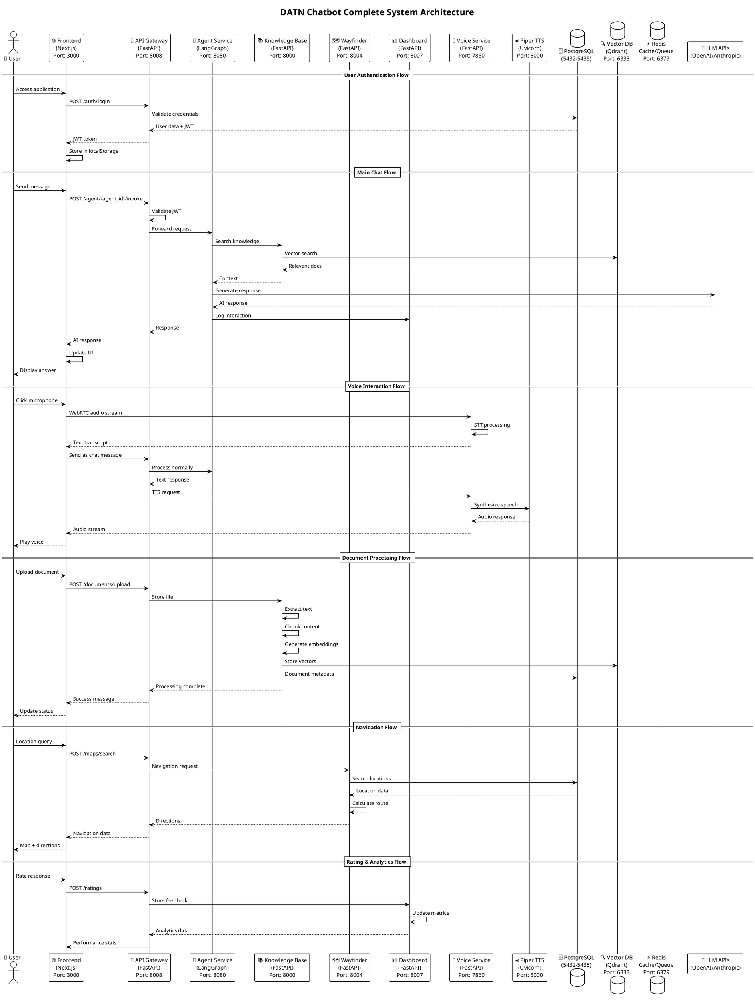

### Architecture Overview

Hệ thống DATN Chatbot được xây dựng với kiến trúc microservices:

#### **Frontend Layer**
- **Next.js 16** với TypeScript và TailwindCSS
- Port **3000**
- Real-time chat interface với voice input support

#### **API Gateway**
- **FastAPI** với JWT authentication
- Port **8008** 
- Request routing, rate limiting, load balancing
- Centralized error handling và logging

#### **Core Services**

**Agent Service Toolkit** 🤖
- **LangGraph** framework với FastAPI
- Port **8080**
- AI agents, reasoning, tool usage
- Support cho multiple agents với different capabilities

**Knowledge Base Service** 📚
- **FastAPI** với PostgreSQL + Qdrant
- Port **8000**
- Document management, RAG, vector search
- Background processing với Redis queue

**Wayfinder Service** 🗺️
- **FastAPI** với PostgreSQL + NetworkX
- Port **8004**
- Indoor navigation, location services
- Route calculation với accessibility support

**Dashboard Service** 📊
- **FastAPI** với PostgreSQL
- Port **8007**
- Analytics, user feedback management
- Performance metrics và reporting

**Voice Service** 🎤
- **FastAPI** với WebRTC
- Port **7860**
- Speech-to-Text với Sherpa-ONNX
- Text-to-Speech với Piper TTS (Port **5000**)

#### **Data Layer**
- **PostgreSQL** (Ports 5432-5435): Service databases
- **Qdrant** (Port 6333): Vector database cho semantic search
- **Redis** (Port 6379): Cache và message queue

#### **External Services**
- **LLM APIs**: OpenAI, Anthropic, Ollama
- **AI Models**: Various LLMs cho different agents

---

### PlantUML Activity Diagram

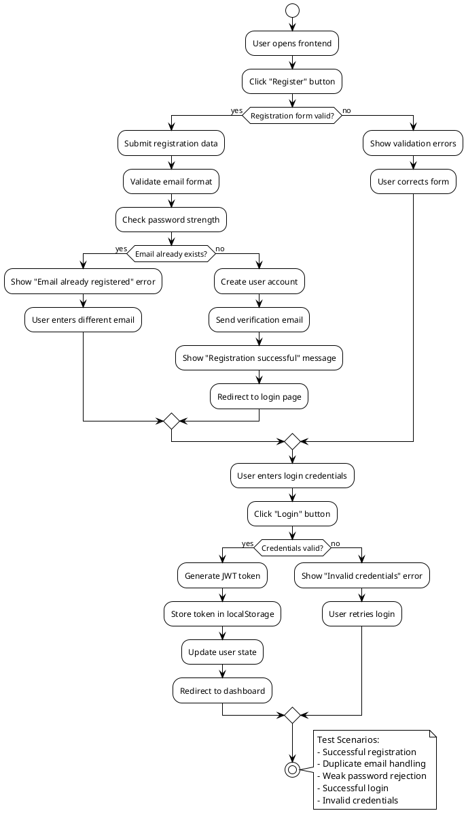

### Test Scenarios

#### Test Case 1: Successful Registration
```gherkin
Feature: User Registration
  Scenario: Successful user registration
    Given user is on registration page
    When user enters valid email "test@example.com"
    And user enters strong password "SecurePass123!"
    And user clicks "Register" button
    Then registration should succeed
    And user should receive verification email
    And user should be redirected to login page
```

#### Test Case 2: Duplicate Email
```gherkin
Scenario: Registration with existing email
    Given user "existing@example.com" already registered
    When user tries to register with "existing@example.com"
    Then system should show "Email already registered" error
    And user should remain on registration page
```

---

## 2. Chat Interaction Activity

### PlantUML Activity Diagram

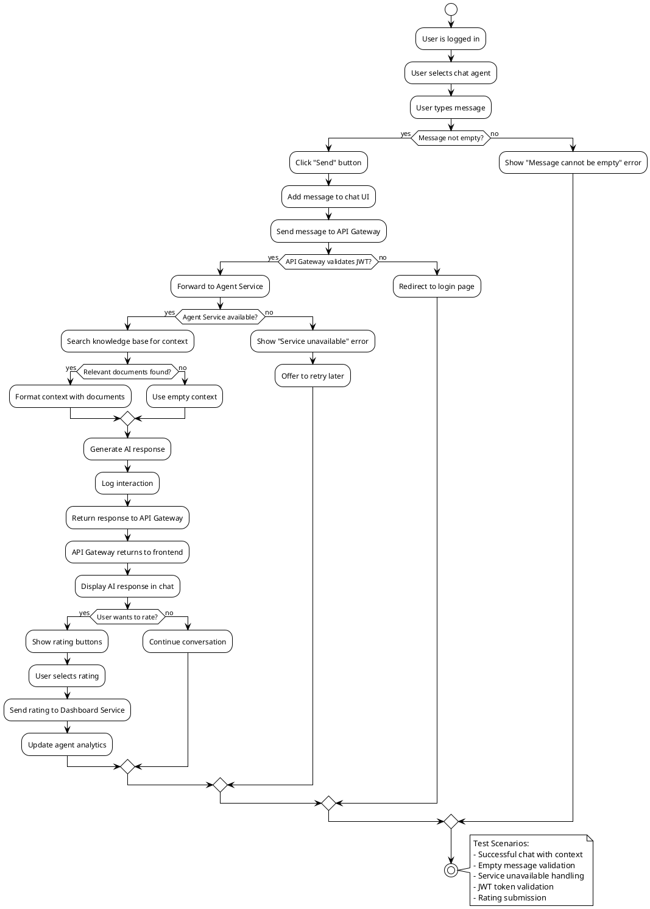

### Test Scenarios

#### Test Case 1: Successful Chat
```gherkin
Feature: Chat Interaction
  Scenario: Successful chat conversation
    Given user is logged in
    And user has selected "sales-agent"
    When user types "What are your products?"
    And user clicks "Send"
    Then message should appear in chat
    And AI should respond within 5 seconds
    And response should be relevant to products
```

---

## 4. Voice Chat Activity

### PlantUML Activity Diagram

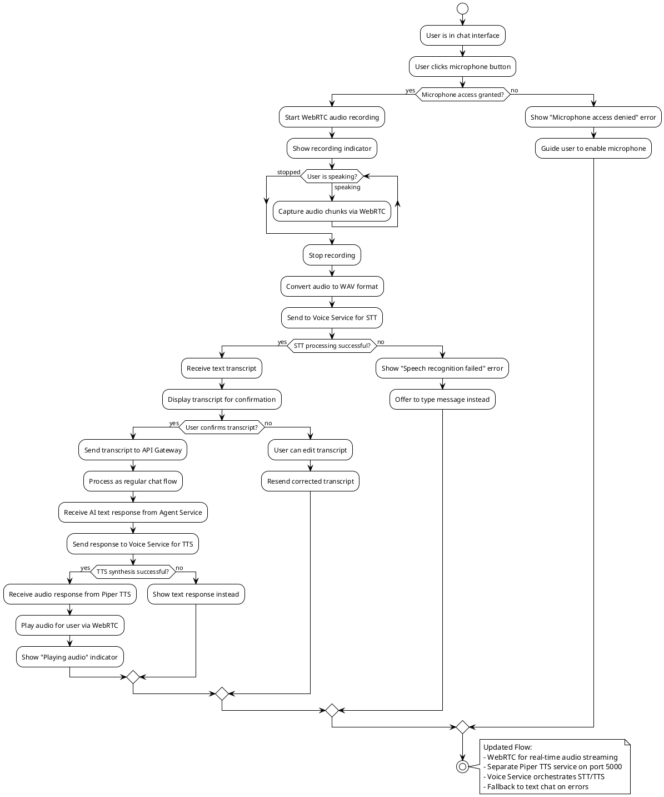

### Updated Voice Architecture

Voice interaction trong DATN Chatbot được thiết kế với kiến trúc phân tách:

#### **Components:**
1. **Frontend WebRTC Client**: Xử lý audio streaming real-time
2. **Voice Service (Port 7860)**: Orchestrator chính cho STT/TTS
3. **Piper TTS Service (Port 5000)**: Dedicated TTS server
4. **Sherpa-ONNX STT**: Local speech recognition engine

#### **Flow Steps:**
1. **Audio Capture**: WebRTC captures audio chunks từ browser
2. **Speech-to-Text**: Voice Service chuyển audio → text
3. **Chat Processing**: Gửi text qua API Gateway → Agent Service
4. **Text-to-Speech**: Response text → Piper TTS service
5. **Audio Playback**: WebRTC plays synthesized speech

#### **Technical Details:**
- **WebRTC**: Real-time audio communication
- **TURN Server**: Required cho Docker/NAT traversal
- **Audio Formats**: WAV processing cho compatibility
- **Fallback**: Text chat khi voice fails

---

## 4. Document Upload Activity

### PlantUML Activity Diagram

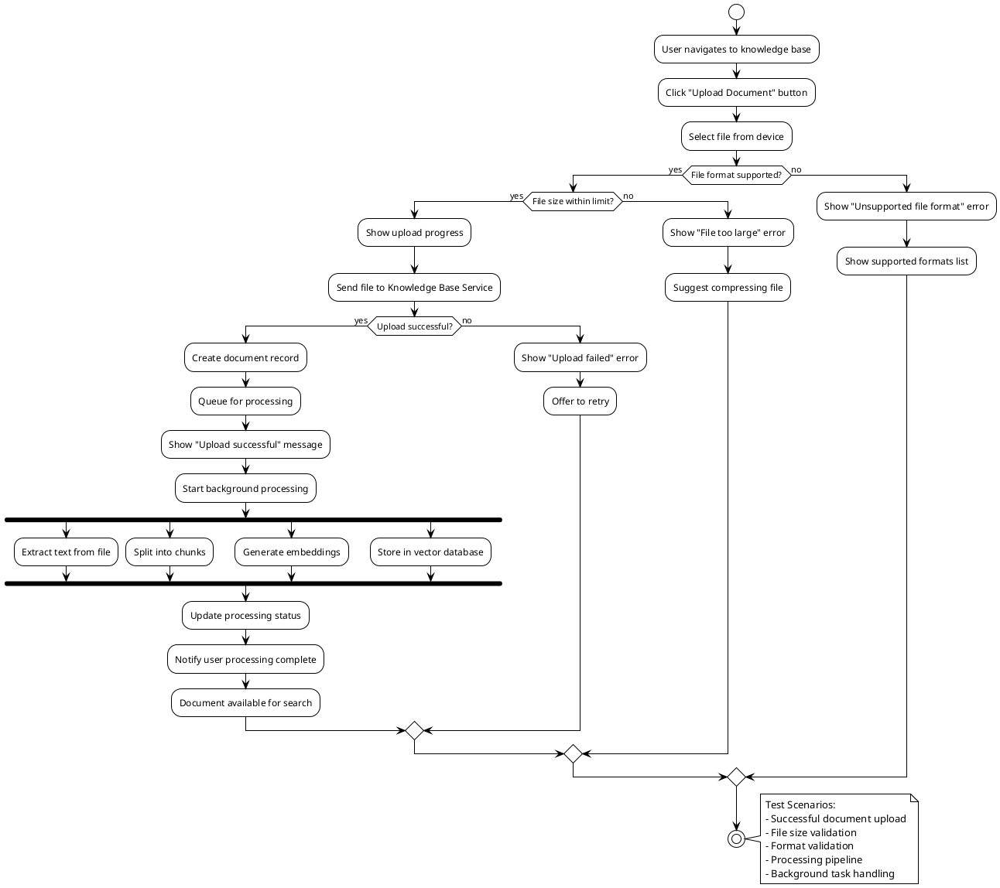

---

## 5. Knowledge Search Activity

### PlantUML Activity Diagram

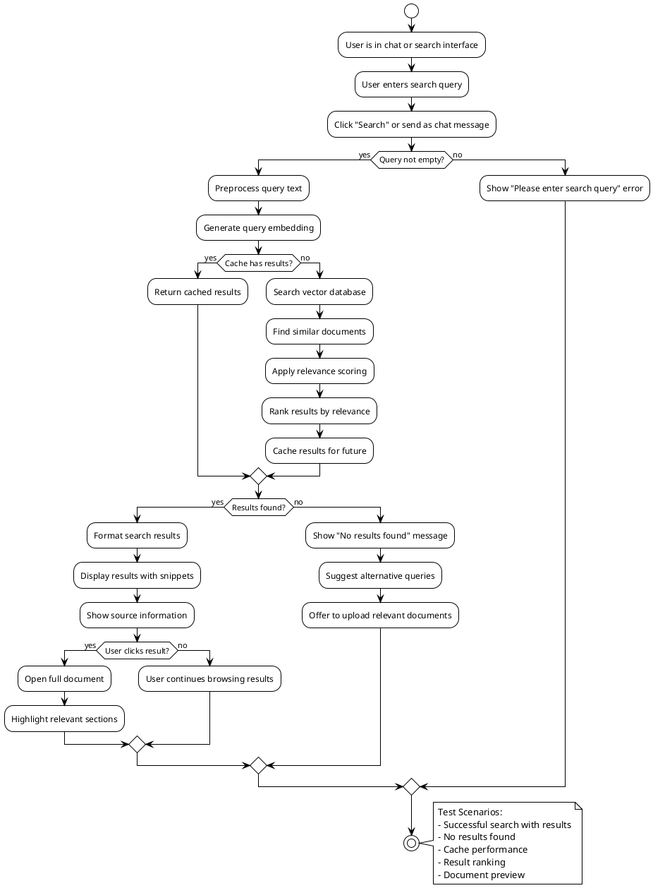

---

## 6. Rating & Feedback Activity

### PlantUML Activity Diagram

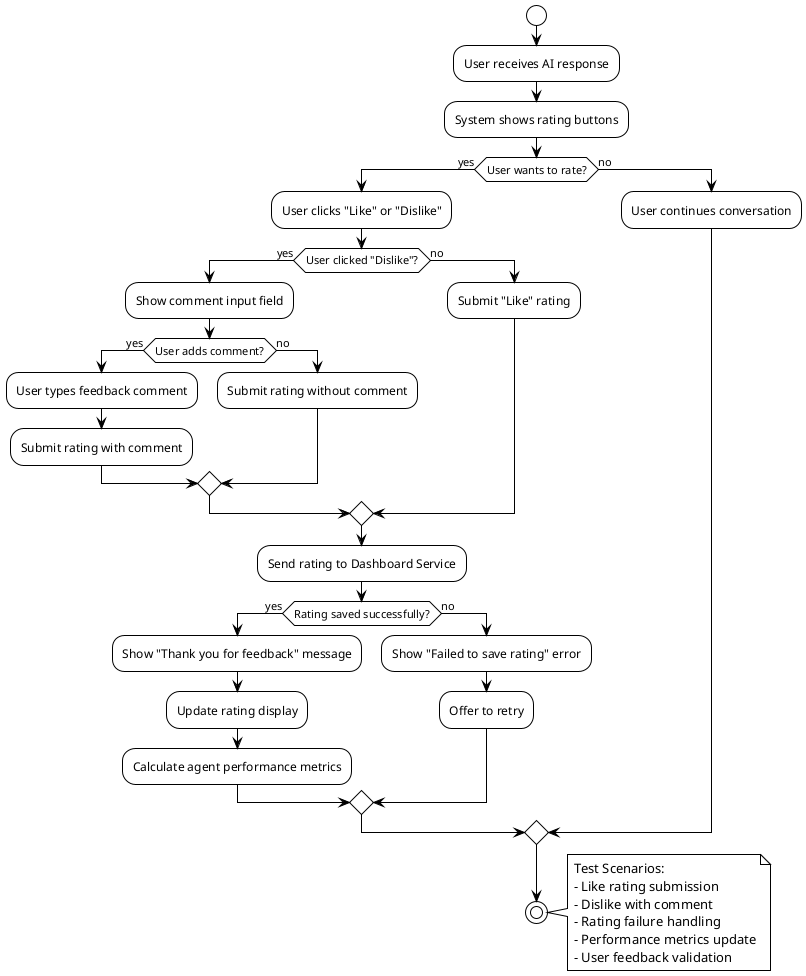

---

## 7. Indoor Navigation Activity

### PlantUML Activity Diagram

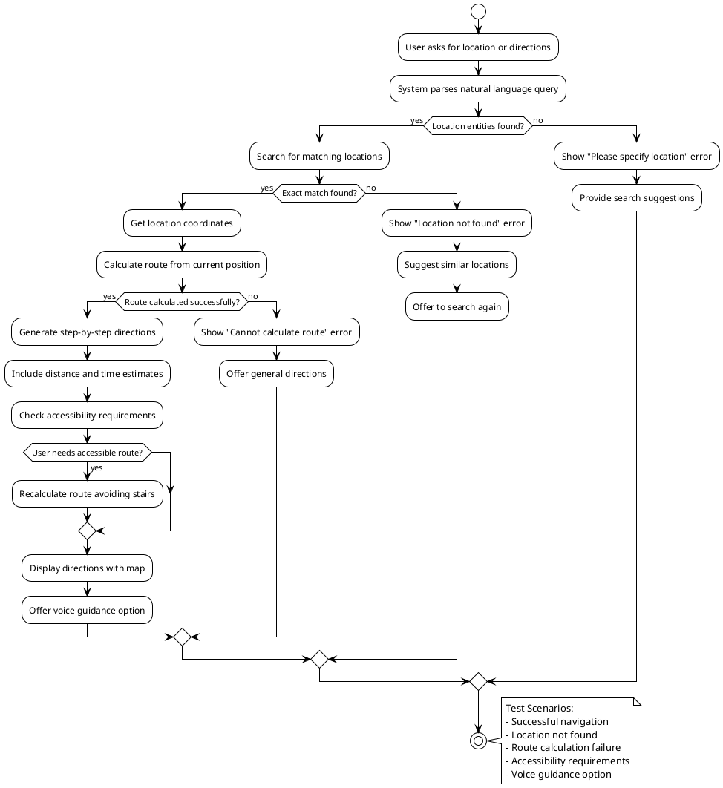

---

## 8. Admin Dashboard Activity

### PlantUML Activity Diagram

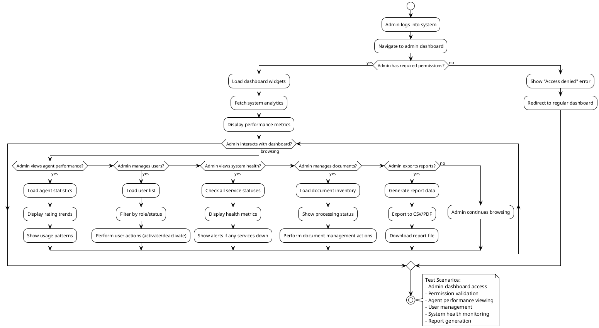

---

## 9. Error Handling Activity

### PlantUML Activity Diagram

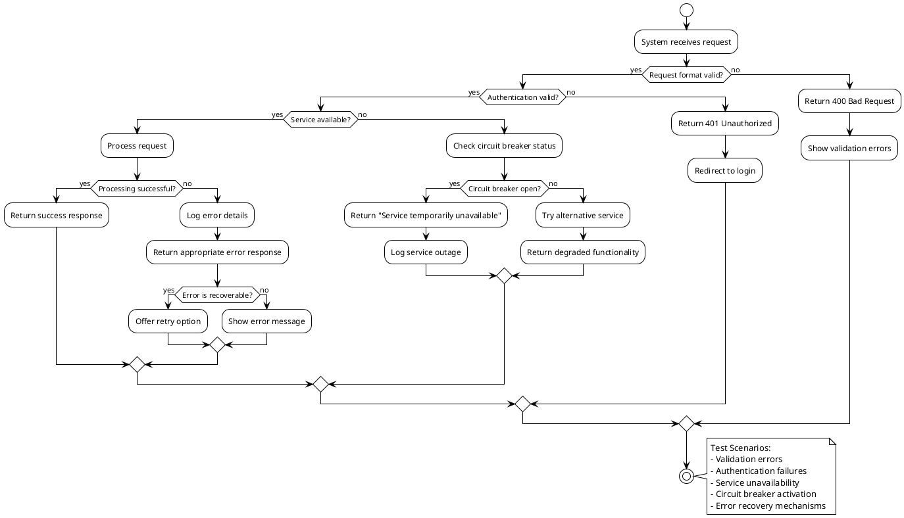

---

## 10. Service Health Check Activity

### PlantUML Activity Diagram

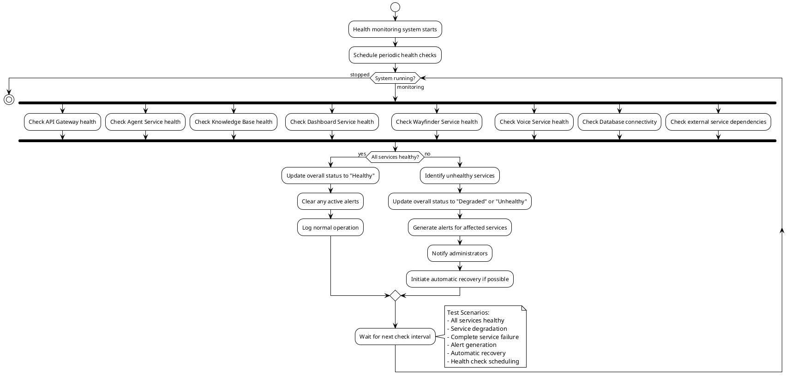

---

## Testing Strategy Implementation

### Automated Testing Framework

#### Test Environment Setup
```python
# conftest.py - Pytest configuration
import pytest
from testcontainers.postgres import PostgresContainer
from testcontainers.redis import RedisContainer

@pytest.fixture(scope="session")
def postgres_container():
    with PostgresContainer("postgres:16") as postgres:
        yield postgres

@pytest.fixture(scope="session")
def redis_container():
    with RedisContainer("redis:7") as redis:
        yield redis

@pytest.fixture
def test_db(postgres_container):
    # Setup test database
    engine = create_engine(postgres_container.get_connection_url())
    Base.metadata.create_all(engine)
    yield engine
    Base.metadata.drop_all(engine)
```

#### Test Utilities
```python
# test_utils.py
import requests
from typing import Dict, Any

class APIClient:
    def __init__(self, base_url: str):
        self.base_url = base_url
        self.session = requests.Session()
        self.token = None
    
    def login(self, email: str, password: str) -> Dict[str, Any]:
        response = self.session.post(
            f"{self.base_url}/auth/login",
            json={"email": email, "password": password}
        )
        self.token = response.json()["access_token"]
        self.session.headers.update({
            "Authorization": f"Bearer {self.token}"
        })
        return response.json()
    
    def send_chat_message(self, message: str, agent_id: str) -> Dict[str, Any]:
        response = self.session.post(
            f"{self.base_url}/agent/{agent_id}/invoke",
            json={"message": message}
        )
        return response.json()
    
    def upload_document(self, file_path: str, title: str) -> Dict[str, Any]:
        with open(file_path, 'rb') as f:
            response = self.session.post(
                f"{self.base_url}/documents/upload",
                files={"file": f},
                data={"title": title}
            )
        return response.json()
```

### Integration Test Examples

#### End-to-End Chat Test
```python
# test_chat_e2e.py
def test_complete_chat_flow(api_client: APIClient):
    # 1. Login
    login_response = api_client.login("test@example.com", "password123")
    assert login_response["access_token"] is not None
    
    # 2. Send chat message
    chat_response = api_client.send_chat_message(
        "What are your products?", 
        "sales-agent"
    )
    assert "content" in chat_response
    assert len(chat_response["content"]) > 0
    
    # 3. Rate the response
    rating_response = api_client.session.post(
        f"{api_client.base_url}/ratings",
        json={
            "run_id": chat_response["run_id"],
            "rating": "LIKE",
            "agent_id": "sales-agent"
        }
    )
    assert rating_response.status_code == 201
```

#### Document Processing Test
```python
# test_document_processing.py
def test_document_upload_and_search(api_client: APIClient, temp_pdf_file):
    # 1. Upload document
    upload_response = api_client.upload_document(
        temp_pdf_file, 
        "Test Document"
    )
    document_id = upload_response["document_id"]
    assert document_id is not None
    
    # 2. Wait for processing
    import time
    time.sleep(30)  # Wait for background processing
    
    # 3. Search for content
    search_response = api_client.session.post(
        f"{api_client.base_url}/search",
        json={"query": "test content", "limit": 5}
    )
    
    results = search_response.json()["documents"]
    assert len(results) > 0
    assert any(doc["document_id"] == document_id for doc in results)
```

### Performance Testing

#### Load Testing Configuration
```python
# load_test.py
from locust import HttpUser, task, between

class ChatUser(HttpUser):
    wait_time = between(1, 3)
    
    def on_start(self):
        """Login on start"""
        response = self.client.post("/auth/login", json={
            "email": "test@example.com",
            "password": "password123"
        })
        self.token = response.json()["access_token"]
        self.headers = {"Authorization": f"Bearer {self.token}"}
    
    @task
    def send_chat_message(self):
        self.client.post("/agent/sales-agent/invoke", 
                        json={"message": "Hello, how are you?"},
                        headers=self.headers)
    
    @task(3)
    def search_knowledge(self):
        self.client.post("/search", 
                        json={"query": "product information", "limit": 5},
                        headers=self.headers)
```

### Test Data Management

#### Test Data Factory
```python
# factory.py
from factory import Factory
from faker import Faker

fake = Faker()

class UserFactory(Factory):
    class Meta:
        model = dict
    
    email = factory.LazyAttribute(lambda _: fake.email())
    password = factory.LazyAttribute(lambda _: fake.password())
    roles = factory.LazyAttribute(lambda _: ["user"])

class DocumentFactory(Factory):
    class Meta:
        model = dict
    
    title = factory.LazyAttribute(lambda _: fake.sentence())
    content = factory.LazyAttribute(lambda _: fake.text(max_nb_chars=1000))
    tags = factory.LazyAttribute(lambda _: [fake.word() for _ in range(3)])
```

---

## 12. Microservices Communication Flow

### PlantUML Communication Diagram

```plantuml
@startuml MicroservicesCommunication
!theme plain
skinparam ParticipantPadding 20
skinparam BoxPadding 20

title Microservices Communication Patterns

participant "Frontend" as FE
participant "API Gateway" as GW
participant "Agent Service" as AS
participant "Knowledge Base" as KB
participant "Wayfinder" as WF
participant "Dashboard" as DB
participant "Voice Service" as VS
participant "Piper TTS" as TTS

database "PostgreSQL" as PG
database "Qdrant" as QD
database "Redis" as RD

== Startup Sequence ==
note over FE,PG: System initialization
GW -> GW: Initialize JWT middleware
AS -> PG: Connect agent database
KB -> PG: Connect knowledge database
KB -> QD: Connect vector database
WF -> PG: Connect navigation database
DB -> PG: Connect analytics database
VS -> VS: Initialize WebRTC
TTS -> TTS: Load voice models

== Request Routing Patterns ==
note over FE,TTS: HTTP request flow

FE -> GW: POST /agent/{id}/invoke
GW -> GW: Validate JWT
GW -> GW: Rate limiting check

alt Chat request
    GW -> AS: Forward with user context
    AS -> KB: Search knowledge base
    KB -> QD: Vector similarity search
    QD --> KB: Document chunks
    KB --> AS: Context documents
    
    AS -> AS: Generate response
    AS -> DB: Log interaction
    AS --> GW: AI response
    
else Navigation request
    GW -> WF: Forward location query
    WF -> PG: Query location data
    PG --> WF: Location results
    WF --> GW: Navigation data
    
else Document request
    GW -> KB: Forward document operation
    KB -> PG: Document CRUD operations
    KB --> GW: Document response
    
else Voice request
    GW -> VS: Forward audio data
    VS -> TTS: Request synthesis
    TTS --> VS: Audio response
    VS --> GW: Audio data
end

GW --> FE: Formatted response

== Async Processing ==
note over KB,RD: Background tasks

KB -> RD: Queue document processing
KB -> KB: Process in background

fork
    KB -> KB: Extract text
fork again
    KB -> KB: Generate embeddings
fork again
    KB -> QD: Store vectors
end fork

KB -> PG: Update status
KB -> RD: Publish completion

== Caching Strategy ==
note over GW,RD: Redis caching patterns

GW -> RD: Check response cache
RD --> GW: Cached response (if hit)

AS -> RD: Cache LLM responses
KB -> RD: Cache search results
WF -> RD: Cache route calculations

== Error Handling & Recovery ==
note over GW,DB: Circuit breaker pattern

alt Service timeout
    GW -> GW: Trigger circuit breaker
    GW -> GW: Return cached response
else Service error
    GW -> DB: Log error details
    GW -> GW: Return graceful error
end

== Health Monitoring ==
note over GW,VS: Health check propagation

loop Every 30 seconds
    GW -> AS: GET /health
    GW -> KB: GET /health
    GW -> WF: GET /health
    GW -> DB: GET /health
    GW -> VS: GET /health
    GW -> TTS: GET /health
    
    alt Service unhealthy
        GW -> DB: Log service status
        GW -> GW: Update routing table
    end
end

@enduml
```

### Communication Patterns

#### **1. Synchronous Request-Response**
- **Frontend API Gateway**: HTTP/REST calls
- **API Gateway Services**: FastAPI routing with validation
- **Service-to-Service**: Direct HTTP calls with timeouts

#### **2. Asynchronous Processing**
- **Document Processing**: Redis queue for background tasks
- **Analytics**: Event-driven logging
- **Notifications**: Pub/sub patterns via Redis

#### **3. Caching Strategy**
- **Response Caching**: Redis cho frequent queries
- **Session Caching**: User context and JWT validation
- **Data Caching**: Search results và computed routes

#### **4. Error Handling**
- **Circuit Breaker**: Prevent cascade failures
- **Retry Logic**: Exponential backoff for external APIs
- **Graceful Degradation**: Fallback responses

#### **5. Service Discovery**
- **Static Configuration**: Known service endpoints
- **Health Checks**: Active monitoring
- **Load Balancing**: Round-robin distribution

### Technology Stack

#### **Communication Protocols**
- **HTTP/REST**: Primary API communication
- **WebRTC**: Real-time audio streaming
- **WebSocket**: Future real-time features

#### **Message Formats**
- **JSON**: Standard API responses
- **Binary**: Audio/video data
- **Protocol Buffers**: Future optimization

#### **Monitoring & Observability**
- **Health Endpoints**: `/health`, `/info`, `/metrics`
- **Structured Logging**: JSON format with correlation IDs
- **Performance Metrics**: Response times, error rates

---

## PlantUML Installation & Usage

### Installation
```bash
# Using VS Code extension
code --install-extension jebbs.plantuml

# Using CLI
npm install -g plantuml
```

### Rendering Diagrams
```bash
# Generate PNG from PlantUML file
plantuml -tpng diagram.puml

# Generate SVG
plantuml -tsvg diagram.puml

# Generate PDF
plantuml -tpdf diagram.puml
```

### VS Code Integration
1. Install PlantUML extension
2. Open `.puml` file
3. Use `Ctrl+Shift+P` → "PlantUML: Preview"
4. Or use `Alt+D` to preview current diagram

### Integration with Documentation
```markdown
<!-- In Markdown files -->


<!-- Or embed directly -->
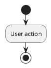

---

## Conclusion

PlantUML diagrams provide superior visualization cho DATN Chatbot system so với Mermaid. Key advantages:

### 🎯 Enhanced System Architecture Visualization
- **Complete System Overview**: Total architecture với all services
- **Microservices Communication**: Detailed interaction patterns
- **Complex decision trees** với multiple branches
- **Parallel processing** visualization cho background tasks

### 🔄 Better Development Understanding
- **Service Dependencies**: Clear relationships between components
- **Data Flow Visualization**: End-to-end request/response paths
- **Error Handling Patterns**: Comprehensive failure scenarios
- **Performance Monitoring**: Health check và alerting flows

### 📊 Improved Documentation Quality
- **Professional diagram rendering** với PlantUML
- **Multiple output formats** (PNG, SVG, PDF)
- **Version control friendly** text-based diagrams
- **IDE integration** cho real-time preview

### 🚀 System-Specific Benefits
- **Voice Architecture**: WebRTC + Piper TTS integration
- **Knowledge Processing**: RAG pipeline visualization
- **Navigation System**: Indoor routing với accessibility
- **Multi-Agent Support**: LangGraph agent interactions
- **Real-time Features**: WebRTC audio streaming patterns

### 🛠️ Implementation Guidance
- **Port Mapping**: Clear service endpoints (3000, 5000, 7860, 8000, 8004, 8007, 8008, 8080)
- **Database Layout**: PostgreSQL + Qdrant + Redis architecture
- **API Gateway**: Centralized routing và authentication
- **Microservices Patterns**: Communication best practices

Documentation này serves as comprehensive system blueprint với PlantUML diagrams, ensuring:
- **Clear architecture understanding** cho developers
- **Efficient troubleshooting** với detailed flow analysis
- **Scalable design patterns** cho future enhancements
- **Production deployment guidance** với complete system view
